<h1>
  
  Radiology-Lab-Slicing
</h1>


> **Author:** Matteo Bignardi  
> **Course:** Network and Cloud Infrastructures  
> **Institution:** Università degli Studi di Napoli Federico II  
> **Academic Year:** 2024–2025

## Panoramica del Progetto

Radiology-Lab-Slicing è un sistema SDN modulare per la gestione dinamica di slice di rete all’interno di uno **studio radiologico**.
Questa piattaforma consente l’attivazione e la disattivazione delle slice di rete, sia di **topologia** che di **servizio** e un controllo intuitivo delle slice tramite interfacce CLI e GUI.
Realizzato utilizzando **Mininet** per l’emulazione e un **controller Ryu** per l’applicazione delle politiche di slicing, il sistema integra meccanismi di **simulazione del traffico** per riprodurre scenari operativi realistici e dimostrare come le risorse di rete possano essere allocate in modo flessibile ed efficiente in uno studio radiologico.

## Indice

- [Panoramica del Progetto](#panoramica-del-progetto)
- [Indice](#indice)
- [Idea del Progetto](#idea-del-progetto)
- [Funzionalità Principali](#funzionalità-principali)
- [Struttura del Progetto](#struttura-del-progetto)
- [Architettura del Sistema](#architettura-del-sistema)
  - [Host](#host)
  - [Switch OpenFlow](#switch-openflow)
- [Implementazione della Topologia di Rete](#implementazione-della-topologia-di-rete)
  - [`topology.py`](#topologypy)
    - [Classe `Topology`](#classe-topology)
  - [`topology_defs.py`](#topology_defspy)
  - [`topology.json`](#topologyjson)
- [Panoramica sul Network Slicing](#panoramica-sul-network-slicing)
  - [Slicing basato sulla Topologia](#slicing-basato-sulla-topologia)
  - [Slicing basato sui Servizi](#slicing-basato-sui-servizi)
- [Descrizione delle Slice di Topologia](#descrizione-delle-slice-di-topologia)
  - [Slice Radiologia](#slice-radiologia)
  - [Slice Sicurezza](#slice-sicurezza)
  - [Slice Core Amministrativo](#slice-core-amministrativo)
- [Descrizione delle Slice di Servizio](#descrizione-delle-slice-di-servizio)
  - [Service Slice Video / Non-Video](#service-slice-video--non-video)
- [Controller Ryu](#controller-ryu)
  - [Applicazioni](#applicazioni)
  - [Eventi](#eventi)
  - [Threads](#threads)
  - [Eventi osservati](#eventi-osservati)
  - [Eventi generati](#eventi-generati)
  - [Datapath](#datapath)
  - [Packet](#packet)
- [Switch OpenFlow](#switch-openflow-1)
  - [Flow Table](#flow-table)
  - [Rimozione delle flow entry](#rimozione-delle-flow-entry)
  - [Istruzioni](#istruzioni)
  - [Azioni](#azioni)
  - [Contatori](#contatori)
- [Messaggi OpenFlow](#messaggi-openflow)
  - [Messaggi Controller-to-Switch](#messaggi-controller-to-switch)
    - [Messaggi Modify-State](#messaggi-modify-state)
    - [Messaggi Read-State](#messaggi-read-state)
    - [Messaggi Packet-Out](#messaggi-packet-out)
    - [Messaggi Handshake](#messaggi-handshake)
  - [Messaggi Asincroni](#messaggi-asincroni)
    - [Messaggi Packet-In](#messaggi-packet-in)
- [Progettazione del Controller e Logica Decisionale](#progettazione-del-controller-e-logica-decisionale)
  - [`controller.py`](#controllerpy)
    - [Classe `Controller`](#classe-controller)
  - [`MacToPortMapper.py`](#mactoportmapperpy)
  - [`ProblemConstants.py`](#problemconstantspy)
    - [Classe `ProblemConstants`](#classe-problemconstants)
    - [Classe `ControllerState`](#classe-controllerstate)
- [Configurazione dell’Applicazione e Comandi di Test](#configurazione-dellapplicazione-e-comandi-di-test)
  - [Installazione](#installazione)
  - [Avvio](#avvio)
  - [Test](#test)
    - [Test di Connettività di Base (ping)](#test-di-connettività-di-base-ping)
    - [Esempio: output pingall – Modalità Operativa Topology - Day - Slice Radiologia attiva](#esempio-output-pingall--modalità-operativa-topology---day---slice-radiologia-attiva)
    - [Esempio: output pingall – Modalità Operativa Topology - Day - Slice Sicurezza attiva](#esempio-output-pingall--modalità-operativa-topology---day---slice-sicurezza-attiva)
    - [Esempio: output pingall – Modalità Operativa Topology - Day - Slice Core Amministrativo attiva](#esempio-output-pingall--modalità-operativa-topology---day---slice-core-amministrativo-attiva)
    - [Esempio: output pingall – Modalità Operativa Topology - Night - Slice Core Amministrativo attiva](#esempio-output-pingall--modalità-operativa-topology---night---slice-core-amministrativo-attiva)
    - [Esempio: output pingall – Modalità Operativa Topology - Day - Slice Radiologia, Sicurezza e Core Amministrativo attive](#esempio-output-pingall--modalità-operativa-topology---day---slice-radiologia-sicurezza-e-core-amministrativo-attive)
    - [Esempio: output pingall – Modalità Operativa Service con Video Slice attiva](#esempio-output-pingall--modalità-operativa-service-con-video-slice-attiva)
    - [Esempio: output pingall – Modalità Operativa Service con Video Slice disattivata / Modalità Operativa Topology Day/Night con nessuna slice di topologia attivata](#esempio-output-pingall--modalità-operativa-service-con-video-slice-disattivata--modalità-operativa-topology-daynight-con-nessuna-slice-di-topologia-attivata)
    - [Test della Modalità Operativa Service](#test-della-modalità-operativa-service)
- [Applicazione GUI](#applicazione-gui)
  - [Attivazione e disattivazione delle slice](#attivazione-e-disattivazione-delle-slice)
- [`docker-compose.yml`](#docker-composeyml)
  - [Monitoraggio](#monitoraggio)
  - [Configurazione del Progetto](#configurazione-del-progetto)
    - [Servizio Prometheus](#servizio-prometheus)
    - [Servizio Grafana](#servizio-grafana)
  - [Deployment e Accesso](#deployment-e-accesso)
- [Prometheus](#prometheus)
- [Campioni, Job e Instance](#campioni-job-e-instance)
  - [Notazione](#notazione)
  - [Job e Instance](#job-e-instance)
- [`prometheus.yml`](#prometheusyml)
- [PromQL](#promql)
  - [Selettori di serie temporali](#selettori-di-serie-temporali)
  - [Operatori di matching](#operatori-di-matching)
  - [Tipi di metriche](#tipi-di-metriche)
- [`datasource.yml`](#datasourceyml)
- [Configurazione della sorgente dati Prometheus](#configurazione-della-sorgente-dati-prometheus)
  - [Connessione](#connessione)
  - [Autenticazione](#autenticazione)
  - [Opzioni di configurazione](#opzioni-di-configurazione)
- [Variabili template di Prometheus](#variabili-template-di-prometheus)
  - [Utilizzo delle query variables](#utilizzo-delle-query-variables)
- [`sdn_qos_dashboard.json`](#sdn_qos_dashboardjson)
  - [Campi principali della dashboard](#campi-principali-della-dashboard)
  - [Sezione templating](#sezione-templating)
  - [Sezione Panels](#sezione-panels)
  - [Campo gridPos](#campo-gridpos)
  - [Campo targets](#campo-targets)
  - [Campo options](#campo-options)
- [Pannelli della dashboard](#pannelli-della-dashboard)
- [`monitor_prometheus.py`](#monitor_prometheuspy)
  - [Classe `PrometheusController`](#classe-prometheuscontroller)
  - [Classe `MonitorPrometheus`](#classe-monitorprometheus)
- [`traffic_simulation.py`](#traffic_simulationpy)
  - [Classe `SimState`](#classe-simstate)
    - [Classe `TrafficSimulationManager`](#classe-trafficsimulationmanager)
  - [Tool utilizzati per la simulazione del traffico](#tool-utilizzati-per-la-simulazione-del-traffico)
    - [mnexec](#mnexec)
    - [DCMTK (Digital Imaging and Communications in Medicine Toolkit)](#dcmtk-digital-imaging-and-communications-in-medicine-toolkit)
    - [tcpdump](#tcpdump)
    - [FFmpeg](#ffmpeg)
    - [netcat](#netcat)
  - [Avvio della simulazione da un host selezionato](#avvio-della-simulazione-da-un-host-selezionato)
  - [Simulazione DICOM tra Image Acquisition Device e PACS – Storage](#simulazione-dicom-tra-image-acquisition-device-e-pacs--storage)
  - [Simulazione DICOM tra Radiology Workstation e PACS – Query](#simulazione-dicom-tra-radiology-workstation-e-pacs--query)
  - [Simulazione traffico video – Telecamera di sicurezza verso Stazione di Controllo](#simulazione-traffico-video--telecamera-di-sicurezza-verso-stazione-di-controllo)
  - [Simulazione traffico video – Telecamera di sicurezza verso NVR](#simulazione-traffico-video--telecamera-di-sicurezza-verso-nvr)
- [Documentazione della REST API](#documentazione-della-rest-api)
  - [Response](#response)
  - [Metodi](#metodi)
    - [1. GUI Index](#1-gui-index)
    - [2. GUI Monitor](#2-gui-monitor)
    - [3. File Statici della GUI](#3-file-statici-della-gui)
    - [4. Stato del controller](#4-stato-del-controller)
    - [5. Stato della simulazione di traffico](#5-stato-della-simulazione-di-traffico)
    - [6. Avvio di una simulazione di traffico](#6-avvio-di-una-simulazione-di-traffico)
    - [7. Arresto di tutte le simulazioni di traffico](#7-arresto-di-tutte-le-simulazioni-di-traffico)
    - [8. Definizione delle porte degli switch](#8-definizione-delle-porte-degli-switch)
    - [9. Definizione degli host](#9-definizione-degli-host)
    - [10. Imposta modalità operativa diurna o nottura del controller](#10-imposta-modalità-operativa-diurna-o-nottura-del-controller)
    - [11. Imposta modalità di slicing](#11-imposta-modalità-di-slicing)
    - [12. Attiva una slice di topologia](#12-attiva-una-slice-di-topologia)
    - [13. Rimuovi slice di topologia](#13-rimuovi-slice-di-topologia)
    - [14. Attiva Video Slice](#14-attiva-video-slice)
    - [15. Disattiva Video Slice](#15-disattiva-video-slice)


## Idea del Progetto

Il progetto emula una rete intelligente basata su **Software Defined Networking (SDN)** per uno **studio radiologico moderno**, caratterizzato da esigenze operative differenziate.  
La rete integra diverse aree funzionali, tra cui **radiologia**, **sicurezza**, **core amministrativo**.

Attraverso l’utilizzo di SDN e del **network slicing**, il sistema si adatta dinamicamente a differenti scenari operativi:

- **Modalità Day**: lo slicing di topologia consente l’attivazione delle slice **Radiology**, **Security** e **Admin Core**, permettendo l’utilizzo completo della topologia di rete prevista dal sistema.
- **Modalità Night**: lo slicing di topologia viene riconfigurato disabilitando la slice **Radiology**, in quanto lo studio radiologico risulta chiuso nella fascia notturna; restano attive le slice **Security** e **Admin Core**.

In parallelo, il progetto implementa anche uno **slicing basato sui servizi**, indipendente dallo slicing di topologia, introducendo una **slice Video** per distinguere il traffico video delle telecamere di sicurezza dal restante traffico di rete.

## Funzionalità Principali

- Attivazione e disattivazione dinamica delle slice di rete (**topology slicing** e **service slicing**)
- Controllo delle slice tramite **CLI** e **GUI web**
- Emulazione della topologia di rete tramite **Mininet**
- Integrazione del controller **Ryu** per controllo del traffico e applicazione delle policy
- **Simulazione del traffico** per riprodurre scenari realistici (video / non-video) e validare le politiche
- **Sistema di monitoring** con esportazione metriche e dashboard (**Prometheus/Grafana**)
- Architettura modulare ed estendibile per testare strategie SDN e slicing


## Struttura del Progetto

La struttura del progetto è la seguente:


```
├── first_topology/
│   ├── controller.py              # Controller SDN (Ryu) con endpoint REST per la gestione delle slice
│   ├── MacToPortMapper.py         # Gestione dell’inoltro dei pacchetti per ciascuna slice
│   ├── ProblemConstants.py        # Definizione delle slice e delle modalità operative
│   ├── topology.py                # Creazione della topologia dello studio radiologico in Mininet
│   ├── topology.json              # Definizione di host, switch e collegamenti
│   ├── topology_defs.py           # Caricamento e utilizzo della topologia da file JSON
│   ├── traffic_simulation.py      # Generazione di traffico realistico di rete per i test
│   └── monitoring/
│       └── monitor_prometheus.py  # Raccoglie statistiche dai flussi degli switch e le rende disponibili al database Prometheus 
│
├── html/
│   ├── index.html                 # Interfaccia web per la gestione della rete
│   ├── monitor.html               # Interfaccia web per il monitoraggio della rete
│   └── static/
│       ├── scripts/               # Logica Frontend dell’interfaccia per la visualizzazione della topologia e il controllo delle slice
│       ├── styles/                # Stili grafici dell’interfaccia
│       └── images/                # Icone SVG per i componenti di rete
│
├── assets/
│   ├── dicom/                     # File DICOM usati per i test del traffico radiologico
│   └── video/                     # File .mp4 usati per i test del traffico video delle telecamere di sicurezza
│
│
├── first_topology/
│   └── monitoring/
│       ├── __init__.py                 # Inizializza il modulo di monitoring del controller
│       └── monitor_prometheus.py       # Raccoglie le statistiche di traffico dagli switch OpenFlow
│                                      # e le rende disponibili a Prometheus
├── monitoring/
│   ├── prometheus/
│   │   └── prometheus.yml              # Indica a Prometheus dove leggere le statistiche
│   └── grafana/
│       ├── grafana.ini                 # Impostazioni di base dell’interfaccia Grafana
│       ├── dashboards/
│       │   └── sdn_qos_dashboard.json  # Struttura della dashboard per visualizzare i dati raccolti
│       └── provisioning/
│           ├── datasources/
│           │   └── datasource.yml      # Collega Grafana a Prometheus
│           └── dashboards/
│               └── dashboards.yml      # Carica automaticamente la dashboard all’avvio
│
├── clean #script di pulizia dell’ambiente di esecuzione che arresta i servizi di monitoring, termina tutti i processi in ascolto sulla porta 8080 ed elimina le istanze Mininet residue.
│
└── docker-compose.monitor.yml           # Avvia Prometheus e Grafana con queste configurazioni
```

## Architettura del Sistema

Il sistema è composto da:

- **1 Controller SDN** 
- **15 Host**, che rappresentano i principali dispositivi di uno studio radiologico
- **8 Switch OpenFlow**, organizzati in zone funzionali

### Host

| Host         | Ruolo                    | Descrizione                                                                                | Radiology | Security | Admin | Video | Non-Video |
| ------------ | ------------------------ | ------------------------------------------------------------------------------------------------------ | :-------: | :------: | :---: | :---: | :-------: |
| **hImgDev1** | Image Acquisition Device | Dispositivo di imaging medico (ad esempio la risonanza magnetica) utilizzato per l’acquisizione delle immagini diagnostiche. Genera immagini mediche in formato DICOM e le invia al PACS server tramite il protocollo DICOM utilizzando, a tal fine, l'operazione C-STORE.    |     ✓     |          |       |       |     ✓     |
| **hImgDev2** | Image Acquisition Device | Secondo dispositivo di imaging medico. |     ✓     |          |       |       |     ✓     |
| **hRadWS1**  | Radiology Workstation    | Computer dedicato per la visualizzazione e l’analisi delle immagini mediche. Consente ai radiologi di visualizzare, elaborare e interpretare le immagini archiviate nel PACS. Utilizza l'operazione C-FIND per la ricerca e il recupero delle immagini dal PACS e le operazioni C-MOVE / C-GET per il trasferimento delle immagini dal PACS alle workstation. |     ✓     |          |       |       |     ✓     |
| **hRadWS2**  | Radiology Workstation    | Secondo computer dedicato per la visualizzazione e l’analisi delle immagini mediche.                                                               |     ✓     |          |       |       |     ✓     |
| **hPACS**    | PACS Server              |  Nucleo centrale del sistema PACS, dove vengono archiviate e gestite le immagini mediche. Utilizza il protocollo DICOM per comunicare con le Radiology Workstation e gli Image acquisition device.                                |     ✓     |          |       |       |     ✓     |
| **hRIS**     | RIS Server               | Nucleo centrale del sistema informativo radiologico (RIS), dove vengono archiviati e gestiti i dati clinici, amministrativi e gli esami dei pazienti.                                         |           |          |   ✓   |       |     ✓     |
| **hBroker**  | RIS/PACS Broker          | Costituisce l’interfaccia tra il sistema PACS e il RIS.                                           |     ✓     |          |   ✓   |       |     ✓     |
| **hRISW1**   | RIS Workstation          | Computer dedicato utilizzato per la prenotazione degli esami, l’accettazione dei pazienti, la produzione del programma giornaliero di sala, l’inserimento dei dati anamnestici e del quesito clinico dei pazienti, la consegna dei risultati, l’invio dei referti al PACS tramite messaggi HL7, per la stesura dei referti da parte dei medici radiologi che consultano gli eventuali precedenti referti dei pazienti e per la gestione dei rendiconti per i pazienti interni ed esterni (che vanno rimborsati dalla Regione).                                                 |           |          |   ✓   |       |     ✓     |
| **hRISW2**   | RIS Workstation          | Secondo computer dedicato per le operazioni di amministrazione.                                                                          |           |          |   ✓   |       |     ✓     |
| **hCam1**    | Security Camera          | Telecamera di sicurezza.                                                |           |     ✓    |       |   ✓   |           |
| **hCam2**    | Security Camera          | Seconda telecamera di sicurezza.                                                                   |           |     ✓    |       |   ✓   |           |
| **hNVR**     | Network Video Recorder   | Videoregistratore di rete atto a registrare i video provenienti dalle telecamere di sicurezza.                                            |           |     ✓    |       |   ✓   |           |
| **lCS**      | Local Control Station    | Computer dedicato per il monitoraggio e la gestione delle telecamere di sicurezza e del videoregistratore di rete. |           |     ✓    |      |    ✓      |       |
| **hPrImg**   | Imaging Printer          | Stampante termica per etichette, adesivi, CD/DVD.                                                                      |     ✓     |          |       |       |     ✓     |
| **hPrDiag**  | Diagnostic Printer       | Stampante su carta per lettere di appuntamento, documenti e referti.                                                               |    ✓      |          |    |       |     ✓  |

### Switch OpenFlow

| Switch | Zona | Funzione |
|--------|------|----------|
| **s1** | Zona di Refertazione Radiologica | Gestisce il traffico relativo alle workstation radiologiche e alle stampanti utilizzate dai medici. |
| **s2** | Zona di Acquisizione delle Immagini | Gestisce il traffico generato dai dispositivi di acquisizione delle immagini mediche.  |
| **s3** | Zona di Interconnessione | Switch di interconnessione che consente la comunicazione tra le diverse zone funzionali della rete. |
| **s4** | Zona di Interconnessione| Switch di interconnessione. |
| **s5** | Zona Server | Gestisce il traffico relativo ai server PACS, RIS e al broker RIS/PACS. |
| **s6** | Zona Sicurezza | Gestisce il traffico relativo ai dispositivi di sorveglianza. |
| **s7** | Zona di Interconnessione | Switch di interconnessione. |
| **s8** | Zona Amministrativa | Gestisce il traffico relativo alle postazioni RIS e alla postazione di controllo locale. |

<p align="center">
  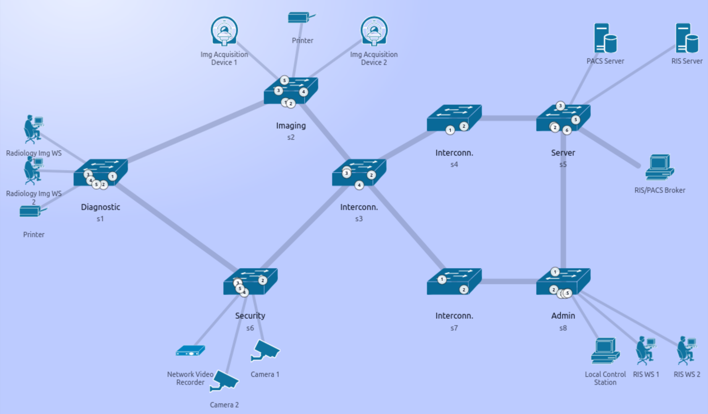
  <br/>
  <em>Architettura del sistema</em>
</p>

## Implementazione della Topologia di Rete

La topologia della rete è implementata mediante tre file distinti: `topology.py`, `topology.json` e `topology_defs.py`.

### `topology.py`

#### Classe `Topology`

La classe `Topology` estende la classe `Topo` di Mininet e definisce la struttura completa della topologia della rete.

| Nome attributo | Descrizione |
|---|---|
| `HOST_UI_ALIAS` | alias associati agli host, utilizzati per la rappresentazione grafica della topologia. |
| `HOST_UI_LABEL` | etichette descrittive associate agli host, utilizzate per la rappresentazione grafica della topologia. |

I metodi principali della classe sono:

- `__init__(self)`  
  costruisce l’intera topologia Mininet.  

Le funzioni definite nel file sono: 

- `setOpenFlow13(net)`  
  configura tutti gli switch Open vSwitch presenti nella rete affinché utilizzino il protocollo OpenFlow versione 1.3.  

- `write_mn_host_pids(net, out_path: str = "/tmp/mn_host_pids.json")`  
  genera un file JSON contenente l’associazione tra ciascun host Mininet e il PID del processo Linux che lo rappresenta.  
  Questo file viene utilizzato dal modulo del progetto che esegue le simulazioni del traffico e viene rigenerato a ogni avvio della rete, poiché i PID assegnati da Mininet cambiano ad ogni avvio.

Nel metodo `__init__()` della classe `Topology` viene utilizzata la classe Mininet `Topo`, che consente di definire la struttura logica della topologia di rete mediante la creazione di nodi e collegamenti.  
Nel blocco principale del file viene inoltre utilizzata la classe Mininet `Mininet`, che consente di istanziare ed eseguire concretamente la rete emulata a partire dalla topologia definita.  
Nel metodo `setOpenFlow13()` viene invece utilizzata la classe Mininet `Node`, da cui derivano host, switch e controller, per eseguire comandi direttamente sugli switch della rete.

Le principali classi Mininet coinvolte nel file sono riportate nella tabella seguente.

| Classe | Metodo | Descrizione del metodo |
|---|---|---|
| `Topo` | `__init__()` | Inizializza la struttura interna della topologia. |
| `Topo` | `addSwitch()` | Aggiunge uno switch al grafo della topologia. |
| `Topo` | `addHost()` | Aggiunge un host al grafo della topologia. |
| `Topo` | `addLink()` | Crea un collegamento tra due nodi della topologia. |
| `Mininet` | `__init__()` | Crea l’istanza della rete Mininet. |
| `Mininet` | `addController()` | Aggiunge un controller alla rete. |
| `Mininet` | `build()` | Costruisce concretamente la rete a partire dalla topologia definita. |
| `Mininet` | `start()` | Avvia controller e switch della rete. |
| `Mininet` | `stop()` | Arresta controller, switch e host della rete. |
| `Node` | `cmd()` | Esegue un comando, attende l’output e lo restituisce. |

Nel metodo `__init__()` della classe `Topology` viene utilizzato il metodo `addSwitch()` della classe Mininet `Topo`.

| Parametro | Valore | Spiegazione |
|---|---|---|
| `name` | `"s%d" % (i + 1)` | Nome dello switch. Nel progetto viene generato dinamicamente in un ciclo for (`s1`, `s2`, ..., `s8`). |
| `opts` | `{"dpid": "%016x" % (i + 1)}` | Opzioni dello switch. Nel progetto vengono usate per assegnare il parametro `dpid`. |
| `dpid` | `"%016x" % (i + 1)` | Identificatore OpenFlow dello switch. Il valore è formattato su 16 cifre esadecimali. |

Nel metodo `__init__()` della classe `Topology` viene utilizzato il metodo `addHost()` della classe Mininet `Topo`.

| Parametro | Valore | Spiegazione |
|---|---|---|
| `name` | `hname` | Nome dell’host.|
| `opts` | `inNamespace=True, mac=hmac, ip=(ip + "/24") if ip else None` | Opzioni dell’host. Nel progetto raccolgono i parametri di configurazione dell’host. |
| `inNamespace` | `True` | Indica che l’host viene eseguito nel proprio namespace di rete Linux, così da essere logicamente isolato dagli altri nodi. |
| `mac` | `hmac` | Indirizzo MAC assegnato esplicitamente all’host secondo quanto definito nella configurazione della topologia. |
| `ip` | `(ip + "/24") if ip else None` | Indirizzo IPv4 assegnato all’host. Se disponibile, viene configurato con subnet mask `/24`; in caso contrario il parametro viene lasciato a `None`. |

Nel metodo `__init__()` della classe `Topology` viene utilizzato il metodo `addLink()` della classe Mininet `Topo`.

Per i collegamenti switch–switch, i parametri utilizzati sono i seguenti.

| Parametro | Valore | Spiegazione |
|---|---|---|
| `node1` | `swA` | Primo nodo coinvolto nel collegamento. Nel progetto corrisponde al primo switch del link. |
| `node2` | `swB` | Secondo nodo coinvolto nel collegamento. Nel progetto corrisponde al secondo switch del link. |
| `port1` | `pA` | Porta del primo nodo utilizzata per il collegamento. Nel progetto rappresenta la porta del primo switch. |
| `port2` | `pB` | Porta del secondo nodo utilizzata per il collegamento. Nel progetto rappresenta la porta del secondo switch. |
| `key` | `None` | Identificatore interno del collegamento. |
| `opts` | `bw=bw, use_htb=True` | Opzioni del collegamento. Nel progetto contengono i parametri di configurazione del link. |
| `bw` | `bw` | Banda assegnata al collegamento. Nel progetto viene usata per simulare capacità differenti dei link. |
| `use_htb` | `True` | Abilita l’uso di HTB per applicare il vincolo di banda sul collegamento. |

Per i collegamenti host–switch, i parametri utilizzati sono i seguenti.

| Parametro | Valore | Spiegazione |
|---|---|---|
| `node1` | `host` | Primo nodo coinvolto nel collegamento. Nel progetto corrisponde all’host. |
| `node2` | `sw` | Secondo nodo coinvolto nel collegamento. Nel progetto corrisponde allo switch a cui l’host è connesso. |
| `port1` | `hport` | Porta del primo nodo utilizzata per il collegamento. Nel progetto rappresenta la porta dell’host. |
| `port2` | `sport` | Porta del secondo nodo utilizzata per il collegamento. Nel progetto rappresenta la porta dello switch. |
| `key` | `None` | Identificatore interno del collegamento. Nel progetto non viene valorizzato esplicitamente. |
| `opts` | non specificato | Nel caso dei collegamenti host–switch non vengono passate opzioni aggiuntive. |

Nel blocco principale di `topology.py` viene utilizzato il costruttore della classe Mininet `Mininet`, che consente di creare l’istanza della rete emulata a partire dalla topologia definita.

| Parametro | Valore | Spiegazione |
|---|---|---|
| `topo` | `topo` | Oggetto topologia passato al costruttore di Mininet. |
| `switch` | `OVSKernelSwitch` | Classe di switch utilizzata nella rete. |
| `controller` | `None` | Classe controller di default. Nel progetto viene impostata a `None` per disabilitare il controller predefinito di Mininet. |
| `link` | `TCLink` | Classe di collegamento utilizzata nella rete. |
| `build` | `False` | Indica se costruire immediatamente la rete. Nel progetto è impostato a `False` per richiedere una chiamata esplicita a `net.build()`. |
| `autoSetMacs` | `False` | Disabilita l’assegnazione automatica degli indirizzi MAC, che nel progetto vengono configurati manualmente. |
| `autoStaticArp` | `True` | Indica se creare automaticamente entry ARP statiche. Nel progetto è impostato a `True`, quindi Mininet abilita la configurazione automatica delle entry ARP statiche tra gli host della rete. |

Un possibile sviluppo futuro del progetto consiste nell’impostare il parametro autoStaticArp a False, disabilitando la creazione automatica delle entry ARP statiche da parte di Mininet, così da consentire la gestione esplicita del traffico ARP da parte del controller.

Nel blocco principale di `topology.py` viene utilizzato il metodo `addController()` della classe Mininet `Mininet`.

| Parametro | Valore | Spiegazione |
|---|---|---|
| `name` | `'c0'` | Nome assegnato al controller nella rete Mininet. |
| `controller` | `RemoteController` | Specifica che il controller utilizzato è un controller OpenFlow remoto. |
| `ip` | `'127.0.0.1'` | Indirizzo IP del controller. |
| `port` | `6653` | Porta TCP utilizzata dal controller per ricevere connessioni OpenFlow dagli switch. |

Nel metodo `setOpenFlow13()` viene utilizzato il metodo `cmd()` della classe Mininet `Node`.

Nel progetto, il metodo `cmd()` viene invocato con i seguenti comandi:

```bash
ovs-vsctl set bridge <switch> protocols=OpenFlow13
```

I parametri utilizzati del comando sono descritti nella tabella.

| Parametro   | Valore       | Spiegazione                                                                                                                                          |
| ----------- | ------------ | ---------------------------------------------------------------------------------------------------------------------------------------------------- |
| `bridge`    | `<switch>`   | Nome del bridge Open vSwitch su cui viene applicata la configurazione.        |
| `protocols` | `OpenFlow13` | Campo del bridge che definisce le versioni del protocollo OpenFlow supportate. Il valore `OpenFlow13` impone l’utilizzo della versione OpenFlow 1.3. |


```bash
ovs-vsctl set-controller <switch> tcp:127.0.0.1:6653
```
I parametri utilizzati del comando sono descritti nella tabella.

| Parametro | Valore               | Spiegazione                                                                                                                                       |
| --------- | -------------------- | ------------------------------------------------------------------------------------------------------------------------------------------------- |
| `bridge`  | `<switch>`           | Nome del bridge Open vSwitch a cui viene associato il controller remoto.                                                                          |
| `target`  | `tcp:127.0.0.1:6653` | Target del controller OpenFlow. La forma `tcp:host[:port]` specifica protocollo di trasporto, indirizzo IP e porta utilizzata per la connessione. |

---

### `topology_defs.py`

Il file `topology_defs.py` definisce funzioni e strutture dati utilizzate per rendere disponibili in Python i dati contenuti nel file `topology.json`.

Le funzioni definite nel file sono:

- `_load() -> Dict[str, Any]`  
  legge il contenuto del file `topology.json` e lo converte in una struttura dati Python.  

- `host_ip(hostname: str, mac: str | None = None) -> str | None`  
  restituisce l’indirizzo IP associato al nome dell’host specificato.  

- `ui_line_id_for_switch_link(self, swA: str, swB: str) -> str`  
  genera l’identificatore associato a un collegamento tra due switch.  

- `ui_line_id_for_host_link(self, host: str, sw: str) -> str`  
  genera l’identificatore associato a un collegamento tra un host e uno switch.  

- `ui_host_defs(self) -> dict`  
  restituisce una struttura dati contenente i metadati degli host della topologia.  

---

### `topology.json`

Il file `topology.json` non contiene codice eseguibile, ma definisce in forma dichiarativa la struttura della topologia di rete utilizzata nel progetto.  
Tutte le informazioni contenute in questo file vengono successivamente caricate e utilizzate dai moduli Python responsabili della costruzione della rete.

I principali campi definiti nel file sono riportati nella tabella seguente.

| Nome campo | Descrizione |
|---|---|
| `n_switches` | numero di switch. |
| `links` | elenco dei collegamenti tra switch. Per ogni collegamento vengono specificati i due estremi, le rispettive porte e la capacità del link. |
| `hosts` | definizione degli host della rete e i rispettivi indirizzi MAC. |
| `host_ip` | associazione tra ciascun host e il relativo indirizzo IPv4. |
| `host_links` | elenco dei collegamenti tra host e switch. Per ogni host vengono specificati lo switch a cui è collegato e le porte coinvolte nel collegamento. |
| `host_ui_alias` | alias utilizzati per la rappresentazione grafica degli host. |
| `host_ui_label` | etichette utilizzate per la rappresentazione grafica degli host. |

## Panoramica sul Network Slicing

La rete è logicamente suddivisa in più slice, ciascuna delle quali rappresenta un segmento virtuale e isolato della rete fisica dello studio radiologico.
Queste slice consentono un’allocazione dinamica delle risorse di rete in base alla modalità temporale e alle esigenze operative dello studio.

Ogni slice collega specifici host e zone funzionali per supportare attività dedicate (ad esempio radiologia, sicurezza e amministrazione).
Le slice possono essere attivate o disattivate in tempo reale tramite il controller SDN e vengono gestite dinamicamente in base alle priorità operative del sistema (modalità DAY / NIGHT).

### Slicing basato sulla Topologia

Il **Topology Slicing** limita e controlla i percorsi di comunicazione tra host specifici.
Ogni slice di topologia garantisce che solo determinati dispositivi possano comunicare tra loro, in base al ruolo e alla modalità operativa (**DAY / NIGHT**).

### Slicing basato sui Servizi

Il **Service Slicing** permette di dare priorità a specifiche tipologie di traffico rispetto ad altre.  
In questo progetto, lo slicing di servizio distingue il traffico **Video** dal traffico **Non-Video**.

---

## Descrizione delle Slice di Topologia

### Slice Radiologia

**Modalità Day**  
Questa slice è attivabile durante la modalità **DAY**.  
Garantisce la comunicazione tra i **dispositivi di acquisizione delle immagini**, le **workstation radiologiche**, il **server PACS**, il **broker RIS/PACS** e le **stampanti medicali**, supportando le operazioni di acquisizione, archiviazione, consultazione e stampa delle immagini mediche in formato DICOM.

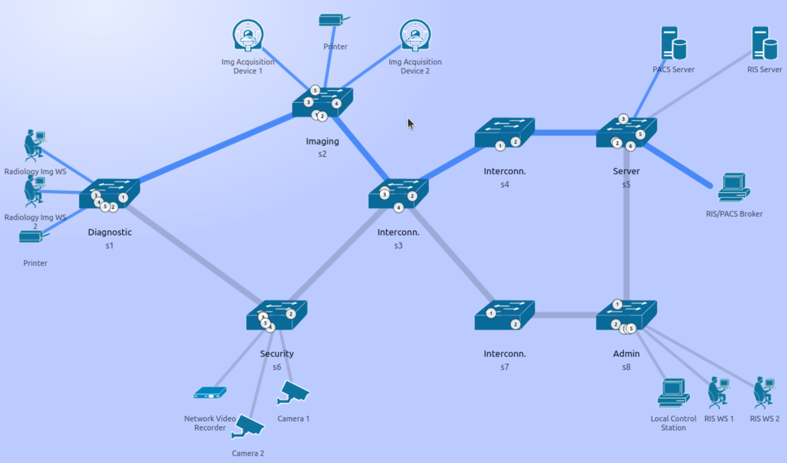  
*Slice Radiologia – Modalità Day*

**Modalità Night**  
Durante la modalità **NIGHT**, la slice Radiologia è **disattivata**, poiché lo studio radiologico è chiuso e non vengono eseguite attività di acquisizione delle immagini o refertazione.

---

### Slice Sicurezza 

Questa slice è attivabile sia in **modalità DAY** che in **modalità NIGHT**.  
Garantisce la comunicazione tra le **telecamere di sicurezza**, il **Network Video Recorder (NVR)** e la **Local Control Station**, supportando le operazioni di videosorveglianza, registrazione dei flussi video e monitoraggio in tempo reale dell’infrastruttura.

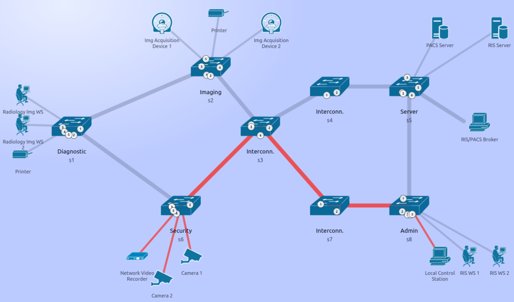  
*Slice Sicurezza – Modalità Day e Night*

---

### Slice Core Amministrativo

**Modalità Day**  
Questa slice è attivabile sia in **modalità DAY** che in **modalità NIGHT**.  
Garantisce la comunicazione tra il **RIS Server**, le **RIS Workstation**, il **broker RIS/PACS**, supportando le attività di prenotazione degli esami, gestione dei pazienti, produzione dei referti, consultazione dei dati clinici e amministrativi.

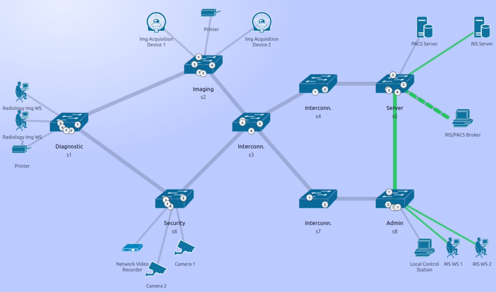  
*Slice Core Amministrativo – Modalità Day*

**Modalità Night**  
Durante la modalità **NIGHT**, la slice opera in **modalità limitata**, garantendo la comunicazione esclusivamente tra il **RIS Server** e le **RIS workstation** per consentire l’accesso ai dati e la continuità dei servizi essenziali di amministrazione.
Il **broker RIS/PACS** risulta spento, in quanto lo studio radiologico è chiuso e non sono richieste operazioni di integrazione tra i sistemi RIS e PACS.

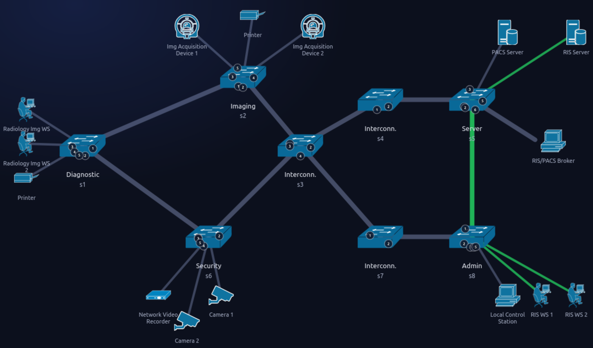  
*Slice Core Amministrativo – Modalità Night*

---

## Descrizione delle Slice di Servizio

### Service Slice Video / Non-Video

L'obiettivo è prioritizzare il traffico video generato dalle **telecamere di sicurezza**, dal **Network Video Recorder** e dalla **Local Control Station** , identificato esplicitamente come traffico **UDP con porta di destinazione 9999**.

Questo traffico deve essere instradato lungo il percorso dedicato che attraversa gli switch **s6, s3, s7, s8**, cioè la ** slice Video**

Tutto il restante traffico utilizza invece la **slice Non-Video**.

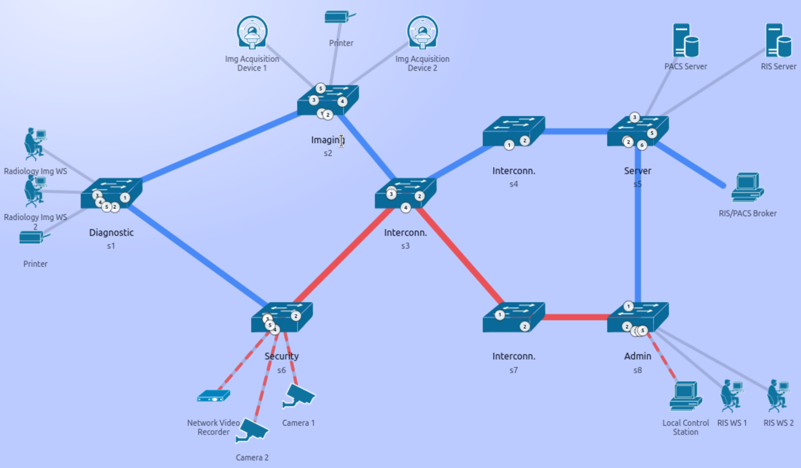  
*Slice Video e Non-Video*

## Controller Ryu

Questa sezione introduce i concetti fondamentali del framework Ryu utilizzati nel progetto.  

Ryu è un framework Software Defined Networking component-based.
Ryu mette a disposizione componenti software dotati di API ben definite, che consentono agli sviluppatori di realizzare con facilità nuove applicazioni per la gestione e il controllo della rete.  
Ryu supporta diversi protocolli southbound per la gestione dei dispositivi di rete, come ad esempio OpenFlow e Netconf.

### Applicazioni

Le applicazioni sono classi che ereditano da `ryu.base.app_manager.RyuApp`.  
Un’applicazione Ryu è singleton: per una determinata applicazione Ryu è supportata una sola istanza.
La logica definita dall’utente viene espressa sotto forma di applicazione.

Nel progetto sono definite le seguenti applicazioni Ryu:

| Applicazione | File |
|---|---|
| `Controller` | `controller.py` |
| `MonitorPrometheus` | `monitor_prometheus.py` |

### Eventi

Gli eventi sono oggetti di classi che ereditano da `ryu.controller.event.EventBase`.  
Una classe rappresentativa di un evento descrive un evento Ryu generato all’interno del sistema.  
Per convenzione, i nomi delle classi rappresentative degli eventi sono preceduti dal prefisso `"Event"`.  
La comunicazione tra applicazioni avviene attraverso la trasmissione e la ricezione di eventi.
Ogni applicazione dispone di una singola coda dedicata alla ricezione degli eventi.

Nel progetto vengono utilizzati i seguenti eventi:

| Evento | File |
|---|---|
| `EventOFPSwitchFeatures` | `controller.py` |
| `EventOFPStateChange` | `controller.py` |
| `EventOFPPacketIn` | `controller.py` |
| `EventOFPStateChange` | `monitor_prometheus.py` |
| `EventOFPFlowStatsReply` | `monitor_prometheus.py` |

### Threads

Ryu viene eseguito in ambiente multithread utilizzando eventlets.  
Poiché i thread non sono preemptive, è necessario prestare attenzione quando si eseguono operazioni che richiedono tempi elevati.
Per ogni applicazione viene creato automaticamente un thread.  
Questo thread esegue un event loop.  
Quando nella coda degli eventi è presente un evento, l’event loop lo preleva e richiama il corrispondente event handler, che verrà descritto successivamente.
È possibile creare thread aggiuntivi mediante la funzione `hub.spawn`, così da eseguire elaborazioni specifiche dell’applicazione.
Nel progetto, la creazione esplicita di thread aggiuntivi è utilizzata nel file `monitor_prometheus.py`, dove viene creato un thread dedicato all’invio periodico di richieste agli switch OpenFlow per l’acquisizione di informazioni statistiche.

### Eventi osservati

Un’applicazione Ryu può registrarsi per ascoltare eventi specifici utilizzando il decoratore `ryu.controller.handler.set_ev_cls`.

In particolare un event handler può essere definito decorando un metodo della classe applicazione con il decoratore `ryu.controller.handler.set_ev_cls`.  

Quando si verifica un evento del tipo specificato, l’event handler viene invocato dall’event loop dell’applicazione.

Nel progetto sono presenti i seguenti observe events:

| Applicazione | Metodo | Evento |
|---|---|---|
| `Controller` | `_switch_features_handler` | `EventOFPSwitchFeatures` |
| `Controller` | `_state_change_handler` | `EventOFPStateChange` |
| `Controller` | `_packet_in_handler` | `EventOFPPacketIn` |
| `MonitorPrometheus` | `_state_change_handler` | `EventOFPStateChange` |
| `MonitorPrometheus` | `_flow_stats_reply_handler` | `EventOFPFlowStatsReply` |

### Eventi generati

Un’applicazione Ryu può generare eventi richiamando gli opportuni metodi di `ryu.base.app_manager.RyuApp`, come `send_event` oppure `send_event_to_observers`.

### Datapath

Datapath è la classe che descrive uno switch OpenFlow connesso al controller. 

La classe Datapath svolge elaborazioni fondamentali, come la comunicazione effettiva con lo switch OpenFlow e la generazione degli eventi corrispondenti ai messaggi ricevuti.

Un’istanza dispone dei seguenti attributi e metodi.

| Attributo/metodo utilizzato | Descrizione |
|---|---|
| `id` | Datapath ID OpenFlow a 64 bit. Disponibile solo nella fase `ryu.controller.handler.MAIN_DISPATCHER`. |
| `ofproto` | Modulo che esporta le definizioni OpenFlow, principalmente le costanti presenti nella specifica, per la versione OpenFlow negoziata. |
| `ofproto_parser` | Modulo che esporta l’encoder e il decoder dei messaggi wire OpenFlow per la versione OpenFlow negoziata. |
| `ofproto_parser.OFPxxxx(datapath, ...)` | Funzione richiamabile per preparare un messaggio OpenFlow da inviare a uno switch specifico. Può essere inviato successivamente con `Datapath.send_msg`. `xxxx` rappresenta il nome del messaggio. Gli argomenti dipendono dal messaggio. |
| `send_msg(self, msg)` | Accoda un messaggio OpenFlow da inviare allo switch corrispondente. Se `msg.xid` è `None`, `set_xid` viene richiamato automaticamente sul messaggio prima dell’accodamento. |

### Packet

Packet è la classe che descrive un pacchetto di rete.

Un’istanza viene utilizzata per decodificare o codificare un singolo pacchetto.

| Attributo/metodo utilizzato | Descrizione |
|---|---|
| `Packet(data, protocols, parse_cls)` | Costruttore della classe. Permette di creare un oggetto Packet a partire da dati grezzi oppure da una lista di protocolli. |
| `get_protocol(protocol)` | Restituisce il primo protocollo trovato che corrisponde al protocollo specificato. |

## Switch OpenFlow

Uno switch OpenFlow è costituito da una o più flow table e da una group table oltre che da un canale OpenFlow verso un controller esterno.
 Lo switch comunica con il controller e il controller gestisce lo switch tramite il protocollo OpenFlow.

Ogni flow table presente nello switch contiene un insieme di flow entry; ciascuna flow entry è composta da campi di match, contatori e da un insieme di istruzioni da applicare ai pacchetti che soddisfano il match.

Quando un pacchetto viene elaborato da una flow table, esso viene confrontato con le flow entry presenti nella tabella per selezionare la flow entry corrispondente.

Se viene trovata una flow entry corrispondente, viene eseguito l’insieme di istruzioni associato a quella flow entry.

Se invece un pacchetto non corrisponde ad alcuna flow entry presente in una flow table, si verifica una table miss.

Nel progetto, il comportamento in caso di table miss è gestito dal metodo `_install_table_miss()`, che installa una table-miss flow entry con match vuoto e priorità minima. Tale regola specifica che tutti i pacchetti che non corrispondono ad alcuna flow entry precedentemente installata devono essere inoltrati al controller tramite la porta riservata `OFPP_CONTROLLER`.

Nel progetto, le flow entry inoltrano i pacchetti verso una porta. Nella maggior parte dei casi si tratta di una porta fisica dello switch, determinata dalla logica di forwarding definita dal controller in base alla destinazione e alla modalità di slicing/operativa attiva. 

Nel caso della table miss, invece, viene utilizzata una porta riservata per rappresentare l’invio del pacchetto al controller.

Nel progetto, le istruzioni associate a ciascuna flow entry contengono esclusivamente azioni che descrivono operazioni di inoltro del pacchetto. 

Non vengono invece utilizzate istruzioni che modificano la pipeline di elaborazione, né azioni di modifica del pacchetto o di elaborazione basati su group table.

In questa sezione vengono descritti alcuni termini fondamentali della specifica OpenFlow, utili per la comprensione del progetto:

- **Packet**: una trama Ethernet, comprensiva di intestazione e payload.

- **Flow Table**: uno stadio della pipeline di elaborazione. Contiene le flow entry.

- **Flow Entry**: un elemento di una flow table utilizzato per eseguire il match e il trattamento dei pacchetti. Contiene un insieme di campi di match, una priorità per determinare la precedenza nel matching, un insieme di contatori per monitorare i pacchetti e un insieme di istruzioni da applicare.

- **Match Field**: un campo rispetto al quale un pacchetto viene confrontato. Può includere campi dell’intestazione del pacchetto, la porta di ingresso e il valore dei metadata. Un match field può essere wildcarded, cioè può accettare qualunque valore, e in alcuni casi può essere soggetto a mascheramento bit a bit.

- **Instruction**: insieme di istruzioni associato a una flow entry, che descrive il comportamento OpenFlow da eseguire quando un pacchetto soddisfa il match. Un’istruzione può modificare l’elaborazione della pipeline, ad esempio inviando il pacchetto a un’altra flow table, oppure può contenere un insieme di azioni da aggiungere all’action set o una lista di azioni da applicare immediatamente al pacchetto.

- **Action**: operazione che inoltra il pacchetto verso una porta oppure ne modifica il contenuto, ad esempio decrementando il campo TTL. Le azioni possono essere specificate come parte dell’insieme di istruzioni associato a una flow entry oppure all’interno di un action bucket associato a una group entry. Le azioni possono essere accumulate nell’Action Set del pacchetto oppure applicate immediatamente.

- **Controller**: entità che interagisce con lo switch OpenFlow utilizzando il protocollo OpenFlow.

### Flow Table

Una flow table è composta da un insieme di flow entry.

Ogni flow entry contiene:
- **match fields**: utilizzati per confrontare i pacchetti. Comprendono la porta di ingresso e i campi dell’intestazione del pacchetto, ed eventualmente metadata provenienti da una tabella precedente.
- **priority**: determina la precedenza nel processo di matching tra più flow entry.
- **counters**: aggiornati quando i pacchetti soddisfano il match.
- **instructions**: definiscono le operazioni da applicare al pacchetto o modificano il comportamento della pipeline.
- **timeouts**: indicano il tempo massimo o il tempo di inattività oltre il quale la flow viene rimossa dallo switch.
- **cookie**: valore opaco definito dal controller, utilizzato per identificare le flow entry nelle operazioni di gestione (statistiche, modifica, cancellazione), ma non coinvolto nel processamento dei pacchetti. In particolare, viene utilizzato dal metodo `_delete_flows_by_cookie()` per cancellare soltanto le regole di forwarding associate a una determinata slice di topologia o di servizio.

Tramite il protocollo OpenFlow, il controller può aggiungere, aggiornare e rimuovere flow entry nelle flow table, sia in modo reattivo (in risposta ai pacchetti ricevuti) sia in modo proattivo.

Nel progetto vengono sperimentate e adottate entrambe le modalità. 
In particolare, nella modalità di slicing `TOPOLOGY` le flow entry vengono aggiunte in modo reattivo, mentre nella modalità di slicing `SERVICE` le flow entry relative al traffico non video vengono aggiunte in modo reattivo, mentre quelle relative al traffico video vengono aggiunte in modo proattivo.

| Nome del campo di match | Descrizione | Modalità di slicing |
|---|---|---|
| `in_port` | Numero della porta di ingresso del pacchetto | TOPOLOGY |
| `eth_dst` | Indirizzo MAC di destinazione del frame Ethernet | TOPOLOGY, SERVICE |
| `eth_src` | Indirizzo MAC sorgente del frame Ethernet | TOPOLOGY, SERVICE |
| `eth_type` | Tipo del frame Ethernet | SERVICE |
| `ip_proto` | Protocollo del pacchetto IP | SERVICE (slice video) |
| `udp_dst` | Numero di porta di destinazione del segmento UDP | SERVICE (slice video) |


Nel contesto del progetto, l’impiego del campo di match `in_port` non risulta strettamente necessario ai fini della corretta determinazione della porta di uscita.
 Sebbene la topologia presenti cicli a livello fisico, la politica di forwarding implementata non introduce cicli logici, in quanto per ogni coppia costituita da identificatore di switch e indirizzo MAC di destinazione è definita un’unica porta di inoltro.

Ne consegue che la decisione di forwarding dipende esclusivamente dallo switch attraversato e dalla destinazione del traffico, e non dalla porta attraverso cui il pacchetto viene ricevuto. 

L’utilizzo di `in_port` risulterebbe invece necessario qualora, sul medesimo switch, la porta di uscita associata a una stessa destinazione dovesse variare in funzione della porta di ingresso del pacchetto.

### Rimozione delle flow entry

Le flow entry possono essere rimosse dalle flow table in due modi: su richiesta del controller oppure tramite il meccanismo di scadenza automatica implementato dallo switch.

Nel progetto non viene utilizzato il meccanismo di scadenza automatica delle flow entry, poiché non vengono configurati timeout per la loro rimozione automatica.

Le flow entry dalle flow table  vengono invece rimosse su richiesta del controller e tale funzionalità è implementata nella classe `Controller`, in particolare tramite i metodi `_delete_flows_by_cookie()` e `_delete_all_flows()`, utilizzati rispettivamente per la rimozione selettiva delle flow associate a una specifica slice e per la cancellazione completa delle flow installate su uno switch.

### Istruzioni

Nel progetto viene utilizzata esclusivamente l’istruzione OpenFlow **Apply Actions**.

| Istruzione | Descrizione |
|---|---|
| **Apply Actions** | Applica immediatamente le azioni specificate al pacchetto, senza modificare l’action set. |

### Azioni

Nel progetto viene utilizzata esclusivamente l’azione **Output**.
L’azione Output inoltra un pacchetto verso una specifica porta OpenFlow.

### Contatori

I contatori sono mantenuti per ciascuna flow table, flow entry, porta, coda, gruppo, bucket di gruppo, meter e banda di meter. 

La durata si riferisce alla quantità di tempo per cui la flow entry, una porta, un gruppo, una coda o un meter è stato installato nello switch, e deve essere tracciata con precisione al secondo. 

Nel progetto vengono utilizzati esclusivamente contatori associati alle **flow entry**. 

In particolare, essi vengono letti dal metodo `_flow_stats_reply_handler()` della classe `PrometheusMonitor` definita nel file `monitor_prometheus.py`.


| Contatore |
|---|
| **Per Flow Entry** |
| `Pacchetti ricevuti` |
| `Byte ricevuti` |
| `Durata (secondi)` |
| `Durata (nanosecondi)` |


## Messaggi OpenFlow

Come la maggior parte delle piattaforme controller SDN, Ryu implementa nativamente la possibilità di costruire e inviare messaggi OpenFlow/SDN verso il piano dati programmabile.

Il protocollo OpenFlow supporta tre tipi di messaggi: controller-to-switch, asynchronous e symmetric, ciascuno con molteplici sottotipi.  
Lo scambio di messaggi controller-to-switch è avviato dal controller e sono utilizzati per gestire direttamente o ispezionare lo stato degli switch.
Lo scambio di messaggi asynchronous è avviato dagli switch e sono utilizzati per aggiornare il controller sugli eventi di rete e sui cambiamenti di stato degli switch.
I messaggi symmetric sono inviati sia dallo switch sia dal controller senza richiesta esplicita.

Nel progetto sono stati utilizzati solo messaggi di tipo controller-to-switch e asincroni.

| Messaggio | Tipo di Messaggio | Direzione |
|---|---|---|
| `OFPSwitchFeatures` | `Controller-to-Switch` | `Switch → Controller` |
| `OFPPacketIn` | `Asynchronous` | `Switch → Controller` |
| `OFPPacketOut` | `Controller-to-Switch` | `Controller → Switch` |
| `OFPFlowMod` | `Controller-to-Switch` | `Controller → Switch` |
| `OFPFlowStatsRequest` | `Controller-to-Switch` | `Controller → Switch` |
| `OFPFlowStatsReply` | `Controller-to-Switch` | `Switch → Controller` |

I tipi di messaggi utilizzati nel progetto sono descritti di seguito.

### Messaggi Controller-to-Switch

I messaggi controller-to-witch sono iniziati dal controller e possono o meno richiedere una risposta dallo switch.

I sottotipi dei messaggi Controller-to-Switch utilizzati nel progetto sono:

- **Modify-State:** utilizzati dal controller per gestire lo stato sugli switch. Il loro scopo principale è aggiungere, eliminare e modificare le flow entry nelle flow table, nonché impostare le proprietà delle porte dello switch.

- **Read-State:** utilizzati dal controller per raccogliere statistiche dalle flow table degli switch, dalle porte e dalle singole flow entry.

- **Packet-Out:** utilizzati dal controller per inviare pacchetti in uscita su una porta specificata dello switch

- **Handshake:** utilizzati nella fase di instaurazione della sessione.

#### Messaggi Modify-State

```python
class ryu.ofproto.ofproto_v1_0_parser.OFPFlowMod(datapath, match, cookie,
                                                 command, idle_timeout,
                                                 hard_timeout, priority,
                                                 buffer_id,
                                                 out_port, flags,
                                                 actions)
```

Il messaggio `OFPFlowMod` è utilizzato nei metodi `_install_table_miss`, `_add_flow`, `_delete_flows_by_cookie`, `_delete_all_flows`  della classe `Controller`.

Il controller invia questo messaggio per modificare la flow table degli switch.

| Attributo utilizzato  | Descrizione                                                                                                                                               |
| ----------- | --------------------------------------------------------------------------------------------------------------------------------------------------------- |
| `match`     | Istanza di `OFPMatch`.                                                                                                                                    |
| `cookie`    | Identificatore opaco controllato dal controller.                                                                                                          |
| `command`   | Uno dei seguenti valori: `OFPFC_ADD`, `OFPFC_MODIFY`, `OFPFC_MODIFY_STRICT`, `OFPFC_DELETE`, `OFPFC_DELETE_STRICT`.                                       |
| `priority`  | Livello di priorità della flow entry.                                                                                                                     |
| `buffer_id` | Buffer ID del pacchetto a cui fa riferimento `OFPPacketIn`. Non significativo per i comandi `OFPFC_DELETE*`.                                              |
| `out_port`  | Per i comandi `OFPFC_DELETE`, richiede che la corrispondenza includa questa porta come porta di uscita. Il valore `OFPP_NONE` indica nessuna restrizione. |
| `flags`     | Uno dei seguenti valori: `OFPFF_SEND_FLOW_REM`, `OFPFF_CHECK_OVERLAP`, `OFPFF_EMERG`.                                                                     |
| `actions`   | Lista di istanze `OFPAction*`.                                                                                                                            |


#### Messaggi Read-State

```python
class ryu.ofproto.ofproto_v1_0_parser.OFPFlowStatsRequest(datapath, flags, match,
                                                          table_id, out_port)
```

Nel progetto, il messaggio `OFPFlowStatsRequest` è utilizzato nel metodo `_request_flow_stats` della classe `MonitorPrometheus`.

Il controller utilizza questo messaggio per interrogare le statistiche di una singola flow entry.

| Attributo utilizzato | Descrizione |
|---|---|
| `flags` | Zero (nessuno ancora definito nella specifica). |
| `match` | Istanza di `OFPMatch`. |
| `table_id` | ID della tabella da leggere (`0xff` per tutte le tabelle oppure `0xfe` per emergenza). |
| `out_port` | Richiede che le entry corrispondenti includano questa porta come porta di uscita. Il valore `OFPP_NONE` indica nessuna restrizione. |

```python
class ryu.ofproto.ofproto_v1_0_parser.OFPFlowStatsReply(datapath)
```

Nel progetto, il messaggio `OFPFlowStatsReply` è utilizzato nel metodo `_flow_stats_reply_handler` della classe `MonitorPrometheus`.
Lo switch risponde con un messaggio contenente le statistiche di una singola flow entry in risposta a una richiesta di statistiche di una singola flow entry.

| Attributo utilizzato | Descrizione |
|---|---|
| `table_id` | ID della tabella da cui proviene la flow. |
| `match` | Istanza di `OFPMatch`. |
| `duration_sec` | Tempo per cui la flow è rimasta attiva, espresso in secondi. |
| `duration_nsec` | Tempo per cui la flow è rimasta attiva, espresso in nanosecondi oltre `duration_sec`. |
| `cookie` | Identificatore opaco emesso dal controller. |
| `packet_count` | Numero di pacchetti nella flow. |
| `byte_count` | Numero di byte nella flow. |

#### Messaggi Packet-Out

```python
class ryu.ofproto.ofproto_v1_5_parser.OFPPacketOut(datapath, buffer_id,
                                                   match, actions,
                                                   data, actions_len)
```

Il controller utilizza questo messaggio per inviare un pacchetto attraverso lo switch.

Nel progetto, il messaggio `OFPPacketOut` è utilizzato nei metodi `_packetout_single` e `_packet_in_handler` della classe `Controller`.

| Attributo utilizzato | Descrizione |
|---|---|
| `buffer_id` | ID assegnato dal datapath (`OFP_NO_BUFFER` se assente). |
| `actions` | Lista di classi di azioni OpenFlow. |
| `data` | Dati del pacchetto, sotto forma di valore binario oppure istanza di `packet.Packet`. |

#### Messaggi Handshake

Dopo il completamento dell’handshake con lo switch OpenFlow, viene aggiunta alla flow table la flow entry Table-miss, così da predisporre il controller alla ricezione dei messaggi `Packet-In`.  
In particolare, la Table-miss flow entry viene aggiunta al momento della ricezione del messaggio `Switch Features`.

```python
class ryu.ofproto.ofproto_v1_0_parser.OFPSwitchFeatures(datapath,
                                                        datapath_id,
                                                        n_buffers,
                                                        n_tables,
                                                        capabilities,
                                                        actions,
                                                        ports)
```

Nel progetto, il messaggio `OFPSwitchFeatures` è utilizzato nel metodo `switch_features_handler` della classe `Controller`.

| Attributo utilizzato | Descrizione |
|---|---|
| `datapath_id` | ID univoco del datapath. |

### Messaggi Asincroni

I messaggi asincroni vengono inviati senza che il controller li richieda agli switch. 
Gli switch inviano messaggi asincroni al controller per segnalare l’arrivo di un pacchetto, un cambiamento di stato dello switch oppure un errore.
Tra i quattro principali tipi di messaggi asynchronous, nel progetto viene utilizzato esclusivamente il messaggio Packet-In.

#### Messaggi Packet-In

Per tutti i pacchetti che non presentano una flow entry corrispondente nella tabella, viene inviato al controller un messaggio packet-in (oppure quando un pacchetto corrisponde a una entry che prevede un’azione di tipo “send to controller”).  
Questo messaggio è utilizzato per trasferire al controller l'elaborazione di un pacchetto. 
Se lo switch dispone di memoria sufficiente per bufferizzare i pacchetti inviati al controller, gli eventi packet-in contengono una parte dell’header del pacchetto (per impostazione predefinita 128 byte) e un buffer ID che può essere utilizzato dal controller quando è pronto a far inoltrare il pacchetto allo switch.  
Gli switch che non supportano il buffering interno (oppure che hanno esaurito il buffer interno disponibile) devono inviare al controller l’intero pacchetto come parte dell’evento.

Nel progetto, il messaggio `OFPPacketIn` è utilizzato nel metodo `_packet_in_handler` della classe `Controller`.

| Attributo utilizzato | Descrizione |
|---|---|
| `buffer_id` | Identificatore assegnato dal datapath. |
| `in_port` | Porta sulla quale il frame è stato ricevuto. |
| `data` | Frame Ethernet. |

## Progettazione del Controller e Logica Decisionale

La logica di controllo della rete è descritta in più file: `controller.py`, `MacToPortMapper.py`, `ProblemConstants.py` e `traffic_simulation.py`.

### `controller.py`

#### Classe `Controller`

La classe `Controller` estende la classe `RyuApp` del framework Ryu e rappresenta il componente che consente di astrarre l’infrastruttura degli switch sottostanti, rendendola direttamente programmabile.

Ryu dispone di una funzionalità di Web server corrispondente a WSGI. Utilizzando questa funzionalità, è possibile creare una REST API, utile per collegarsi ad altri sistemi o a browser.

WSGI è la **Web Server Gateway Interface**. Si tratta di una **specifica** che descrive **come un server web comunica con le applicazioni web** e **come più applicazioni web possono essere concatenate tra loro per elaborare una singola richiesta**.


| Nome attributo | Descrizione |
|---|---|
| `OFP_VERSIONS` | lista delle versioni del protocollo OpenFlow supportate dall’applicazione Ryu. Nel progetto viene utilizzata OpenFlow 1.3. |
| `wsgi` | istanza di `WSGIApplication`, utilizzata per registrare la classe che implementa gli endpoint REST del controller. |
| `datapaths` | dizionario che mantiene i datapath associati agli switch OpenFlow attualmente connessi al controller. |
| `learned` | Dizionario utilizzato dal controller per memorizzare, per ciascun identificatore di switch, l’associazione tra indirizzo MAC appreso e porta di ingresso osservata. |
| `state` | istanza di `ControllerState`, che rappresenta lo stato operativo corrente del controller, includendo la modalità di slicing attiva, la modalità operativa attiva e l’insieme delle slice attive. |
| `traffic_sim` | istanza di `TrafficSimulationManager`, utilizzata per la gestione delle simulazioni di traffico. |


I metodi principali della classe sono:

- `__init__(self, *args, **kwargs)`  
  inizializza il controller, le sue strutture dati interne e il supporto WSGI per la REST API.  
  Il costruttore acquisisce inoltre l’istanza di `WSGIApplication`, necessaria per registrare la classe controller.  
  Per effettuare tale registrazione viene utilizzato il metodo `register()`.  
  Durante la chiamata a `register()`, viene passato un oggetto dizionario con chiave `simple_switch_api_app`, in modo che il costruttore della classe `ControllerServer` possa accedere all’istanza del controller principale.  

- `switch_features_handler(self, ev)`  
  rappresenta l’handler associato all’evento `EventOFPSwitchFeatures`, generato da uno switch OpenFlow al termine dell’handshake con il controller.  
  All’interno del metodo viene acquisito il `datapath` associato allo switch che ha generato l’evento e viene installata nella tabella di flusso del datapath, la flow entry di table-miss.  

- `_state_change_handler(self, ev)`  
  rappresenta l’handler associato all’evento `EventOFPStateChange`, che segnala un cambiamento di stato di un datapath OpenFlow.  
  All’interno del metodo il datapath viene aggiunto oppure rimosso dal dizionario dei datapath connessi, in funzione dello stato della connessione.

- `_packet_in_handler(self, ev)`  
  rappresenta l’handler associato all’evento `EventOFPPacketIn`, generato quando il controller riceve un messaggio `Packet-In` da un datapath, contenente un pacchetto che non ha trovato corrispondenza in alcuna flow entry già presente nella flow table.
  All’interno del metodo vengono acquisiti il messaggio ricevuto, il datapath che lo ha generato, il parser OpenFlow associato, la porta di ingresso e l’identificatore del datapath in formato stringa.  
  A partire dai dati del messaggio viene ricostruito il pacchetto ricevuto e ne viene estratta l’intestazione Ethernet.  
  Se l’intestazione Ethernet non è presente, il metodo termina immediatamente.  
  Se il pacchetto appartiene al protocollo LLDP (`ethertype = 0x88cc`), il metodo termina immediatamente, poiché tale traffico viene utilizzato per il discovery della topologia e non deve essere gestito dalla logica di forwarding del progetto.  
  Se il pacchetto appartiene al protocollo ARP (`ethertype = 0x0806`), il metodo termina immediatamente.  
  Dal pacchetto vengono quindi ricavati l’indirizzo MAC sorgente e l’indirizzo MAC di destinazione.  
  Vengono inoltre estratti, se presenti, il pacchetto IPv4 e il segmento UDP.  
  Il metodo determina quindi se il traffico corrente debba essere classificato come traffico video, verificando contemporaneamente:
  - che il pacchetto contenga un’intestazione IPv4;
  - che il pacchetto contenga un’intestazione UDP;
  - la corrispondenza della porta UDP di destinazione con `VIDEO_UDP_DST_PORT`;
  - l’appartenenza dell’host sorgente a `VIDEO_HOST_MACS`;
  - l’appartenenza dell’host di destinazione a `VIDEO_HOST_MACS`.
  
  Se la modalità di slicing attiva è `SERVICE`, il metodo entra nel ramo di service slicing.  
  In questa modalità, se `SERVICE_SLICE_VIDEO` non è abilitata, il metodo termina immediatamente.
  Successivamente viene selezionata la mappa di forwarding da utilizzare:
  - `SERVICE_VIDEO_MAP` se il traffico corrente è classificato come traffico video;
  - `SERVICE_NONVIDEO_MAP` in caso contrario.  
  Dalla mappa selezionata viene quindi ricavata la porta di uscita associata all’indirizzo MAC di destinazione.  
  Se la porta di uscita è definita, il metodo richiama `_service_install_flow_for_packet()` per installare la regola corrispondente al pacchetto corrente e richiama `_packetout_single()` per inoltrare immediatamente il pacchetto.  
  Se la porta di uscita non è definita, il metodo termina immediatamente.  
  Al termine del ramo `SERVICE`, il metodo termina sempre con `return`.
  
  Se la modalità di slicing attiva non è `SERVICE`, il metodo esegue il ramo di topology slicing.  
  In questo ramo viene innanzitutto verificato se almeno una slice di topologia risulti attualmente attiva nel mapper associato alla modalità operativa corrente.  
  Se nessuna slice di topologia è attiva, il metodo termina immediatamente.  
  Successivamente viene inizializzata, se non già presente, la struttura di apprendimento associata al datapath corrente.  
  Il metodo aggiorna quindi la struttura `learned`, associando al datapath corrente l’indirizzo MAC sorgente e la porta di ingresso osservata.  
  Viene quindi acquisito il mapper associato alla modalità operativa attiva.  
  La porta di uscita e l’identificatore della slice vengono ricavati richiamando `_topology_resolve_out_port_and_slice()`.  
  Se la porta di uscita non è definita, il metodo termina immediatamente.  
  In caso contrario viene costruita l’azione di inoltro verso la porta di uscita individuata.  
  Viene inoltre costruita la condizione di matching per il flusso corrente, basata su porta di ingresso, indirizzo MAC sorgente e indirizzo MAC di destinazione.  
  Se la porta di uscita non corrisponde al flooding, il metodo richiama `_add_flow()` per installare la regola di forwarding associata alla slice individuata.  
  Infine il metodo richiede l’inoltro immediato del pacchetto corrente verso la porta di uscita determinata.
 
- `_install_table_miss(self, datapath)`  
  installa nella flow table dello switch la regola di table-miss.  

- `_delete_all_flows(self, datapath)`  
  rimuove dalla flow table dello switch tutte le flow entry installate dal controller.  

- `_delete_flows_by_cookie(self, datapath, cookie)`  
  rimuove dalla flow table dello switch solo le flow entry associate a un determinato valore di `cookie`.  

- `reset_everything(self)`  
  rimuove , per tutti i datapath attualmente connessi al controller, tutte le flow entry installate dal controller e reinstalla la regola di table-miss nelle loro flow table.

- `_topology_resolve_out_port_and_slice(self, mapper, dpid_str, src_mac, dst_mac)`  
  determina la porta di uscita e l’identificatore della slice di topologia da utilizzare per un pacchetto diretto verso un host di destinazione.  
  All’interno del metodo viene innanzitutto acquisita, a partire dal mapper ricevuto in ingresso, la mappa di forwarding associata alla modalità operativa corrente.  
  Successivamente il metodo scorre l’insieme delle slice di topologia attualmente abilitate.
  Per ciascuna slice, viene verificato se sia l’host sorgente sia l’host di destinazione appartengono a quella stessa slice.  
  Se sorgente e destinazione appartengono alla stessa slice, il metodo ricerca nella mappa di forwarding, per l’identificatore di switch `dpid_str`, la porta di uscita associata all’indirizzo MAC di destinazione.  
  Se la porta di uscita è presente, il metodo restituisce la coppia costituita dalla porta di uscita individuata e dall’identificatore della slice corrente.  
  Se nessuna slice abilitata contiene contemporaneamente host sorgente e host di destinazione, oppure se per lo switch corrente non risulta definita alcuna porta di uscita verso la destinazione, il metodo restituisce `None` come porta di uscita e `None` come identificatore della slice.

- `_install_proactive_video_rules(self)`  
  installa proattivamente le regole di forwarding per il traffico video.
  All’interno del metodo viene innanzitutto verificato che la modalità di slicing attiva sia `SERVICE` e che la video slice risulti attiva.  
  Successivamente, per ciascun datapath appartenente alla video slice, vengono considerate tutte le possibili coppie di host video sorgente–destinazione.  
  Per ogni coppia, il metodo ricava la porta di uscita associata all’host di destinazione e costruisce una flow entry con priorità `200`, caratterizzata da una condizione di matching che seleziona traffico IPv4, traffico UDP, indirizzo MAC sorgente, indirizzo MAC di destinazione e porta UDP di destinazione uguale a `VIDEO_UDP_DST_PORT`.  
  La flow entry viene quindi installata associandola a un’azione di inoltro verso la porta di uscita individuata.  
  In questo modo, il traffico video viene instradato direttamente secondo le regole della video slice, senza attendere la ricezione del primo pacchetto.

- `_add_flow(self, ...)`  
  installa una singola regola di forwarding su uno switch.  

- `_packetout_single(self, ...)`  
  inoltra un singolo pacchetto su una specifica porta dello switch.  

- `_ports_from_dstmac_map(self, dstmac_map, dst_mac)`  
  determina l’insieme delle porte di uscita associate a un determinato indirizzo MAC di destinazione.  
  All’interno del metodo viene consultata la struttura `dstmac_map`, che associa indirizzi MAC di destinazione alle corrispondenti porte di uscita.  
  Se l’indirizzo MAC di destinazione richiesto risulta presente nella struttura, il metodo restituisce l’insieme delle porte associate; in caso contrario restituisce un insieme vuoto.

- `_topology_cookie(self, slice_no)`  
  genera il valore di `cookie` da associare alle flow entry installate per una specifica slice di topologia.  
  All’interno del metodo il valore del `cookie` viene costruito sommando a `1000` il numero della slice ricevuto in ingresso.  
  In questo modo, le regole appartenenti a slice differenti risultano marcate con valori distinti e possono essere successivamente identificate e rimosse in modo selettivo.


### `MacToPortMapper.py`

Il file `MacToPortMapper.py` contiene la definizione della classe `MacToPortMapper`, utilizzata dal controller per determinare, dato uno switch e un host di destinazione, quale porta di uscita debba essere utilizzata per inoltrare il traffico in funzione delle slice attive.

La classe mantiene una rappresentazione interna dello stato di slicing, delle incompatibilità tra slice e della mappa cumulativa di forwarding utilizzata dal controller per risolvere la porta di uscita a partire dal `dpid` dello switch e dal MAC di destinazione.

I principali attributi della classe sono riportati nella tabella seguente.

| Nome attributo | Descrizione |
|---|---|
| `slices_rules` | Lista di regole di forwarding. Ogni elemento della lista rappresenta una slice e contiene, per ciascun identificatore di switch, l’associazione tra indirizzo MAC di destinazione e porta di uscita. |
| `slice_hosts` | Lista in cui ogni elemento rappresenta una slice e contiene gli indirizzi MAC degli host appartenenti a quella slice. |
| `map` | Dizionario utilizzato come mappa di forwarding del controller. Per ciascun identificatore di switch, associa ogni indirizzo MAC di destinazione alla porta di uscita da utilizzare per raggiungerlo. |
| `active_slice` | Vettore di stato delle slice. Ogni elemento del vettore rappresenta una slice e indica se essa è attualmente attiva oppure no. |
| `adjacency_list` | Lista in cui ogni elemento rappresenta una slice e contiene gli identificatori delle slice che non possono essere attivate contemporaneamente a essa.  |

I metodi principali della classe sono:

- `verify_add_compatibility()`  
  Controlla se una slice può essere attivata senza violare i vincoli di compatibilità con le slice che risultano già attive.

- `add_slice()`  
  Attiva una slice aggiornando il vettore `active_slice` e inserendo nel dizionario `map`, per ciascun identificatore di switch, le associazioni tra indirizzo MAC di destinazione e porta di uscita definite per la slice corrispondente in `slices_rules`.

- `remove_slice()`  
  Disattiva una slice aggiornando il vettore `active_slice` e ricostruendo il dizionario `map` utilizzando, per ciascun identificatore di switch, le associazioni tra indirizzo MAC di destinazione e porta di uscita relative alle sole slice che risultano ancora attive.

- `get_map()`  
  Restituisce il dizionario che associa, per ciascun identificatore di switch, ogni indirizzo MAC di destinazione alla porta di uscita da utilizzare per raggiungerlo.

---

### `ProblemConstants.py`

Il file `ProblemConstants.py` contiene la definizione di costanti, strutture dati e classi utilizzate dal controller e dal mapper per configurare il comportamento della rete in funzione della modalità operativa e di slicing attive.

Le principali costanti definite nel file sono riportati nella tabella seguente.

| Nome costante | Descrizione |
|---|---|
| `DEFAULT_REST_PORT` | Costante intera che rappresenta il numero di porta TCP sulla quale il controller espone il servizio REST. |
| `VIDEO_UDP_DST_PORT` | Costante intera che rappresenta il numero di porta UDP utilizzato per identificare il traffico video. |
| `HOST_MAC` | Alias del dizionario `topology_defs.HOSTS`, utilizzato per accedere agli indirizzi MAC degli host definiti nella topologia. |
| `TOPOLOGY_DAY_SLICES_RULES` | Lista di regole di forwarding utilizzata nella modalità di slicing di topologia e modalità operativa `DAY`. Ogni elemento della lista rappresenta una slice e, per ciascun identificatore di switch, associa ogni indirizzo MAC di destinazione alla relativa porta di uscita. |
| `TOPOLOGY_NIGHT_SLICES_RULES` | Lista di regole di forwarding utilizzata nella modalità di slicing di topologia e modalità operativa `NIGHT`. Ogni elemento della lista rappresenta una slice e, per ciascun identificatore di switch, associa ogni indirizzo MAC di destinazione alla relativa porta di uscita. |
| `SERVICE_NONVIDEO_MAP` | Dizionario che rappresenta la mappa di forwarding utilizzata nella modalità di slicing di servizio per il traffico non video. Per ciascun identificatore di switch associa ogni indirizzo MAC di destinazione alla porta di uscita corrispondente. |
| `SERVICE_VIDEO_MAP` | Dizionario che rappresenta la mappa di forwarding utilizzata nella modalità di slicing di servizio per il traffico video. Per ciascun identificatore di switch associa ogni indirizzo MAC di destinazione alla porta di uscita corrispondente. |

#### Classe `ProblemConstants`

La classe `ProblemConstants` raccoglie costanti globali utilizzate dai moduli di controllo e di slicing.

I principali attributi della classe sono riportati nella tabella seguente.

| Nome attributo | Descrizione |
|---|---|
| `NUM_SLICES` | Numero totale di slice supportate dal sistema. |
| `INCOMPATIBLE_SLICES` | Struttura che rappresenta i vincoli di incompatibilità tra slice. Nel file nessuna slice risulta incompatibile con le altre. |

#### Classe `ControllerState`

La classe `ControllerState` rappresenta lo stato operativo corrente del controller, includendo la modalità di slicing attiva, la modalità operativa attiva e l’insieme delle slice attive.

I principali attributi della classe sono riportati nella tabella seguente.

| Nome attributo | Descrizione |
|---|---|
| `active_slicing_mode` | Variabile di stato che rappresenta la modalità di slicing attualmente utilizzata dal controller. |
| `active_mode` | Variabile di stato che rappresenta la modalità operativa attualmente attiva, cioè `DAY` oppure `NIGHT`. |
| `enabled_topology` | Insieme delle slice di topologia attualmente attive nel controller. |
| `enabled_service` | Insieme delle slice di servizio attualmente attive nel controller. |
| `mappers` | Dizionario che associa a ciascuna modalità operativa il relativo oggetto `MacToPortMapper`, utilizzato per determinare le porte di uscita sulla base delle slice attive. |

I metodi principali della classe sono:

- `__init__()`  
  Inizializza lo stato del controller impostando come modalità di slicing `TOPOLOGY`, come modalità operativa `DAY` e inizializzando gli insiemi delle slice abilitate come vuoti.

---

## Configurazione dell’Applicazione e Comandi di Test

### Installazione

1. Spostarsi nella directory del progetto:
   
```bash
cd radiology-lab-slicing/progetto
```
---

### Avvio

Questa sezione fornisce tutti i comandi necessari per avviare e testare
l’applicazione.

2. Avviare il controller:
```bash
sudo ryu-manager progetto/first_topology/controller.py progetto/first_topology/monitoring/monitor_prometheus.py --verbose
```

ryu-manager è l’eseguibile utilizzato per avviare le applicazioni Ryu. Esso carica le applicazioni Ryu e le esegue.

3. Avviare Prometheus e Grafana

```bash
docker-compose -f docker-compose.monitor.yml up -d
```

L'opzione -f del comando docker-compose specifica il nome e il percorso del Compose file.

4. Avviare la topologia Mininet:
```bash
sudo python3 first_topology/topology.py
```

5. Accedere alla GUI: aprire il browser e accedere al sito:
```
http://localhost:8080/ui/index.html
```

---

### Test

Questa sezione guida attraverso i test di connettività di base e la verifica
della corretta classificazione del traffico video, per assicurarsi che lo slicing sia implementato correttamente.

---

#### Test di Connettività di Base (ping)

Utilizzare questo test per verificare quali host possono comunicare tra loro,
in base alle slice di topologia o di servizio attualmente attive.

```bash
mininet> pingall
```

Il comando produce una matrice di connettività che mostra quali host riescono
a raggiungere gli altri.  
Se le regole sono corrette, solo gli host appartenenti alla stessa slice
dovrebbero poter comunicare.

---

#### Esempio: output pingall – Modalità Operativa Topology - Day - Slice Radiologia attiva

```bash
mininet> pingall
*** Ping: testing ping reachability
hBroker -> X X hImgDev1 hImgDev2 hPACS hPrDiag hPrImg X X X hRadWS1 hRadWS2 X X 
hCam1 -> X X X X X X X X X X X X X X 
hCam2 -> X X X X X X X X X X X X X X 
hImgDev1 -> hBroker X X hImgDev2 hPACS hPrDiag hPrImg X X X hRadWS1 hRadWS2 X X 
hImgDev2 -> hBroker X X hImgDev1 hPACS hPrDiag hPrImg X X X hRadWS1 hRadWS2 X X 
hPACS -> hBroker X X hImgDev1 hImgDev2 hPrDiag hPrImg X X X hRadWS1 hRadWS2 X X 
hPrDiag -> hBroker X X hImgDev1 hImgDev2 hPACS hPrImg X X X hRadWS1 hRadWS2 X X 
hPrImg -> hBroker X X hImgDev1 hImgDev2 hPACS hPrDiag X X X hRadWS1 hRadWS2 X X 
hRIS -> X X X X X X X X X X X X X X 
hRISW1 -> X X X X X X X X X X X X X X 
hRISW2 -> X X X X X X X X X X X X X X 
hRadWS1 -> hBroker X X hImgDev1 hImgDev2 hPACS hPrDiag hPrImg X X X hRadWS2 X X 
hRadWS2 -> hBroker X X hImgDev1 hImgDev2 hPACS hPrDiag hPrImg X X X hRadWS1 X X 
lCS -> X X X X X X X X X X X X X X 
nvr -> X X X X X X X X X X X X X X 
*** Results: 73% dropped (56/210 received)
```

In questo scenario, solo gli host appartenenti alla slice Radiologia
riescono a comunicare tra loro.

#### Esempio: output pingall – Modalità Operativa Topology - Day - Slice Sicurezza attiva

```bash
mininet> pingall
*** Ping: testing ping reachability
hBroker -> X X X X X X X X X X X X X X 
hCam1 -> X hCam2 X X X X X X X X X X lCS nvr 
hCam2 -> X hCam1 X X X X X X X X X X lCS nvr 
hImgDev1 -> X X X X X X X X X X X X X X 
hImgDev2 -> X X X X X X X X X X X X X X 
hPACS -> X X X X X X X X X X X X X X 
hPrDiag -> X X X X X X X X X X X X X X 
hPrImg -> X X X X X X X X X X X X X X 
hRIS -> X X X X X X X X X X X X X X 
hRISW1 -> X X X X X X X X X X X X X X 
hRISW2 -> X X X X X X X X X X X X X X 
hRadWS1 -> X X X X X X X X X X X X X X 
hRadWS2 -> X X X X X X X X X X X X X X 
lCS -> X hCam1 hCam2 X X X X X X X X X X nvr 
nvr -> X hCam1 hCam2 X X X X X X X X X X lCS 
*** Results: 94% dropped (12/210 received)
```

In questo scenario, solo gli host appartenenti alla slice Sicurezza
riescono a comunicare tra loro.

#### Esempio: output pingall – Modalità Operativa Topology - Day - Slice Core Amministrativo attiva

```bash
mininet> pingall
*** Ping: testing ping reachability
hBroker -> X X X X X X X hRIS hRISW1 hRISW2 X X X X 
hCam1 -> X X X X X X X X X X X X X X 
hCam2 -> X X X X X X X X X X X X X X 
hImgDev1 -> X X X X X X X X X X X X X X 
hImgDev2 -> X X X X X X X X X X X X X X 
hPACS -> X X X X X X X X X X X X X X 
hPrDiag -> X X X X X X X X X X X X X X 
hPrImg -> X X X X X X X X X X X X X X 
hRIS -> hBroker X X X X X X X hRISW1 hRISW2 X X X X 
hRISW1 -> hBroker X X X X X X X hRIS hRISW2 X X X X 
hRISW2 -> hBroker X X X X X X X hRIS hRISW1 X X X X 
hRadWS1 -> X X X X X X X X X X X X X X 
hRadWS2 -> X X X X X X X X X X X X X X 
lCS -> X X X X X X X X X X X X X X 
nvr -> X X X X X X X X X X X X X X 
*** Results: 94% dropped (12/210 received)
```

In questo scenario, solo gli host appartenenti alla slice Core Amministrativo
riescono a comunicare tra loro.

#### Esempio: output pingall – Modalità Operativa Topology - Night - Slice Core Amministrativo attiva

```bash
mininet> pingall
*** Ping: testing ping reachability
hBroker -> X X X X X X X X X X X X X X 
hCam1 -> X X X X X X X X X X X X X X 
hCam2 -> X X X X X X X X X X X X X X 
hImgDev1 -> X X X X X X X X X X X X X X 
hImgDev2 -> X X X X X X X X X X X X X X 
hPACS -> X X X X X X X X X X X X X X 
hPrDiag -> X X X X X X X X X X X X X X 
hPrImg -> X X X X X X X X X X X X X X 
hRIS -> X X X X X X X X hRISW1 hRISW2 X X X X 
hRISW1 -> X X X X X X X X hRIS hRISW2 X X X X 
hRISW2 -> X X X X X X X X hRIS hRISW1 X X X X 
hRadWS1 -> X X X X X X X X X X X X X X 
hRadWS2 -> X X X X X X X X X X X X X X
lCS -> X X X X X X X X X X X X X X 
nvr -> X X X X X X X X X X X X X X 
```

#### Esempio: output pingall – Modalità Operativa Topology - Day - Slice Radiologia, Sicurezza e Core Amministrativo attive

```bash
mininet> pingall
*** Ping: testing ping reachability
hBroker -> X X hImgDev1 hImgDev2 hPACS X X hRIS hRISW1 hRISW2 X X X X 
hCam1 -> X hCam2 X X X X X X X X X X lCS nvr 
hCam2 -> X hCam1 X X X X X X X X X X lCS nvr 
hImgDev1 -> hBroker X X hImgDev2 hPACS hPrDiag hPrImg X X X hRadWS1 hRadWS2 X X 
hImgDev2 -> hBroker X X hImgDev1 hPACS hPrDiag hPrImg X X X hRadWS1 hRadWS2 X X 
hPACS -> hBroker X X hImgDev1 hImgDev2 hPrDiag hPrImg X X X hRadWS1 hRadWS2 X X 
hPrDiag -> X X X hImgDev1 hImgDev2 hPACS hPrImg X X X hRadWS1 hRadWS2 X X 
hPrImg -> X X X hImgDev1 hImgDev2 hPACS hPrDiag X X X hRadWS1 hRadWS2 X X 
hRIS -> hBroker X X X X X X X hRISW1 hRISW2 X X X X 
hRISW1 -> hBroker X X X X X X X hRIS hRISW2 X X X X 
hRISW2 -> hBroker X X X X X X X hRIS hRISW1 X X X X 
hRadWS1 -> X X X hImgDev1 hImgDev2 hPACS hPrDiag hPrImg X X X hRadWS2 X X 
hRadWS2 -> X X X hImgDev1 hImgDev2 hPACS hPrDiag hPrImg X X X hRadWS1 X X 
lCS -> X hCam1 hCam2 X X X X X X X X X X nvr 
nvr -> X hCam1 hCam2 X X X X X X X X X X lCS 
*** Results: 65% dropped (72/210 received)
```

#### Esempio: output pingall – Modalità Operativa Service con Video Slice attiva

```bash
mininet> pingall
*** Ping: testing ping reachability
hBroker -> hCam1 hCam2 hImgDev1 hImgDev2 hPACS hPrDiag hPrImg hRIS hRISW1 hRISW2 hRadWS1 hRadWS2 lCS nvr 
hCam1 -> hBroker hCam2 hImgDev1 hImgDev2 hPACS hPrDiag hPrImg hRIS hRISW1 hRISW2 hRadWS1 hRadWS2 lCS nvr 
hCam2 -> hBroker hCam1 hImgDev1 hImgDev2 hPACS hPrDiag hPrImg hRIS hRISW1 hRISW2 hRadWS1 hRadWS2 lCS nvr 
hImgDev1 -> hBroker hCam1 hCam2 hImgDev2 hPACS hPrDiag hPrImg hRIS hRISW1 hRISW2 hRadWS1 hRadWS2 lCS nvr 
hImgDev2 -> hBroker hCam1 hCam2 hImgDev1 hPACS hPrDiag hPrImg hRIS hRISW1 hRISW2 hRadWS1 hRadWS2 lCS nvr 
hPACS -> hBroker hCam1 hCam2 hImgDev1 hImgDev2 hPrDiag hPrImg hRIS hRISW1 hRISW2 hRadWS1 hRadWS2 lCS nvr 
hPrDiag -> hBroker hCam1 hCam2 hImgDev1 hImgDev2 hPACS hPrImg hRIS hRISW1 hRISW2 hRadWS1 hRadWS2 lCS nvr 
hPrImg -> hBroker hCam1 hCam2 hImgDev1 hImgDev2 hPACS hPrDiag hRIS hRISW1 hRISW2 hRadWS1 hRadWS2 lCS nvr 
hRIS -> hBroker hCam1 hCam2 hImgDev1 hImgDev2 hPACS hPrDiag hPrImg hRISW1 hRISW2 hRadWS1 hRadWS2 lCS nvr 
hRISW1 -> hBroker hCam1 hCam2 hImgDev1 hImgDev2 hPACS hPrDiag hPrImg hRIS hRISW2 hRadWS1 hRadWS2 lCS nvr 
hRISW2 -> hBroker hCam1 hCam2 hImgDev1 hImgDev2 hPACS hPrDiag hPrImg hRIS hRISW1 hRadWS1 hRadWS2 lCS nvr 
hRadWS1 -> hBroker hCam1 hCam2 hImgDev1 hImgDev2 hPACS hPrDiag hPrImg hRIS hRISW1 hRISW2 hRadWS2 lCS nvr 
hRadWS2 -> hBroker hCam1 hCam2 hImgDev1 hImgDev2 hPACS hPrDiag hPrImg hRIS hRISW1 hRISW2 hRadWS1 lCS nvr 
lCS -> hBroker hCam1 hCam2 hImgDev1 hImgDev2 hPACS hPrDiag hPrImg hRIS hRISW1 hRISW2 hRadWS1 hRadWS2 nvr 
nvr -> hBroker hCam1 hCam2 hImgDev1 hImgDev2 hPACS hPrDiag hPrImg hRIS hRISW1 hRISW2 hRadWS1 hRadWS2 lCS 
*** Results: 0% dropped (210/210 received)
```

In questo scenario, solo gli host appartenenti alla slice Radiologia
riescono a comunicare tra loro.

#### Esempio: output pingall – Modalità Operativa Service con Video Slice disattivata / Modalità Operativa Topology Day/Night con nessuna slice di topologia attivata

```bash
mininet> pingall
*** Ping: testing ping reachability
hBroker -> X X X X X X X X X X X X X X
hCam1   -> X X X X X X X X X X X X X X
hCam2   -> X X X X X X X X X X X X X X
hImgDev1 -> X X X X X X X X X X X X X X
hImgDev2 -> X X X X X X X X X X X X X X
hPACS   -> X X X X X X X X X X X X X X
hPrDiag -> X X X X X X X X X X X X X X
hPrImg  -> X X X X X X X X X X X X X X
hRIS    -> X X X X X X X X X X X X X X
hRISW1  -> X X X X X X X X X X X X X X
hRISW2  -> X X X X X X X X X X X X X X
hRadWS1 -> X X X X X X X X X X X X X X
hRadWS2 -> X X X X X X X X X X X X X X
lCS     -> X X X X X X X X X X X X X X
nvr     -> X X X X X X X X X X X X X X
*** Results: 100% dropped (0/210 received)
```

In questi scenari, nessun host riesce a comunicare con gli altri, poichè il controller è stato progettato in modo tale da non installare alcuna regola sugli switch e tutti i pacchetti vengono scartati.

---

#### Test della Modalità Operativa Service

Nel nostro scenario di test viene simulata la generazione di traffico video e non video **dalla telecamera di sicurezza hCam1 verso la Local Control Station (lCS)**.

Sulla base della topologia della rete e delle regole di *Service Slicing* definite nel controller, il traffico viene diretto lungo percorsi differenti in funzione della sua classificazione.

In particolare, il **traffico video**, essendo generato da un host "video", viene diretto esclusivamente lungo il percorso dedicato della *video Slice*, che attraversa gli switch **s6, s3, s7 e s8**.

Tutto il restante traffico generato tra gli stessi host viene invece classificato come **non-Video** e diretto lungo la *non-Video Slice*, che invece attraversa gli host **s6, s1, s2, s3, s4, s5 e s8**.

Per generare traffico video dall'host hCam1 verso l'host lCs è necessario:

1. Avviare il server iperf su lCS

```bash
mininet> lCS iperf -s -u -p 9999 &
```
dove:

* `-s` esegue iPerf in modalità server.
* `-u` forza l’utilizzo del protocollo **UDP**.
* `-p 9999` indica la porta su cui il server resta in ascolto.
* il carattere speciale `&` esegue iperf in background.

1. Utilizzare il comando

```bash
mininet> hCam1 iperf -c 10.0.0.10 -u -p 9999 -t 40 -b 5M
```

dove sono state utilizzate le seguenti opzioni:

* `-c 10.0.0.10` esegue iPerf in modalità client, connettendosi a un server iPerf in esecuzione sull’host specificato con indirizzo IP 10.0.0.10. L’indirizzo IP indicato corrisponde alla **Local Control Station (LCS)**.

* `-u` forza l’utilizzo del protocollo **UDP**.

* `-p 9999` indica la porta alla quale il client si connette. Questo valore deve essere lo stesso sia lato server che lato client. In questo caso la porta è 9999.

* `-t 40` indica il tempo di trasmissione espresso in secondi. In questo caso 40 secondi.
* `-b 5M` imposta la banda target a 5 Mbit/sec. 

Dopo aver generato il traffico video, è possibile ispezionare le flow table degli switch lungo la video slice:

```bash
for s in s1 s2 s3 s4 s5 s6 s7 s8; do
  echo "===== $s =====";
  sudo ovs-ofctl -O OpenFlow13 dump-flows $s;
done
```

```bash
===== s1 =====
 cookie=0x5e12ce01, duration=23.820s, table=0, n_packets=1, n_bytes=170, priority=10,ip,dl_src=00:00:00:00:00:0a,dl_dst=00:00:00:00:00:08 actions=output:"s1-eth2"
 cookie=0x5e12ce01, duration=23.812s, table=0, n_packets=0, n_bytes=0, priority=10,ip,dl_src=00:00:00:00:00:08,dl_dst=00:00:00:00:00:0a actions=output:"s1-eth1"
 cookie=0x0, duration=82.294s, table=0, n_packets=8, n_bytes=862, priority=0 actions=CONTROLLER:65535
===== s2 =====
 cookie=0x5e12ce01, duration=23.857s, table=0, n_packets=1, n_bytes=170, priority=10,ip,dl_src=00:00:00:00:00:0a,dl_dst=00:00:00:00:00:08 actions=output:"s2-eth1"
 cookie=0x5e12ce01, duration=23.847s, table=0, n_packets=0, n_bytes=0, priority=10,ip,dl_src=00:00:00:00:00:08,dl_dst=00:00:00:00:00:0a actions=output:"s2-eth2"
 cookie=0x0, duration=82.330s, table=0, n_packets=8, n_bytes=862, priority=0 actions=CONTROLLER:65535
===== s3 =====
 cookie=0x5e12ce01, duration=81.613s, table=0, n_packets=0, n_bytes=0, priority=200,udp,dl_src=00:00:00:00:00:09,dl_dst=00:00:00:00:00:0a,tp_dst=9999 actions=output:"s3-eth4"
 cookie=0x5e12ce01, duration=81.613s, table=0, n_packets=0, n_bytes=0, priority=200,udp,dl_src=00:00:00:00:00:0a,dl_dst=00:00:00:00:00:09,tp_dst=9999 actions=output:"s3-eth3"
 cookie=0x5e12ce01, duration=81.613s, table=0, n_packets=0, n_bytes=0, priority=200,udp,dl_src=00:00:00:00:00:0a,dl_dst=00:00:00:00:00:07,tp_dst=9999 actions=output:"s3-eth3"
 cookie=0x5e12ce01, duration=81.613s, table=0, n_packets=0, n_bytes=0, priority=200,udp,dl_src=00:00:00:00:00:0a,dl_dst=00:00:00:00:00:08,tp_dst=9999 actions=output:"s3-eth3"
 cookie=0x5e12ce01, duration=81.613s, table=0, n_packets=0, n_bytes=0, priority=200,udp,dl_src=00:00:00:00:00:07,dl_dst=00:00:00:00:00:0a,tp_dst=9999 actions=output:"s3-eth4"
 cookie=0x5e12ce01, duration=81.613s, table=0, n_packets=17837, n_bytes=26969544, priority=200,udp,dl_src=00:00:00:00:00:08,dl_dst=00:00:00:00:00:0a,tp_dst=9999 actions=output:"s3-eth4"
 cookie=0x5e12ce01, duration=23.878s, table=0, n_packets=1, n_bytes=170, priority=10,ip,dl_src=00:00:00:00:00:0a,dl_dst=00:00:00:00:00:08 actions=output:"s3-eth1"
 cookie=0x5e12ce01, duration=23.866s, table=0, n_packets=0, n_bytes=0, priority=10,ip,dl_src=00:00:00:00:00:08,dl_dst=00:00:00:00:00:0a actions=output:"s3-eth2"
 cookie=0x0, duration=82.350s, table=0, n_packets=10, n_bytes=1076, priority=0 actions=CONTROLLER:65535
===== s4 =====
 cookie=0x5e12ce01, duration=23.897s, table=0, n_packets=1, n_bytes=170, priority=10,ip,dl_src=00:00:00:00:00:0a,dl_dst=00:00:00:00:00:08 actions=output:"s4-eth1"
 cookie=0x5e12ce01, duration=23.884s, table=0, n_packets=0, n_bytes=0, priority=10,ip,dl_src=00:00:00:00:00:08,dl_dst=00:00:00:00:00:0a actions=output:"s4-eth2"
 cookie=0x0, duration=82.368s, table=0, n_packets=5, n_bytes=652, priority=0 actions=CONTROLLER:65535
===== s5 =====
 cookie=0x5e12ce01, duration=23.912s, table=0, n_packets=1, n_bytes=170, priority=10,ip,dl_src=00:00:00:00:00:0a,dl_dst=00:00:00:00:00:08 actions=output:"s5-eth1"
 cookie=0x5e12ce01, duration=23.896s, table=0, n_packets=0, n_bytes=0, priority=10,ip,dl_src=00:00:00:00:00:08,dl_dst=00:00:00:00:00:0a actions=output:"s5-eth2"
 cookie=0x0, duration=82.381s, table=0, n_packets=8, n_bytes=862, priority=0 actions=CONTROLLER:65535
===== s6 =====
 cookie=0x5e12ce01, duration=81.656s, table=0, n_packets=0, n_bytes=0, priority=200,udp,dl_src=00:00:00:00:00:09,dl_dst=00:00:00:00:00:0a,tp_dst=9999 actions=output:"s6-eth2"
 cookie=0x5e12ce01, duration=81.656s, table=0, n_packets=0, n_bytes=0, priority=200,udp,dl_src=00:00:00:00:00:09,dl_dst=00:00:00:00:00:07,tp_dst=9999 actions=output:"s6-eth3"
 cookie=0x5e12ce01, duration=81.656s, table=0, n_packets=0, n_bytes=0, priority=200,udp,dl_src=00:00:00:00:00:09,dl_dst=00:00:00:00:00:08,tp_dst=9999 actions=output:"s6-eth4"
 cookie=0x5e12ce01, duration=81.656s, table=0, n_packets=0, n_bytes=0, priority=200,udp,dl_src=00:00:00:00:00:0a,dl_dst=00:00:00:00:00:09,tp_dst=9999 actions=output:"s6-eth5"
 cookie=0x5e12ce01, duration=81.656s, table=0, n_packets=0, n_bytes=0, priority=200,udp,dl_src=00:00:00:00:00:0a,dl_dst=00:00:00:00:00:07,tp_dst=9999 actions=output:"s6-eth3"
 cookie=0x5e12ce01, duration=81.656s, table=0, n_packets=0, n_bytes=0, priority=200,udp,dl_src=00:00:00:00:00:0a,dl_dst=00:00:00:00:00:08,tp_dst=9999 actions=output:"s6-eth4"
 cookie=0x5e12ce01, duration=81.656s, table=0, n_packets=0, n_bytes=0, priority=200,udp,dl_src=00:00:00:00:00:07,dl_dst=00:00:00:00:00:09,tp_dst=9999 actions=output:"s6-eth5"
 cookie=0x5e12ce01, duration=81.656s, table=0, n_packets=0, n_bytes=0, priority=200,udp,dl_src=00:00:00:00:00:07,dl_dst=00:00:00:00:00:0a,tp_dst=9999 actions=output:"s6-eth2"
 cookie=0x5e12ce01, duration=81.656s, table=0, n_packets=0, n_bytes=0, priority=200,udp,dl_src=00:00:00:00:00:07,dl_dst=00:00:00:00:00:08,tp_dst=9999 actions=output:"s6-eth4"
 cookie=0x5e12ce01, duration=81.656s, table=0, n_packets=0, n_bytes=0, priority=200,udp,dl_src=00:00:00:00:00:08,dl_dst=00:00:00:00:00:09,tp_dst=9999 actions=output:"s6-eth5"
 cookie=0x5e12ce01, duration=81.656s, table=0, n_packets=17837, n_bytes=26969544, priority=200,udp,dl_src=00:00:00:00:00:08,dl_dst=00:00:00:00:00:0a,tp_dst=9999 actions=output:"s6-eth2"
 cookie=0x5e12ce01, duration=81.656s, table=0, n_packets=0, n_bytes=0, priority=200,udp,dl_src=00:00:00:00:00:08,dl_dst=00:00:00:00:00:07,tp_dst=9999 actions=output:"s6-eth3"
 cookie=0x5e12ce01, duration=23.915s, table=0, n_packets=1, n_bytes=170, priority=10,ip,dl_src=00:00:00:00:00:0a,dl_dst=00:00:00:00:00:08 actions=output:"s6-eth4"
 cookie=0x5e12ce01, duration=23.911s, table=0, n_packets=0, n_bytes=0, priority=10,ip,dl_src=00:00:00:00:00:08,dl_dst=00:00:00:00:00:0a actions=output:"s6-eth1"
 cookie=0x0, duration=82.393s, table=0, n_packets=8, n_bytes=862, priority=0 actions=CONTROLLER:65535
===== s7 =====
 cookie=0x5e12ce01, duration=81.671s, table=0, n_packets=0, n_bytes=0, priority=200,udp,dl_src=00:00:00:00:00:09,dl_dst=00:00:00:00:00:0a,tp_dst=9999 actions=output:"s7-eth2"
 cookie=0x5e12ce01, duration=81.671s, table=0, n_packets=0, n_bytes=0, priority=200,udp,dl_src=00:00:00:00:00:0a,dl_dst=00:00:00:00:00:09,tp_dst=9999 actions=output:"s7-eth1"
 cookie=0x5e12ce01, duration=81.671s, table=0, n_packets=0, n_bytes=0, priority=200,udp,dl_src=00:00:00:00:00:0a,dl_dst=00:00:00:00:00:07,tp_dst=9999 actions=output:"s7-eth1"
 cookie=0x5e12ce01, duration=81.671s, table=0, n_packets=0, n_bytes=0, priority=200,udp,dl_src=00:00:00:00:00:0a,dl_dst=00:00:00:00:00:08,tp_dst=9999 actions=output:"s7-eth1"
 cookie=0x5e12ce01, duration=81.671s, table=0, n_packets=0, n_bytes=0, priority=200,udp,dl_src=00:00:00:00:00:07,dl_dst=00:00:00:00:00:0a,tp_dst=9999 actions=output:"s7-eth2"
 cookie=0x5e12ce01, duration=81.671s, table=0, n_packets=17837, n_bytes=26969544, priority=200,udp,dl_src=00:00:00:00:00:08,dl_dst=00:00:00:00:00:0a,tp_dst=9999 actions=output:"s7-eth2"
 cookie=0x0, duration=82.408s, table=0, n_packets=4, n_bytes=354, priority=0 actions=CONTROLLER:65535
===== s8 =====
 cookie=0x5e12ce01, duration=81.689s, table=0, n_packets=0, n_bytes=0, priority=200,udp,dl_src=00:00:00:00:00:09,dl_dst=00:00:00:00:00:0a,tp_dst=9999 actions=output:"s8-eth3"
 cookie=0x5e12ce01, duration=81.689s, table=0, n_packets=0, n_bytes=0, priority=200,udp,dl_src=00:00:00:00:00:0a,dl_dst=00:00:00:00:00:09,tp_dst=9999 actions=output:"s8-eth2"
 cookie=0x5e12ce01, duration=81.689s, table=0, n_packets=0, n_bytes=0, priority=200,udp,dl_src=00:00:00:00:00:0a,dl_dst=00:00:00:00:00:07,tp_dst=9999 actions=output:"s8-eth2"
 cookie=0x5e12ce01, duration=81.689s, table=0, n_packets=0, n_bytes=0, priority=200,udp,dl_src=00:00:00:00:00:0a,dl_dst=00:00:00:00:00:08,tp_dst=9999 actions=output:"s8-eth2"
 cookie=0x5e12ce01, duration=81.689s, table=0, n_packets=0, n_bytes=0, priority=200,udp,dl_src=00:00:00:00:00:07,dl_dst=00:00:00:00:00:0a,tp_dst=9999 actions=output:"s8-eth3"
 cookie=0x5e12ce01, duration=81.689s, table=0, n_packets=17837, n_bytes=26969544, priority=200,udp,dl_src=00:00:00:00:00:08,dl_dst=00:00:00:00:00:0a,tp_dst=9999 actions=output:"s8-eth3"
 cookie=0x5e12ce01, duration=23.961s, table=0, n_packets=1, n_bytes=170, priority=10,ip,dl_src=00:00:00:00:00:0a,dl_dst=00:00:00:00:00:08 actions=output:"s8-eth1"
 cookie=0x5e12ce01, duration=23.940s, table=0, n_packets=0, n_bytes=0, priority=10,ip,dl_src=00:00:00:00:00:08,dl_dst=00:00:00:00:00:0a actions=output:"s8-eth3"
 cookie=0x0, duration=82.426s, table=0, n_packets=9, n_bytes=932, priority=0 actions=CONTROLLER:65535
```

Sugli switch della video slice, cioè s6, s3, s7, s8, compaiono flow entry installate proattivamente ad alta priorità che matchano congiuntamente su protocollo di trasporto UDP, indirizzo MAC sorgente di hCam1 00:00:00:00:00:08, indirizzo MAC destinazione di lCS 00:00:00:00:00:0a e porta di destinazione 9999. 
Il fatto che queste regole siano presenti lungo il solo percorso della video slice e abbiano contatori n_packets/n_bytes elevati dimostra che il traffico generato tramite iperf viene riconosciuto in modo univoco e inoltrato esclusivamente sugli switch previsti.

Dopo aver generato traffico video, per generare traffico non-video dall'host hCam1 verso l'host lCs è necessario:

1. Avviare il server iperf su lCS

```bash
mininet> lCS iperf -s &
```

2. Utilizzare il comando

```bash
mininet> hCam1 iperf -c 10.0.0.10 -t 40
```

Dopo aver generato il traffico non video, è possibile ispezionare le flow table degli switch lungo le slice video e non video:

```bash
===== s1 =====
 cookie=0x5e12ce01, duration=149.348s, table=0, n_packets=15045, n_bytes=993110, priority=10,ip,dl_src=00:00:00:00:00:0a,dl_dst=00:00:00:00:00:08 actions=output:"s1-eth2"
 cookie=0x5e12ce01, duration=149.340s, table=0, n_packets=15782, n_bytes=461497616, priority=10,ip,dl_src=00:00:00:00:00:08,dl_dst=00:00:00:00:00:0a actions=output:"s1-eth1"
 cookie=0x0, duration=207.822s, table=0, n_packets=9, n_bytes=932, priority=0 actions=CONTROLLER:65535
===== s2 =====
 cookie=0x5e12ce01, duration=149.381s, table=0, n_packets=15045, n_bytes=993110, priority=10,ip,dl_src=00:00:00:00:00:0a,dl_dst=00:00:00:00:00:08 actions=output:"s2-eth1"
 cookie=0x5e12ce01, duration=149.371s, table=0, n_packets=15782, n_bytes=461497616, priority=10,ip,dl_src=00:00:00:00:00:08,dl_dst=00:00:00:00:00:0a actions=output:"s2-eth2"
 cookie=0x0, duration=207.854s, table=0, n_packets=9, n_bytes=932, priority=0 actions=CONTROLLER:65535
===== s3 =====
 cookie=0x5e12ce01, duration=207.144s, table=0, n_packets=0, n_bytes=0, priority=200,udp,dl_src=00:00:00:00:00:09,dl_dst=00:00:00:00:00:0a,tp_dst=9999 actions=output:"s3-eth4"
 cookie=0x5e12ce01, duration=207.145s, table=0, n_packets=0, n_bytes=0, priority=200,udp,dl_src=00:00:00:00:00:0a,dl_dst=00:00:00:00:00:09,tp_dst=9999 actions=output:"s3-eth3"
 cookie=0x5e12ce01, duration=207.145s, table=0, n_packets=0, n_bytes=0, priority=200,udp,dl_src=00:00:00:00:00:0a,dl_dst=00:00:00:00:00:07,tp_dst=9999 actions=output:"s3-eth3"
 cookie=0x5e12ce01, duration=207.145s, table=0, n_packets=0, n_bytes=0, priority=200,udp,dl_src=00:00:00:00:00:0a,dl_dst=00:00:00:00:00:08,tp_dst=9999 actions=output:"s3-eth3"
 cookie=0x5e12ce01, duration=207.145s, table=0, n_packets=0, n_bytes=0, priority=200,udp,dl_src=00:00:00:00:00:07,dl_dst=00:00:00:00:00:0a,tp_dst=9999 actions=output:"s3-eth4"
 cookie=0x5e12ce01, duration=207.145s, table=0, n_packets=17837, n_bytes=26969544, priority=200,udp,dl_src=00:00:00:00:00:08,dl_dst=00:00:00:00:00:0a,tp_dst=9999 actions=output:"s3-eth4"
 cookie=0x5e12ce01, duration=149.410s, table=0, n_packets=15045, n_bytes=993110, priority=10,ip,dl_src=00:00:00:00:00:0a,dl_dst=00:00:00:00:00:08 actions=output:"s3-eth1"
 cookie=0x5e12ce01, duration=149.398s, table=0, n_packets=15782, n_bytes=461497616, priority=10,ip,dl_src=00:00:00:00:00:08,dl_dst=00:00:00:00:00:0a actions=output:"s3-eth2"
 cookie=0x0, duration=207.882s, table=0, n_packets=10, n_bytes=1076, priority=0 actions=CONTROLLER:65535
===== s4 =====
 cookie=0x5e12ce01, duration=149.424s, table=0, n_packets=15045, n_bytes=993110, priority=10,ip,dl_src=00:00:00:00:00:0a,dl_dst=00:00:00:00:00:08 actions=output:"s4-eth1"
 cookie=0x5e12ce01, duration=149.411s, table=0, n_packets=15782, n_bytes=461497616, priority=10,ip,dl_src=00:00:00:00:00:08,dl_dst=00:00:00:00:00:0a actions=output:"s4-eth2"
 cookie=0x0, duration=207.895s, table=0, n_packets=6, n_bytes=722, priority=0 actions=CONTROLLER:65535
===== s5 =====
 cookie=0x5e12ce01, duration=149.441s, table=0, n_packets=15045, n_bytes=993110, priority=10,ip,dl_src=00:00:00:00:00:0a,dl_dst=00:00:00:00:00:08 actions=output:"s5-eth1"
 cookie=0x5e12ce01, duration=149.425s, table=0, n_packets=15782, n_bytes=461497616, priority=10,ip,dl_src=00:00:00:00:00:08,dl_dst=00:00:00:00:00:0a actions=output:"s5-eth2"
 cookie=0x0, duration=207.910s, table=0, n_packets=9, n_bytes=932, priority=0 actions=CONTROLLER:65535
===== s6 =====
 cookie=0x5e12ce01, duration=207.186s, table=0, n_packets=0, n_bytes=0, priority=200,udp,dl_src=00:00:00:00:00:09,dl_dst=00:00:00:00:00:0a,tp_dst=9999 actions=output:"s6-eth2"
 cookie=0x5e12ce01, duration=207.186s, table=0, n_packets=0, n_bytes=0, priority=200,udp,dl_src=00:00:00:00:00:09,dl_dst=00:00:00:00:00:07,tp_dst=9999 actions=output:"s6-eth3"
 cookie=0x5e12ce01, duration=207.186s, table=0, n_packets=0, n_bytes=0, priority=200,udp,dl_src=00:00:00:00:00:09,dl_dst=00:00:00:00:00:08,tp_dst=9999 actions=output:"s6-eth4"
 cookie=0x5e12ce01, duration=207.186s, table=0, n_packets=0, n_bytes=0, priority=200,udp,dl_src=00:00:00:00:00:0a,dl_dst=00:00:00:00:00:09,tp_dst=9999 actions=output:"s6-eth5"
 cookie=0x5e12ce01, duration=207.186s, table=0, n_packets=0, n_bytes=0, priority=200,udp,dl_src=00:00:00:00:00:0a,dl_dst=00:00:00:00:00:07,tp_dst=9999 actions=output:"s6-eth3"
 cookie=0x5e12ce01, duration=207.186s, table=0, n_packets=0, n_bytes=0, priority=200,udp,dl_src=00:00:00:00:00:0a,dl_dst=00:00:00:00:00:08,tp_dst=9999 actions=output:"s6-eth4"
 cookie=0x5e12ce01, duration=207.186s, table=0, n_packets=0, n_bytes=0, priority=200,udp,dl_src=00:00:00:00:00:07,dl_dst=00:00:00:00:00:09,tp_dst=9999 actions=output:"s6-eth5"
 cookie=0x5e12ce01, duration=207.186s, table=0, n_packets=0, n_bytes=0, priority=200,udp,dl_src=00:00:00:00:00:07,dl_dst=00:00:00:00:00:0a,tp_dst=9999 actions=output:"s6-eth2"
 cookie=0x5e12ce01, duration=207.186s, table=0, n_packets=0, n_bytes=0, priority=200,udp,dl_src=00:00:00:00:00:07,dl_dst=00:00:00:00:00:08,tp_dst=9999 actions=output:"s6-eth4"
 cookie=0x5e12ce01, duration=207.186s, table=0, n_packets=0, n_bytes=0, priority=200,udp,dl_src=00:00:00:00:00:08,dl_dst=00:00:00:00:00:09,tp_dst=9999 actions=output:"s6-eth5"
 cookie=0x5e12ce01, duration=207.186s, table=0, n_packets=17837, n_bytes=26969544, priority=200,udp,dl_src=00:00:00:00:00:08,dl_dst=00:00:00:00:00:0a,tp_dst=9999 actions=output:"s6-eth2"
 cookie=0x5e12ce01, duration=207.186s, table=0, n_packets=0, n_bytes=0, priority=200,udp,dl_src=00:00:00:00:00:08,dl_dst=00:00:00:00:00:07,tp_dst=9999 actions=output:"s6-eth3"
 cookie=0x5e12ce01, duration=149.445s, table=0, n_packets=15045, n_bytes=993110, priority=10,ip,dl_src=00:00:00:00:00:0a,dl_dst=00:00:00:00:00:08 actions=output:"s6-eth4"
 cookie=0x5e12ce01, duration=149.441s, table=0, n_packets=15782, n_bytes=461497616, priority=10,ip,dl_src=00:00:00:00:00:08,dl_dst=00:00:00:00:00:0a actions=output:"s6-eth1"
 cookie=0x0, duration=207.923s, table=0, n_packets=9, n_bytes=932, priority=0 actions=CONTROLLER:65535
===== s7 =====
 cookie=0x5e12ce01, duration=207.203s, table=0, n_packets=0, n_bytes=0, priority=200,udp,dl_src=00:00:00:00:00:09,dl_dst=00:00:00:00:00:0a,tp_dst=9999 actions=output:"s7-eth2"
 cookie=0x5e12ce01, duration=207.203s, table=0, n_packets=0, n_bytes=0, priority=200,udp,dl_src=00:00:00:00:00:0a,dl_dst=00:00:00:00:00:09,tp_dst=9999 actions=output:"s7-eth1"
 cookie=0x5e12ce01, duration=207.203s, table=0, n_packets=0, n_bytes=0, priority=200,udp,dl_src=00:00:00:00:00:0a,dl_dst=00:00:00:00:00:07,tp_dst=9999 actions=output:"s7-eth1"
 cookie=0x5e12ce01, duration=207.203s, table=0, n_packets=0, n_bytes=0, priority=200,udp,dl_src=00:00:00:00:00:0a,dl_dst=00:00:00:00:00:08,tp_dst=9999 actions=output:"s7-eth1"
 cookie=0x5e12ce01, duration=207.203s, table=0, n_packets=0, n_bytes=0, priority=200,udp,dl_src=00:00:00:00:00:07,dl_dst=00:00:00:00:00:0a,tp_dst=9999 actions=output:"s7-eth2"
 cookie=0x5e12ce01, duration=207.203s, table=0, n_packets=17837, n_bytes=26969544, priority=200,udp,dl_src=00:00:00:00:00:08,dl_dst=00:00:00:00:00:0a,tp_dst=9999 actions=output:"s7-eth2"
 cookie=0x0, duration=207.940s, table=0, n_packets=4, n_bytes=354, priority=0 actions=CONTROLLER:65535
===== s8 =====
 cookie=0x5e12ce01, duration=207.216s, table=0, n_packets=0, n_bytes=0, priority=200,udp,dl_src=00:00:00:00:00:09,dl_dst=00:00:00:00:00:0a,tp_dst=9999 actions=output:"s8-eth3"
 cookie=0x5e12ce01, duration=207.216s, table=0, n_packets=0, n_bytes=0, priority=200,udp,dl_src=00:00:00:00:00:0a,dl_dst=00:00:00:00:00:09,tp_dst=9999 actions=output:"s8-eth2"
 cookie=0x5e12ce01, duration=207.216s, table=0, n_packets=0, n_bytes=0, priority=200,udp,dl_src=00:00:00:00:00:0a,dl_dst=00:00:00:00:00:07,tp_dst=9999 actions=output:"s8-eth2"
 cookie=0x5e12ce01, duration=207.216s, table=0, n_packets=0, n_bytes=0, priority=200,udp,dl_src=00:00:00:00:00:0a,dl_dst=00:00:00:00:00:08,tp_dst=9999 actions=output:"s8-eth2"
 cookie=0x5e12ce01, duration=207.216s, table=0, n_packets=0, n_bytes=0, priority=200,udp,dl_src=00:00:00:00:00:07,dl_dst=00:00:00:00:00:0a,tp_dst=9999 actions=output:"s8-eth3"
 cookie=0x5e12ce01, duration=207.216s, table=0, n_packets=17837, n_bytes=26969544, priority=200,udp,dl_src=00:00:00:00:00:08,dl_dst=00:00:00:00:00:0a,tp_dst=9999 actions=output:"s8-eth3"
 cookie=0x5e12ce01, duration=149.488s, table=0, n_packets=15045, n_bytes=993110, priority=10,ip,dl_src=00:00:00:00:00:0a,dl_dst=00:00:00:00:00:08 actions=output:"s8-eth1"
 cookie=0x5e12ce01, duration=149.467s, table=0, n_packets=15782, n_bytes=461497616, priority=10,ip,dl_src=00:00:00:00:00:08,dl_dst=00:00:00:00:00:0a actions=output:"s8-eth3"
 cookie=0x0, duration=207.953s, table=0, n_packets=9, n_bytes=932, priority=0 actions=CONTROLLER:65535
```

Cercando flow entry che matchano esplicitamente il protocollo IP, gli indirizzi MAC sorgente di hCam1 00:00:00:00:00:08 e destinazione di lCS 00:00:00:00:00:0a, è possibile osservare che il traffico non video viene inoltrato lungo la non video slice.

## Applicazione GUI

L’applicazione GUI fornisce un’interfaccia intuitiva e di facile utilizzo per la gestione e il monitoraggio delle slice di rete in tempo reale. 
Attraverso la GUI è possibile attivare o disattivare le slice, visualizzare lo stato corrente della rete, senza la necessità di interagire direttamente con la riga di comando.

### Attivazione e disattivazione delle slice

L’interfaccia grafica consente di selezionare e gestire le diverse slice di rete disponibili.
Lo stato delle slice attive viene aggiornato in tempo reale e riflesso nella rappresentazione grafica della topologia, permettendo di osservare immediatamente l’effetto delle operazioni di attivazione o disattivazione delle slice sulla rete.

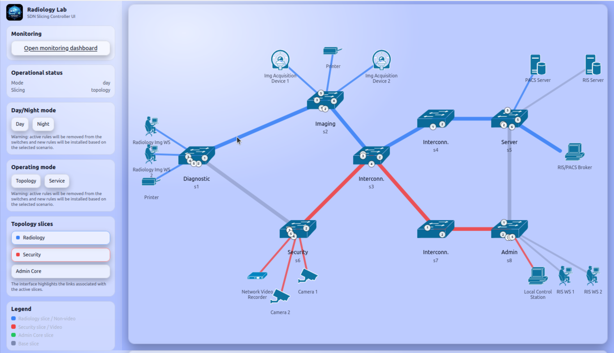    
*GUI - Modalità Day*

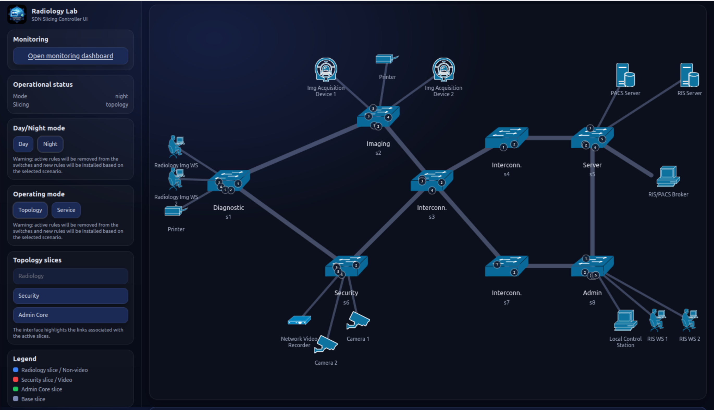  
*GUI - Modalità Night*

## `docker-compose.yml`

Con Docker Compose si utilizza un file di configurazione YAML, noto come Compose file, per configurare i servizi dell’applicazione; successivamente, tramite la CLI di Compose, è possibile creare e avviare tutti i servizi definiti nel file di configurazione.

I componenti computazionali di un’applicazione sono definiti come servizi. 
Un servizio è un concetto astratto implementato sulle piattaforme eseguendo una o più istanze dello stesso container (basato sulla stessa immagine e configurazione). 
Un servizio è una definizione astratta di una risorsa computazionale all’interno di un’applicazione, scalabile o sostituibile indipendentemente dagli altri componenti. 
I servizi sono implementati tramite un insieme di container. 
Poiché i servizi sono basati su container, sono definiti da un’immagine Docker e da un insieme di argomenti di runtime. 
Tutti i container di un servizio sono creati in modo identico con tali parametri.
I servizi comunicano tra loro attraverso le reti.
Nella Compose Specification, una rete è un’astrazione della piattaforma che consente di stabilire un percorso IP tra container appartenenti a servizi connessi. 
I servizi memorizzano e condividono dati persistenti tramite i volumi.
 I volumi sono archivi di dati persistenti implementati dal container engine.
  Compose fornisce un modo neutrale per montarli e parametri di configurazione per assegnarli all’infrastruttura.

### Monitoraggio

Per garantire che l’applicazione funzioni correttamente, il monitoraggio è fondamentale. Uno degli strumenti più diffusi è Prometheus, un toolkit open-source per il monitoraggio e l’alerting. Prometheus raccoglie metriche dai target monitorati interrogando endpoint HTTP esposti da tali target. 
Per la visualizzazione delle metriche è possibile utilizzare Grafana, una piattaforma open-source per monitoraggio e osservabilità che consente di interrogare, visualizzare, generare alert e comprendere le metriche indipendentemente da dove siano archiviate.

### Configurazione del Progetto

La CLI di Docker permette di interagire con le applicazioni Docker Compose tramite il comando`docker compos`e e i relativi sottocomandi.
 Il Compose File si trova nella directory principale del progetto ed è denominato `docker-compose.yaml`

Come esempio, sono stati consultati gli [Awesome Compose - Prometheus Grafana](https://github.com/docker/awesome-compose/tree/master/prometheus-grafana), che forniscono un punto di partenza per integrare diversi servizi tramite un Compose file e gestirne il deployment con Docker Compose. 
Il Compose File è stato utilizzato durante lo sviluppo software in quanto fornisce un modo per documentare e configurare tutte le dipendenze dei servizi dell’applicazione.
Nel nostro caso specifico, i servizi configurati sono Prometheus e Grafana.

Il Compose file dichiara un elemento di primo livello `services` come mappa, le cui chiavi sono i nomi dei servizi e i cui valori sono le rispettive definizioni.
 Una definizione di servizio contiene la configurazione applicata a ciascun container del servizio. 
 Gli attributi utilizzati nel file docker-compose.yaml sono: container_name, volumes, command, ports, restart, extra_hosts, depends_on, environment.

| Attributo | Descrizione | Utilizzo nel progetto |
| :--- | :--- | :--- |
| container_name | specifica un nome personalizzato per il container, in alternativa a quello generato automaticamente. | Utilizzato per assegnare nomi espliciti ai container Prometheus e Grafana. |
| volumes | definisce i percorsi da montare (host o volumi nominati) accessibili ai container dei servizi. La sintassi breve utilizza una stringa con valori separati da due punti VOLUME:CONTAINER_PATH dove VOLUME indica il percorso host o il nome del volume, CONTAINER_PATH indica il percorso nel container dove il volume è montato, mentre ACCESS_MODE assume valore `ro` e indica che l’accesso è in sola lettura | Nel progetto, volumes è utilizzato sia per montare file e cartelle di configurazione dell’host all’interno dei container, come `./monitoring/prometheus/prometheus.yml:/etc/prometheus/prometheus.yml:ro`, `./monitoring/grafana/grafana.ini:/etc/grafana/grafana.ini:ro`, `./monitoring/grafana/provisioning:/etc/grafana/provisioning:ro` e `./monitoring/grafana/dashboards:/var/lib/grafana/dashboards:ro`, sia per definire il volume `grafana_data:/var/lib/grafana`. |
| command | sovrascrive il comando predefinito dichiarato dall’immagine del container. | Utilizzato per specificare il file di configurazione di Prometheus. |
| ports | definisce il mapping delle porte tra la macchina host e i container. Ciò è fondamentale per consentire l’accesso esterno ai servizi in esecuzione nei container. Può essere definito utilizzando la sintassi breve per mapping semplici oppure la sintassi lunga, che include opzioni aggiuntive come il tipo di protocollo. La sintassi breve è una stringa separata da due punti nella forma [HOST:]CONTAINER[/PROTOCOL], dove HOST è opzionale, CONTAINER è la porta del container e PROTOCOL può essere tcp o udp. Se il campo HOST non è specificato, viene associato a tutte le interfacce di rete (0.0.0.0). Se PROTOCOL non è specificato, il default è tcp. Le porte possono essere singole o intervalli e devono essere specificate come stringhe. HOST e CONTAINER devono utilizzare intervalli equivalenti. | Nel progetto è stata utilizzata la sintassi breve, senza specificare PROTOCOL. In particolare sono stati definiti i mapping `"9090:9090"` per il servizio Prometheus e `"3000:3000"` per il servizio Grafana. |
| restart | definisce la politica che la piattaforma applica alla terminazione del container. Ad esempio, la politica unless-stopped riavvia il container indipendentemente dal codice di uscita, ma smette di riavviarlo quando il servizio viene fermato o rimosso. | Nel progetto è utilizzata la politica unless-stopped per entrambi i servizi Prometheus e Grafana. |
| extra_hosts | aggiunge mapping hostname-IP alla configurazione dell’interfaccia di rete del container. La sintassi breve utilizza stringhe semplici in una lista. I valori devono impostare hostname e indirizzo IP nel formato HOSTNAME=IP. Il separatore = è preferito, ma può essere utilizzato anche :. | Nel progetto è utilizzato `extra_hosts: "host.docker.internal:host-gateway"` nel servizio Prometheus per permettere la comunicazione con l’host. |
| depends_on | controlla l’ordine di avvio e arresto dei servizi. È utile quando i servizi sono strettamente accoppiati e la sequenza di avvio influisce sul funzionamento dell’applicazione. La sintassi breve specifica solo i nomi dei servizi da cui dipende il funzionamento dell’applicazione. Compose crea e rimuove i servizi in ordine di dipendenza. Inoltre, Compose garantisce che i servizi da cui si dipende siano stati avviati prima di avviare un servizio dipendente. Tuttavia, non attende che siano “healthy”. | Nel progetto, l’attributo depends_on è stato usato per specificare la dipendenza del servizio Grafana dal servizio Prometheus, garantendo che quest’ultimo venga avviato prima. |
| environment | definisce le variabili d’ambiente impostate nel container. Può utilizzare sia un array che una mappa. | Nel progetto è utilizzata la sintassi array per definire le variabili d’ambiente del servizio Grafana (`GF_SECURITY_ADMIN_USER=admin`, `GF_SECURITY_ADMIN_PASSWORD=admin`). |

Il Compose file definisce uno stack con due servizi, prometheus e grafana. Durante il deployment, Docker Compose associa le porte predefinite dei servizi alle porte corrispondenti sull’host per facilitare l’accesso alle interfacce web. 
È necessario verificare che le porte 9090 e 3000 sull’host non siano già occupate.

L’applicazione è composta da:
- due servizi (prometheus, grafana)
- un volume persistente (grafana_data)

#### Servizio Prometheus

Il **Servizio Prometheus** esegue il server Prometheus in un container. Utilizza l’immagine ufficiale di Prometheus `prom/prometheus:latest`. Espone il server Prometheus sulla porta 9090. E’ stato inoltre montato il file `prometheus.yml` dalla directory `monitoring/prometheus` presente nel progetto. Il file `prometheus.yml` contiene la configurazione di Prometheus per effettuare lo scraping delle metriche.

In particolare, nel file `prometheus.yml` è stato definito un job chiamato `ryu_monitor` per effettuare lo scraping delle metriche. Il campo `metrics_path` è impostato a `/metrics` e specifica l’endpoint da cui Prometheus raccoglie le metriche. Il campo `targets` specifica il target da cui raccogliere le metriche; in questo caso, il target è `host.docker.internal:8080`. Il server Prometheus raccoglierà quindi le metriche esposte su tale indirizzo ogni 2 secondi, come indicato dal campo `scrape_interval`.

#### Servizio Grafana

Il **Servizio Grafana** esegue il server Grafana in un container. Utilizza l’immagine ufficiale di Grafana `grafana/grafana:latest`. Espone il server Grafana sulla porta 3000. Sono stati inoltre montati i file di configurazione dalla directory `monitoring/grafana`, inclusi `grafana.ini`, la cartella `provisioning` e le dashboard. Nelle variabili d’ambiente sono stati impostati l’utente amministratore e la password di Grafana, che verranno utilizzati per accedere alla dashboard di Grafana.

La dichiarazione di primo livello volumes consente di configurare volumi riutilizzabili tra più servizi. Nel file `datasource.yml` è stata definita la sorgente dati Prometheus. Il campo `type` specifica il tipo della sorgente dati, che in questo caso è `prometheus`. Il campo `url` specifica l’URL del server Prometheus da cui recuperare le metriche. In questo caso, l’URL è `http://prometheus:9090`. `prometheus` è il nome del servizio del server Prometheus nel file Docker Compose. Il campo `isDefault` specifica se la sorgente dati è quella predefinita in Grafana.

### Deployment e Accesso

Il comando 

```bash
docker-compose -f docker-compose.monitor.yml up 
```

avvia i servizi, crea il volume e applica le configurazioni necessarie ai container. E’ possibile accedere a Prometheus all’indirizzo `http://localhost:9090` e a Grafana all’indirizzo `http://localhost:3000`. E' possibile anche verificare i container in esecuzione utilizzando il comando 

```bash
docker ps
``` 

## Prometheus

Prometheus è un toolkit open-source per il monitoraggio dei sistemi e l’alerting.

Prometheus raccoglie e memorizza le proprie metriche come dati di serie temporali, cioè le informazioni delle metriche vengono memorizzate con il timestamp in cui sono state registrate, insieme a coppie chiave-valore opzionali chiamate label.

Le principali caratteristiche di Prometheus sono:
• un modello di dati multidimensionale con serie temporali identificate dal nome della metrica e da coppie chiave/valore
• PromQL, un linguaggio di query flessibile per sfruttare questa dimensionalità
• la raccolta delle serie temporali avviene tramite un modello pull su HTTP
• supporto a diverse modalità di creazione di grafici e dashboard

In termini semplici, le metriche sono misurazioni numeriche.

L’ecosistema di Prometheus è composto da molteplici componenti, molti dei quali sono opzionali:
• il server Prometheus principale, che effettua lo scraping e memorizza i dati delle serie temporali
• librerie client per strumentare il codice applicativo
• un push gateway per supportare job di breve durata
• exporter specializzati per servizi come HAProxy, StatsD, Graphite, ecc.
• un alertmanager per gestire gli alert
• vari strumenti di supporto

Nel progetto è presente il server Prometheus principale e un exporter custom implementato nel file `monitor_prometheus.py`.

## Campioni, Job e Instance

I sample costituiscono i dati effettivi delle serie temporali. 
Ogni sample è composto da:
- un valore `float64` oppure un valore di tipo `native histogram`
- un timestamp con precisione al millisecondo

### Notazione

Data una metrica e un insieme di label, le serie temporali vengono frequentemente identificate mediante la seguente notazione:

```text
<metric_name>{<label_name>="<label_value>", ...}
```

Ad esempio, nel progetto una serie temporale con nome di metrica `ryu_packet_count` e con le label `datapath_id="1"` e `mode="default"` può essere rappresentata come:

```text
ryu_packet_count{datapath_id="1", mode="default"}
```

### Job e Instance

Nel contesto di Prometheus, un endpoint da cui è possibile effettuare lo scraping è chiamato *instance* e corrisponde generalmente a un singolo processo. 
Un insieme di instance che svolgono lo stesso scopo, ad esempio un processo replicato per motivi di scalabilità o affidabilità, è chiamato *job*.

Quando Prometheus effettua lo scraping di un target, associa automaticamente alcune label alle serie temporali raccolte, utili per identificare il target monitorato:
- `job`: il nome del job configurato a cui appartiene il target
- `instance`: la parte `<host>:<port>` dell’URL del target da cui sono state raccolte le metriche

Per ogni scraping di una *instance*, Prometheus memorizza un sample nella seguente serie temporale:

```text
up{job="<job-name>", instance="<instance-id>"}
```

Nel progetto, Prometheus genera automaticamente una serie temporale del tipo:

```text
up{job="ryu_monitor", instance="host.docker.internal:8080"}
```

La serie temporale `up` è utile per monitorare la disponibilità dell’instance.

## `prometheus.yml`

Prometheus è una piattaforma di monitoraggio che raccoglie metriche dai target monitorati effettuando lo scraping dagli endpoint HTTP delle metriche esposti da tali target.

Prometheus è stato configurato tramite il file di configurazione `prometheus.yml`, che definisce tutto ciò che riguarda i job di scraping e le loro istanze.

| Sezione | Descrizione | Parametri utilizzati e come sono stati impostati |
|--------|------------|-----------------------------------------------|
| scrape_config | specifica un insieme di target e parametri che descrivono come eseguire lo scraping. Nel caso generale, una configurazione di scraping specifica un singolo job. | `static_configs: ['host.docker.internal:8080']` utilizzato per configurare staticamente il target, `job_name: 'ryu_monitor'` utilizzato per configurare il nome del job assegnato di default alle metriche raccolte, `metrics_path: '/metrics'` utilizzato per configurare il percorso della risorsa HTTP da cui recuperare le metriche dai target. |
| global | specifica la configurazione globale | `scrape_interval: 2s` utilizzato per specificare con quale frequenza eseguire lo scraping dei target del job di scraping. |


## PromQL

PromQL è il linguaggio di interrogazione che fa parte di Prometheus.
Il tipo di dato fondamentale di Prometheus è lo scalar che rappresenta un valore in virgola mobile.
Prometheus utilizza tre tipi di dato per le metriche: lo scalar, l’instant vector e il range vector:
- Instant vector - un insieme di serie temporali contenente un singolo campione per ciascuna serie temporale, tutte con lo stesso timestamp; nel progetto è utilizzato nelle query PromQL definite nei pannelli della dashboard Grafana (`sdn_qos_dashboard.json`) per ottenere il valore più recente delle metriche esposte dall’exporter custom nel file `monitor_prometheus.py` e raccolte da Prometheus tramite il target `host.docker.internal:8080/metrics` configurato in `prometheus.yml`
- Range vector - un insieme di serie temporali contenente un intervallo di punti dati nel tempo per ciascuna serie temporale; nel progetto è utilizzato nei pannelli grafici della dashboard Grafana per rappresentare l’andamento temporale delle metriche raccolte da Prometheus
- Scalar - un semplice valore numerico in virgola mobile


### Selettori di serie temporali

I selettori di serie temporali indicano a PromQL quali dati recuperare.

I selettori di instant vector consentono di selezionare un insieme di serie temporali e un singolo valore campione per ciascuna in un determinato timestamp.  
Nella forma più semplice, viene specificato solo il nome di una metrica, il che produce un instant vector contenente campioni per tutte le serie temporali che hanno quel nome di metrica.

Il valore restituito sarà quello del campione più recente al timestamp di valutazione della query o precedente a esso (nel caso di una instant query) oppure allo step corrente della query (nel caso di una range query). 

È possibile filtrare ulteriormente queste serie temporali aggiungendo una lista di label matcher separati da virgole e racchiusi tra parentesi graffe; nel progetto i label matcher vengono utilizzati nelle query della dashboard per selezionare le metriche relative a specifici switch o modalità, utilizzando le label `datapath_id` e `mode`.

Questo esempio seleziona solo le serie temporali con nome di metrica ryu_packet_count che hanno anche la label datapath_id e la label mode impostate tramite le variabili della dashboard Grafana:
ryu_packet_count{datapath_id=~"$switch",mode=~"$mode"}

È anche possibile effettuare un match negativo su un valore di label oppure confrontare valori di label con espressioni regolari; nel progetto questo consente di includere o escludere determinati valori di `datapath_id` o `mode` nelle query della dashboard, selezionando in modo dinamico gli switch e le modalità da visualizzare.

### Operatori di matching

Esistono i seguenti operatori di matching per le label:
- =: seleziona le label esattamente uguali alla stringa fornita.
- !=: seleziona le label non uguali alla stringa fornita.
- =~: seleziona le label che corrispondono tramite regex alla stringa fornita.
- !~: seleziona le label che non corrispondono tramite regex alla stringa fornita.

Nel progetto viene utilizzato esclusivamente l’operatore di matching =~ nelle query della dashboard Grafana, in quanto le variabili `$switch` e `$mode` richiedono un confronto tramite regex per selezionare dinamicamente i valori delle label `datapath_id` e `mode`.

I label matcher che corrispondono a valori di label vuoti selezionano anche tutte le serie temporali che non hanno affatto quella specifica label impostata.  
È possibile avere più matcher per lo stesso nome di label.

Per esempio, dato il dataset:  ryu_packet_count, ryu_packet_count{datapath_id="1"}, ryu_packet_count{datapath_id="2"}, ryu_packet_count{mode="default"}

La query ryu_packet_count{mode=""} corrisponderebbe e restituirebbe: ryu_packet_count, ryu_packet_count{datapath_id="1"}, ryu_packet_count{datapath_id="2"}  

### Tipi di metriche

Prometheus, concettualmente, ha quattro diversi tipi di metriche. 
Tutti i tipi di metriche sono rappresentati da uno o più valori scalari, con convenzioni differenti che ne determinano l’uso e lo scopo.
Counter e Gauge sono tipi di metriche di base, entrambi memorizzano uno scalar. 
Un Counter può solo aumentare (può azzerarsi in seguito a un riavvio), mentre un Gauge può sia aumentare sia diminuire. 
Nel progetto vengono utilizzate esclusivamente metriche di tipo Gauge, definite nel file `monitor_prometheus.py` tramite l’utilizzo della classe Gauge della libreria prometheus_client.

## `datasource.yml`

## Configurazione della sorgente dati Prometheus

Grafana include il supporto nativo per Prometheus, quindi non è necessario installare alcun plugin. 
È possibile definire e configurare la sorgente dati tramite file YAML come parte del sistema di provisioning di Grafana.

Nel progetto, la sorgente dati Prometheus è stata configurata tramite il file `datasource.yml`

### Connessione

Per la connessione è stato utilizzato l’URL del server Prometheus. 
Dato che Prometheus è in esecuzione in locale, è stato possibile utilizzare direttamente `http://localhost:9090`.

### Autenticazione

Esistono tre opzioni di autenticazione per la sorgente dati Prometheus.

- **Basic authentication** - Il metodo di autenticazione più comune.  
  - **User** - Il nome utente utilizzato per connettersi alla sorgente dati.  
  - **Password** - La password utilizzata per connettersi alla sorgente dati.

- **Forward OAuth identity** - Inoltra il token di accesso OAuth (e anche il token ID OIDC, se disponibile) dell’utente che interroga la sorgente dati.

- **No authentication** - Consente l’accesso alla sorgente dati senza alcuna autenticazione.

Nel progetto è stata utilizzata l’opzione **No authentication**.

### Opzioni di configurazione

E' stata utilizzata la seguente opzione di configurazione per Prometheus:

- **Name**: specifica il nome della sorgente dati, cioè il nome utilizzato per fare riferimento alla sorgente dati nei pannelli e nelle query. 

## Variabili template di Prometheus

Invece di definire in modo statico dettagli all’interno delle query delle metriche, è possibile utilizzare delle variabili note come *template variables*. 
Grafana mostra queste variabili in menu a tendina nella parte superiore della dashboard per consentire di modificare i dati visualizzati.

Nel progetto, queste variabili sono state utilizzate nella dashboard per modificare dinamicamente le metriche in base allo switch e/o alla modalità di slicing selezionata.

### Utilizzo delle query variables

Grafana supporta diversi tipi di variabili, ma le **Query variables** sono utilizzate specificamente per interrogare Prometheus.
Queste possono restituire un elenco di metriche, label, valori di label, risultati di query oppure serie temporali.

Nel progetto, è stata utilizzata una variabile chiamata `switch` di tipo `Classic query` per restituire l’elenco degli identificativi degli switch della topologia.

Questa variabile restituisce il risultato della seguente query Prometheus:

```text
label_values(ryu_flow_count, datapath_id)
```

In altre parole, restituisce tutti i valori della label `datapath_id` presenti nella metrica `ryu_flow_count`.

Questa espressione segue la sintassi:

```text
label_values(<metric>, <label>)
```

L'opzione di **Refresh** della variabile `switch` è impostata a `2` (On dashboard load), pertanto il valore della variabile viene aggiornato ogni volta che la dashboard viene caricata.

## `sdn_qos_dashboard.json`

Il file `sdn_qos_dashboard.json` definisce la dashboard Grafana utilizzata per il monitoraggio della rete.

La dashboard è organizzata in una singola pagina composta da una parte superiore con due menu a tendina e quattro pannelli principali disposti verticalmente.

Una dashboard Grafana è un insieme di uno o più pannelli che forniscono una vista d’insieme di informazioni correlate tra loro.

I pannelli rappresentano i blocchi principali delle dashboard Grafana e vengono creati utilizzando componenti che interrogano e trasformano i dati grezzi provenienti da una sorgente dati in grafici o diagrammi.

Una sorgente dati può essere un database SQL, Grafana Loki, Grafana Mimir oppure un’API basata su JSON.

Nel progetto, la sorgente dati utilizzata è Prometheus.

### Campi principali della dashboard 

Le dashboard Grafana sono rappresentate come oggetti JSON che memorizzano metadati, pannelli, variabili e impostazioni. 

Ogni campo del JSON della dashboard è spiegato di seguito insieme al relativo utilizzo.

| Nome | Utilizzo |
|------|----------|
| `uid` | identificatore univoco della dashboard |
| `title` | titolo corrente della dashboard |
| `tags` | tag associati alla dashboard, come array di stringhe |
| `timezone` | fuso orario della dashboard |
| `time` | intervallo temporale della dashboard, impostato da now-15m a now, cioè agli ultimi 15 minuti |
| `refresh` | intervallo di aggiornamento automatico, impostato a 5 secondi |
| `schemaVersion` | versione dello schema JSON, incrementato a ogni aggiornamento di Grafana che modifica lo schema |
| `version` | versione della dashboard, incrementato ogni volta che la dashboard viene aggiornata |
| `panels` | array dei pannelli presenti nella dashboard |
| `templating` | metadati della sezione templating |

### Sezione templating

La sezione templating contiene un array di variabili di template con i rispettivi valori salvati, insieme ad altri metadati.

Ogni campo della sezione templating è spiegato di seguito.

| Nome | Utilizzo |
|------|----------|
| `list` | array di oggetti, ciascuno dei quali rappresenta una variabile di template |
| `current` | mostra il testo/valore attualmente selezionato per la variabile nella dashboard |
| `datasource` | indica la sorgente dati della variabile |
| `includeAll` | indica se l’opzione `All` è disponibile |
| `multi` | indica se è possibile selezionare più valori contemporaneamente dalla lista |
| `name` | nome della variabile |
| `options` | array di coppie testo/valore disponibili per la selezione nella dashboard |
| `query` | query verso la sorgente dati utilizzata per ottenere i valori della variabile |
| `refresh` | definisce quando aggiornare la variabile |
| `type` | tipo della variabile, ad esempio `custom`, `query` oppure `interval` |

In questa sezione sono definite due variabili:

 - `switch`: consente di selezionare lo switch di cui visualizzare le statistiche nella dashboard  
-  `mode`: consente di selezionare la modalità di slicing, in modo tale da visualizzare esclusivamente le regole installate nelle tabelle degli switch durante quella modalità. I valori disponibili sono `topology`, `service` e `All`. 

### Sezione Panels

I pannelli rappresentano i componenti fondamentali di una dashboard.

Un pannello è un contenitore che visualizza i dati e mette a disposizione diversi controlli per interagire con essi.

La configurazione del pannello consente di definire la modalità con cui si desidera visualizzare i dati.

I campi della sezione `panels` permettono di personalizzare numerosi aspetti della visualizzazione e variano in base al tipo di visualizzazione scelta.

| Campo | Descrizione |
|--------|-------------|
| **type** | Specifica il tipo di visualizzazione del pannello. Nella dashboard è stato utilizzato esclusivamente il tipo `timeseries`. Una visualizzazione Time series è un diagramma cartesiano x-y in cui l’asse x rappresenta il tempo e l’asse y rappresenta il valore assunto dalla grandezza osservata. |
| **title** | Indica il titolo del pannello, visualizzato nella parte superiore del grafico. |
| **datasource** | Indica la sorgente dati interrogata dal pannello. |
| **gridPos** | Indica la dimensione e la posizione del pannello nella griglia della dashboard. |
| **targets** | Specifica il target da cui vengono raccolte le metriche |
| **options** | Specifica le opzioni di configurazione della visualizzazione. |

### Campo gridPos

Le opzioni del campo `gridPos` permettono di personalizzare la dimensione e la posizione del pannello nella griglia della dashboard.

| Opzione | Descrizione |
|--------|-------------|
| **w** | larghezza del pannello. Il valore è espresso su una griglia suddivisa in 24 colonne. |
| **h** | altezza del pannello in unità di griglia. Ogni unità corrisponde a 30 pixel. |
| **x** | posizione orizzontale del pannello all’interno della griglia, utilizzando la stessa unità di `w`. |
| **y** | posizione verticale del pannello all’interno della griglia, utilizzando la stessa unità di `h`. |


### Campo targets

Le opzioni del campo `targets` utilizzate sono descritte nella tabella.

| Opzione | Descrizione |
|--------|-------------|
| **refId** | Identificatore univoco assegnato a ciascuna query all’interno di un pannello, utilizzato come nome di riferimento per i dati restituiti da quella query. |
| **expr** | Espressione della query utilizzata per interrogare Prometheus. |

### Campo options

Le opzioni del campo `options` utilizzate sono descritte nella tabella.

| Opzione | Descrizione |
|--------|-------------|
| **legend** | Definisce le impostazioni della legenda del pannello.  Nella dashboard la legenda viene mostrata in forma tabellare e sotto il grafico.  |

---

## Pannelli della dashboard

| Pannello | Descrizione |
|----------|-------------|
| **Flow count per switch/table** | Mostra un grafico a linee in cui ogni linea rappresenta il numero totale di flow entry installate nella tabella dello switch; l’asse orizzontale rappresenta il tempo e l’asse verticale rappresenta il numero di flow entry installate. |
| **Packet count per flow** | Mostra un grafico a linee in cui ogni linea rappresenta il numero di pacchetti gestiti da una singola flow entry; l’asse orizzontale rappresenta il tempo e l’asse verticale rappresenta il numero di pacchetti gestiti. |
| **Byte count per flow** | Mostra un grafico a linee in cui ogni linea rappresenta il numero totale di byte dei pacchetti gestiti da una singola flow entry; l’asse orizzontale rappresenta il tempo e l’asse verticale rappresenta il numero di byte gestiti. |
| **Flow duration** | Mostra un grafico a linee in cui ogni linea rappresenta il numero di secondi da quando una flow entry risulta installata sullo switch; l’asse orizzontale rappresenta il tempo e l’asse verticale rappresenta il numero di secondi. |

Lo screenshot della dashboard è stato acquisito dopo la generazione del solo traffico video, partendo da una condizione iniziale in cui non era stato generato alcun traffico tra gli host hCam1 e lCS. 
Aprendo la dashboard di monitoraggio, è possibile verificare che il numero di regole visualizzato sia coerente con quanto osservato tramite ispezione diretta delle flow table.  
Ad esempio, considerando lo switch **s7**, dopo l’esecuzione delle due simulazioni di traffico video e non video tramite `iperf`,  il comando `dpctl dump-flows` mostra un totale di **7** regole installate.  
Lo stesso valore **7** è riportato nella dashboard di monitoraggio nel pannello dedicato al conteggio delle flow.
L’allineamento tra percorso, numero di flow installate e dimensione dei pacchetti dimostra che la classificazione e l’instradamento del traffico funzionano correttamente e che la dashboard rappresenta fedelmente il comportamento reale della rete.

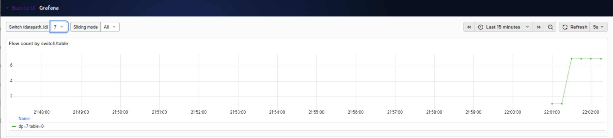  
*Dashboard Grafana del sistema di monitoraggio durante l’esecuzione delle simulazioni.*

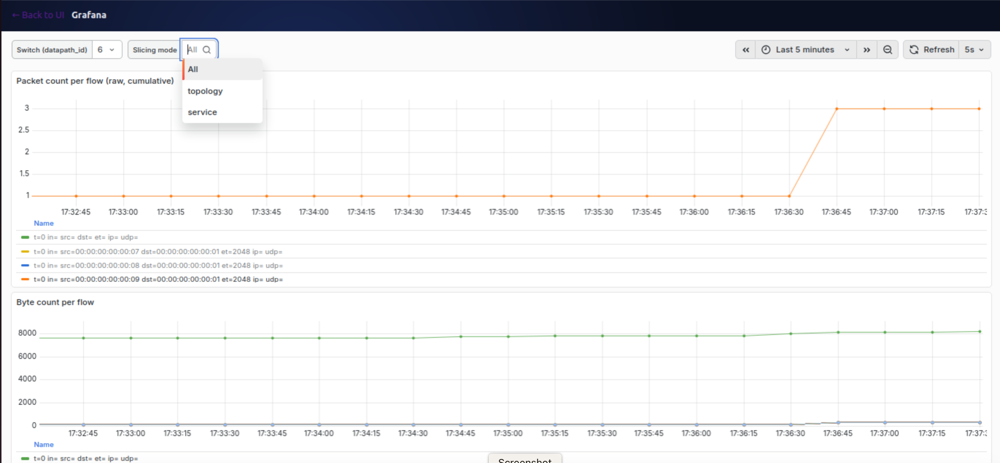  
*Dashboard Grafana del sistema di monitoraggio.*

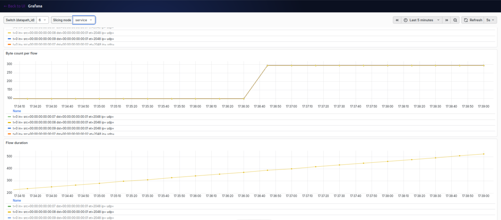  
*Dashboard Grafana del sistema di monitoraggio.*

## `monitor_prometheus.py`

### Classe `PrometheusController`

La classe `PrometheusController`  rappresenta il componente responsabile dell’esposizione delle metriche Prometheus tramite endpoint HTTP.

I metodi principali della classe sono:

- `__init__(self, req, link, data, **config)`
  inizializza il controller responsabile della gestione delle richieste HTTP verso l’endpoint Prometheus.

- `metrics(self, req, **kwargs)`
  rappresenta il metodo che gestisce le richieste HTTP `GET` inviate all’endpoint `/metrics`.  
  Il suo compito è restituire, in formato compatibile con Prometheus, tutte le metriche attualmente raccolte dal monitor.  

  All’interno del metodo viene creato un nuovo registro locale di metriche (`CollectorRegistry`), separato da quello globale utilizzato da Prometheus.  
  Successivamente, tutte le metriche presenti nel registro globale vengono inserite in questo nuovo registro.  

  Una volta raccolte le metriche, il metodo genera il contenuto testuale da inviare come risposta HTTP tramite `generate_latest(registry)`.  
  Infine, restituisce una `Response` contenente:
  - il tipo di contenuto corretto per Prometheus (`text/plain; version=0.0.4; charset=utf-8`);
  - il testo delle metriche, che potrà essere letto direttamente dal server Prometheus.

### Classe `MonitorPrometheus`

La classe `MonitorPrometheus` rappresenta l’applicazione di monitoraggio che raccoglie statistiche dagli switch OpenFlow e le rende disponibili sotto forma di metriche Prometheus.

| Nome attributo | Descrizione |
|---|---|
| `SERVICE_COOKIE` | valore del cookie utilizzato per identificare le flow entry appartenenti alla modalità di **service slicing**. |
| `TOPOLOGY_COOKIE_BASE` | valore base del cookie utilizzato per identificare le flow entry appartenenti alla modalità di **topology slicing**. |
| `TOPOLOGY_COOKIE_MASK` | maschera utilizzata per riconoscere i cookie relativi alla modalità topology, ignorando l’ultimo byte che codifica il numero della slice. |
| `OFP_VERSIONS` | lista delle versioni del protocollo OpenFlow supportate dall’applicazione. Nel progetto viene utilizzata OpenFlow 1.3. |
| `_CONTEXTS` | dizionario dei contesti richiesti dall’applicazione Ryu. In questo caso include il supporto WSGI. |
| `datapaths` | dizionario che mantiene i datapath associati agli switch OpenFlow attualmente connessi al monitor. |
| `_seen_flow_series` | struttura dati utilizzata per memorizzare, per ciascun switch, l’insieme delle serie Prometheus osservate nell’ultima risposta, utile per rimuovere le metriche relative a flow entry non più presenti. |
| `ryu_flow_count` | metrica Prometheus di tipo `Gauge` che rappresenta il numero di flow entry presenti in una specifica tabella di uno switch. |
| `ryu_packet_count` | metrica Prometheus di tipo `Gauge` che rappresenta il numero cumulativo di pacchetti gestititi da una determinata flow entry. |
| `ryu_byte_count` | metrica Prometheus di tipo `Gauge` che rappresenta il numero cumulativo di byte gestiti da una determinata flow entry. |
| `ryu_duration_sec` | metrica Prometheus di tipo `Gauge` che rappresenta il numero di secondi da quando una determinata flow entry è installata nella flow table di uno switch. |
| `monitor_thread` | riferimento al thread  avviato tramite `hub.spawn(self._monitor)`, utilizzato per eseguire ciclicamente il monitoraggio degli switch. |

I metodi principali della classe sono:

- `_cookie_to_mode(cls, cookie)`  
  determina la modalità operativa associata a una determinata regola a partire dal valore del relativo `cookie`.  
  All’interno del metodo viene verificato se il `cookie` ricevuto in ingresso identifica:
  - una regola appartenente alla modalità di **service slicing**;
  - una regola appartenente alla modalità di **topology slicing**.  
  In base a tale verifica, il metodo restituisce una stringa descrittiva che identifica la modalità associata alla regola.  
  Se il `cookie` non corrisponde ad alcuna delle due categorie previste, il metodo restituisce il valore `"other"`.

- `__init__(self, *args, **kwargs)`
  inizializza l’applicazione.

- `_state_change_handler(self, ev)`
  rappresenta l’handler associato all’evento `EventOFPStateChange`, registrato per gli stati `MAIN_DISPATCHER` e `DEAD_DISPATCHER`.
  All’interno del metodo viene acquisito il datapath associato all’evento.
  Se il datapath entra nello stato `MAIN_DISPATCHER`, esso viene aggiunto al dizionario `datapaths`, in modo da essere incluso nel monitoraggio periodico.
  Se invece il datapath entra nello stato `DEAD_DISPATCHER`, esso viene rimosso dal dizionario, poiché non più attivo.
  In questo modo il monitor mantiene sempre aggiornato l’insieme degli switch OpenFlow effettivamente connessi.

- `_monitor(self)`  
  rappresenta il metodo responsabile del monitoraggio periodico degli switch OpenFlow connessi.  
  All’interno del metodo viene eseguito un ciclo infinito che, a ogni iterazione:
  - acquisisce l’insieme dei datapath attualmente connessi;
  - invia a ciascuno di essi una richiesta delle statistiche delle flow entry presenti nelle flow table, richiamando `_request_flow_stats(dp)`;
  - attende un intervallo di tempo pari a `PROMETHEUS_POLLTIME` prima di avviare una nuova iterazione del monitoraggio.  
  In questo modo, il metodo raccoglie periodicamente le informazioni necessarie all’aggiornamento delle metriche Prometheus.

- `_request_flow_stats(self, dp)`  
  invia a uno switch OpenFlow una richiesta di statistiche relativa alle flow entry presenti nelle sue flow table.  
  All’interno del metodo viene costruito un messaggio di tipo `OFPFlowStatsRequest`, che consente al controller di richiedere allo switch le informazioni necessarie al monitoraggio.  
  Infine, la richiesta viene inviata al datapath specificato.

- `_flow_stats_reply_handler(self, ev)`  
  rappresenta l’handler associato all’evento `EventOFPFlowStatsReply`, generato quando uno switch OpenFlow restituisce al monitor le statistiche relative alle flow entry presenti nelle proprie flow table.  
  All’interno del metodo viene innanzitutto acquisito il datapath che ha generato la risposta e ne viene ricavato l’identificatore in formato stringa.  
  Viene inoltre inizializzato l’insieme `current_series`, utilizzato per memorizzare le regole restituite dallo switch nella risposta corrente, così da poterle confrontare con quelle osservate nell’interrogazione precedente.  
  Il metodo esegue anzitutto il conteggio del numero di flow entry presenti in ciascuna tabella dello switch e aggiorna la metrica `ryu_flow_count` per ogni tabella rilevata.  
  Successivamente, il metodo scorre tutte le statistiche restituite dallo switch e, per ciascuna flow entry, ne acquisisce le principali informazioni identificative, tra cui il contenuto del campo `match`, il valore del `cookie` e i contatori associati.  
  A partire da tali informazioni vengono ricavati i valori necessari a descrivere la regola osservata, come porta di ingresso, indirizzi MAC sorgente e destinazione, eventuali campi di protocollo e modalità di slicing associata.  
  Il metodo aggiorna quindi le metriche Prometheus associate alla flow entry osservata, che descrivono:
  - il numero cumulativo di pacchetti elaborati dalla regola (`ryu_packet_count`);
  - il numero cumulativo di byte dei pacchetti elaborati dalla regola (`ryu_byte_count`);
  - il tempo per cui la regola è rimasta installata nello switch (`ryu_duration_sec`). 
  
  Per ciascuna regola osservata, viene inoltre costruita una chiave identificativa che viene inserita nell’insieme `current_series`.  
  Infine, il metodo confronta l’insieme delle regole restituite nella risposta corrente con quello memorizzato in precedenza per lo stesso switch.  
  Tutte le regole non più presenti vengono considerate rimosse e le metriche Prometheus ad esse associate vengono quindi eliminate.  
  Al termine dell’elaborazione, la struttura `_seen_flow_series` viene aggiornata con il nuovo insieme di regole osservate.

## `traffic_simulation.py`

### Classe `SimState`

La classe `SimState` è una dataclass utilizzata per rappresentare in modo strutturato lo stato runtime di una singola simulazione di traffico.

Essa contiene tutte le informazioni necessarie per descrivere una simulazione durante il suo ciclo di vita (avvio, esecuzione, terminazione) ed è aggiornata dinamicamente dal `TrafficSimulationManager`.

| Nome attributo | Descrizione |
|---|---|
| `sim_id` | Stringa che identifica univocamente un’istanza di `SimState` all’interno del dizionario delle simulazioni gestito dal `TrafficSimulationManager`. |
| `label` | Stringa descrittiva associata alla simulazione, utilizzata dall’interfaccia utente. |
| `src_host` | Nome dell’host sorgente (namespace Mininet). |
| `dst_host` | Nome dell’host destinazione (namespace Mininet). |
| `kind` | Stringa che rappresenta la tipologia di simulazione da eseguire. I valori previsti dal modulo sono `dicom_store`, `dicom_qr` e `video`. |
| `slice_id` | Identificatore della slice di topologia coinvolta nella simulazione. |
| `status` | Stringa che rappresenta lo stato corrente della simulazione. I valori utilizzati dal modulo sono `idle`, `running`, `interrupted`, `terminated` ed `error`. |
| `error` | Eventuale messaggio di errore associato alla simulazione. |
| `started_at` | Valore temporale opzionale che memorizza l’istante di avvio della simulazione, oppure `None` se la simulazione non è ancora stata avviata. |
| `ended_at` | Valore temporale opzionale che memorizza l’istante di terminazione della simulazione, oppure `None` se la simulazione è ancora in esecuzione. |
| `processes` | Lista di oggetti `subprocess.Popen` associati ai processi applicativi avviati per generare il traffico della simulazione. |
| `server_processes` | Lista di oggetti `subprocess.Popen` associati ai processi di supporto avviati automaticamente per ricevere o gestire il traffico della simulazione. |
| `capture_proc` | Riferimento a un oggetto `subprocess.Popen` associato al processo `tcpdump` avviato per catturare il traffico di rete della simulazione, oppure `None` se la cattura non è attiva. |
| `capture_file` | Stringa che rappresenta il percorso assoluto o relativo del file `.pcap` generato dalla cattura del traffico della simulazione, oppure `None` se nessun file di cattura è stato creato. |

---

#### Classe `TrafficSimulationManager`

La classe `TrafficSimulationManager` gestisce l’intero ciclo di vita delle simulazioni di traffico eseguite sugli host Mininet.

I principali attributi della classe sono riportati nella tabella seguente.

| Nome attributo | Descrizione |
|---|---|
| `PID_MAP_PATH` | Percorso del file JSON che associa il nome di ciascun host Mininet al corrispondente PID. |
| `DICOM_PORT` | Porta TCP utilizzata per il traffico DICOM. |
| `VIDEO_PORT` | Porta UDP utilizzizzata per il traffico video. |
| `DICOM_AET_SRC` | Application Entity Title utilizzato come identificativo del nodo sorgente DICOM. |
| `DICOM_AET_DST` | Application Entity Title utilizzato come identificativo del nodo destinazione DICOM. |
| `sims` | Dizionario che mantiene l’insieme delle simulazioni registrate, indicizzate tramite `sim_id`. |
| `_host_pid_map` | Dizionario che associa ciascun host Mininet al corrispondente PID. |

I metodi principali della classe sono:

- `__init__(self)`  
  inizializza il gestore delle simulazioni.

- `_load_host_pid_map(self)`  
  carica dal file JSON la struttura che associa i nomi degli host Mininet ai PID dei relativi namespace Linux.  
  Se il file non è disponibile oppure non contiene dati validi, il metodo restituisce un dizionario vuoto.

- `_run_in_host(self, host, cmd, bg=False)`  
  esegue un comando all’interno del namespace di rete associato all’host specificato.  
  All’interno del metodo viene innanzitutto recuperato, a partire dal nome logico dell’host ricevuto in ingresso, il PID del processo corrispondente.  
  Successivamente viene costruito un comando basato su `mnexec`.  
  Se il parametro `bg` è impostato a `True`, il comando viene avviato in esecuzione concorrente e il metodo restituisce l’oggetto che rappresenta il processo avviato.  
  In caso contrario, il comando viene eseguito in modo bloccante e il metodo restituisce il codice di terminazione del comando eseguito.

- `_kill_proc(self, proc, sig=signal.SIGINT, wait=5.0)`  
  termina un processo precedentemente avviato.  
  All’interno del metodo viene inviato inizialmente il segnale specificato in ingresso.  
  Se il processo non termina entro il timeout indicato, viene forzata la chiusura con `kill()`.

- `_sim_to_dict(self, s)`  
  converte un oggetto `SimState` in una struttura dizionario serializzabile.  
  Tale rappresentazione è utilizzata per esporre lo stato della simulazione tramite API REST.

- `_label(self, kind, src, dst)`  
  costruisce una descrizione testuale sintetica della simulazione a partire dal tipo di traffico e dagli host coinvolti.

- `_validate_pair_for_slice(self, src, dst, slice_id)`  
  verifica che l’host sorgente e l’host destinazione appartengano entrambi alla slice richiesta.  

- `_pcap_path(self, sim_id, kind, src, dst)`  
  costruisce il percorso del file `.pcap` che verrà utilizzato per la cattura del traffico della simulazione.  

- `_start_capture(self, s)`  
  avvia la cattura del traffico di rete associato alla simulazione.  
  All’interno del metodo viene innanzitutto costruito il percorso del file di cattura `.pcap` da associare alla simulazione corrente.  
  Successivamente viene recuperato, a partire dall’host sorgente memorizzato in `s`, il PID del processo Mininet corrispondente, così da poter eseguire il comando di cattura nel corretto namespace di rete.  
  Il metodo costruisce quindi il comando `tcpdump`, configurato per intercettare i pacchetti scambiati dall’host sorgente durante l’esecuzione della simulazione e salvarli nel file `.pcap` precedentemente generato.  
  Il comando viene infine avviato in esecuzione concorrente e l’oggetto che rappresenta il processo avviato viene memorizzato nell’attributo `capture_proc`, mentre il percorso del file di cattura viene salvato in `capture_file`.

- `_ensure_video_server(self, dst_host)`  
  avvia, se necessario, il processo server utilizzato per ricevere traffico video sull’host destinazione.  

- `_ensure_dicom_server(self, dst_host)`  
  avvia, se necessario, il processo server DICOM sull’host destinazione.  

- `start(self, kind, src_host, dst_host, slice_id=None)`  
  avvia una nuova simulazione di traffico.  
  All’interno del metodo viene innanzitutto determinato il tipo di slice da utilizzare.  
  Se `slice_id` non è specificato, esso viene dedotto automaticamente dal tipo di traffico richiesto.  
  Successivamente viene verificata la coerenza tra host selezionati e slice richiesta tramite `_validate_pair_for_slice()`.  
  Se la validazione fallisce, il metodo restituisce immediatamente un errore.  
  In caso contrario:
  - viene generato un nuovo identificatore di simulazione;
  - viene creato il relativo oggetto `SimState`;
  - viene avviata la cattura del traffico tramite `_start_capture()`;
  - vengono predisposti i processi server necessari in funzione del tipo di traffico;
  - viene avviato il traffico applicativo vero e proprio tra sorgente e destinazione.  
  Se l’avvio va a buon fine, la simulazione viene registrata nel dizionario `self.sims` e il metodo restituisce la sua rappresentazione serializzabile.  
  In caso di errore, la simulazione viene marcata come fallita e viene restituito il relativo stato.

- `stop(self, sim_id)`  
  termina una simulazione attualmente registrata.  
  All’interno del metodo viene recuperata la simulazione associata all’identificatore fornito in ingresso.  
  Se la simulazione non esiste, il metodo restituisce un errore.  
  In caso contrario:
  - vengono terminati tutti i processi client associati;
  - vengono terminati tutti i processi server associati;
  - viene terminato il processo di cattura del traffico precedentemente avviato tramite `tcpdump`;
  - viene aggiornato lo stato finale della simulazione.  
  Il metodo restituisce quindi la rappresentazione aggiornata della simulazione.

- `stop_all(self)`  
  termina tutte le simulazioni attualmente registrate nel gestore.  
  All’interno del metodo viene iterato l’insieme delle simulazioni presenti nella struttura interna `self.sims`; per ciascuna simulazione viene invocato il metodo `stop(sim_id)`.

- `status(self, sim_id=None)`  
  restituisce lo stato delle simulazioni gestite.  
  Se `sim_id` è specificato, il metodo restituisce lo stato della singola simulazione corrispondente.  
  Se `sim_id` non è specificato, il metodo restituisce l’elenco completo di tutte le simulazioni registrate.

- `cleanup_finished(self)`  
  rimuove dal dizionario interno le simulazioni che risultano già terminate o interrotte.  

### Tool utilizzati per la simulazione del traffico

Per l’esecuzione delle simulazioni di traffico è richiesta l’installazione dei seguenti tool:

```bash
sudo apt update
sudo apt update && sudo apt install -y dcmtk ffmpeg netcat-openbsd tcpdump
```
#### mnexec

mnexec è un'utility di esecuzione per Mininet.

```bash
mnexec -a <pid> bash -lc "<cmd>"
```
| Parametro | Valore  | Spiegazione                                    |
| --------- | ------- | ---------------------------------------------- |
| `pid`     | `<pid>` | Identificativo del processo a cui agganciarsi. |
| `cmd`     | `<cmd>` | Comando da eseguire.                           |

| Opzione | Valore  | Spiegazione                                                     |
| ------- | ------- | --------------------------------------------------------------- |
| `-a`    | `<pid>` | Si aggancia ai namespace di rete e mount del processo indicato. |


#### DCMTK (Digital Imaging and Communications in Medicine Toolkit)

DCMTK è una collezione di librerie e applicazioni che implementano gran parte dello standard DICOM.  
Include software per:

- esaminare, costruire e convertire file immagine DICOM  
- gestire supporti di memorizzazione  
- inviare e ricevere immagini su connessioni di rete  
- fornire server dimostrativi per storage di immagini e worklist  

I comandi utilizzati della suite DCMTK nel progetto sono i seguenti:

```bash
dcmqrscp -v -c "<cfg_path>" <pacs_port>
```

| Parametro | Valore | Spiegazione |
|---|---|---|
| `port` | `<pacs_port>` | Numero di porta TCP/IP su cui il server resta in ascolto. |


| Opzione | Valore | Spiegazione |
|---|---|---|
| `-v` | verbose | Modalità verbosa, stampa i dettagli dell’elaborazione. |
| `-c` | `<cfg_path>` | Specifica il file di configurazione da utilizzare. |

```bash
echoscu -v -aec "<pacs_aet>" -aet "<src_aet/ws_aet>" "<pacs_ip>" <pacs_port>
```

| Parametro | Valore | Spiegazione |
|---|---|---|
| `port` | `<pacs_port>` | Numero di porta TCP/IP su cui il server resta in ascolto. |


| Opzione | Valore | Spiegazione |
|---|---|---|
| `-v` | verbose | Modalità verbosa, stampa i dettagli dell’elaborazione. |
| `-c` | `<cfg_path>` | Specifica il file di configurazione da utilizzare. |


```bash
storescu -v -aec "<pacs_aet>" -aet "<src_aet>" "<pacs_ip>" <pacs_port> "<dicom_dir>"
```

| Parametro | Valore | Spiegazione |
|---|---|---|
| `peer` | `<pacs_ip>` | Host del peer DICOM. |
| `port` | `<pacs_port>` | Porta TCP/IP del peer. |
| `dcmfile-in` | `<dicom_dir>` | File o directory DICOM da trasmettere. |

| Opzione | Valore | Spiegazione |
|---|---|---|
| `-aet` | `<src_aet>` | AE Title del chiamante. |
| `-aec` | `<pacs_aet>` | AE Title del peer. |
| `-v` | verbose | Modalità verbosa. |

```bash
findscu -v -S/-P -aec <AET> -aet <AET> ... <ip> <port>
```

| Parametro | Valore | Spiegazione |
|---|---|---|
| `peer` | `<ip>` | Host del peer DICOM. |
| `port` | `<port>` | Porta TCP/IP del peer. |
| `dcmfile-in` | query | File di query DICOM. |

| Opzione | Valore | Spiegazione |
|---|---|---|
| `-aet` | `<AET>` | AE Title del chiamante. |
| `-aec` | `<AET>` | AE Title del peer. |
| `-P` | patient | Usa il modello Patient Root. |
| `-S` | study | Usa il modello Study Root. |
| `-v` | verbose | Modalità verbosa. |

#### tcpdump

tcpdump stampa una descrizione del contenuto dei pacchetti su un’interfaccia di rete che corrispondono all’espressione booleana.  
In tutti i casi, solo i pacchetti che corrispondono all’espressione verranno elaborati da tcpdump.

```bash
tcpdump -i <iface> -U -n -w <pcap>
```

| Opzione | Valore      | Spiegazione                                                                                                                                                                                                                    |
| ------- | ----------- | ------------------------------------------------------------------------------------------------------------------------------------------------------------------------------------------------------------------------------ |
| `-i`    | `interface` | Ascolta, riporta l’elenco dei tipi di link-layer, riporta l’elenco dei tipi di timestamp, oppure riporta i risultati della compilazione di un’espressione di filtro sull’interfaccia.                                          |
| `-U`    |             | Rende l’output salvato tramite l’opzione `-w` “bufferizzato per pacchetto”; cioè, ogni pacchetto, quando viene salvato, verrà scritto nel file di output, invece di essere scritto solo quando il buffer di output si riempie. |
| `-n`    |             | Non converte gli indirizzi host in nomi. Questo può essere usato per evitare interrogazioni DNS.                                                                                                                               |
| `-w`    | `file`      | Scrive i pacchetti grezzi su file invece di analizzarli e stamparli.                                                                                                                                                           |

#### FFmpeg


ffmpeg è un convertitore multimediale universale. Può leggere un’ampia varietà di input, inclusi dispositivi di acquisizione/registrazione live, filtrarli e transcodificarli in una moltitudine di formati di output.

ffmpeg legge da un numero arbitrario di input (che possono essere file regolari, pipe, stream di rete, dispositivi di acquisizione, ecc.), specificati tramite l’opzione `-i`, e scrive su un numero arbitrario di output, che sono specificati tramite un semplice URL di output.

Nel progetto FFmpeg viene utilizzato per generare flussi video tramite protocollo UDP, a partire da file multimediali presenti nella directory `assets/video`, riproducendo il comportamento delle telecamere di sicurezza che inviano flussi video verso la postazione di controllo e il videoregistratore di rete.

```bash
ffmpeg -hide_banner -loglevel warning -nostdin -re -i <video> -t <dur> -f mpegts udp://<ip>:<port>
```

| Parametro  | Valore              | Spiegazione                    |
| ---------- | ------------------- | ------------------------------ |
| `url`      | `<video>`           | URL del file di input.         |
| `duration` | `<dur>`             | Specifica di durata temporale. |
| `output`   | `udp://<ip>:<port>` | URL di output.                 |


Le opzioni principali sono le seguenti:

| Opzione        | Valore     | Spiegazione                                                                                                                                                                                               |
| -------------- | ---------- | --------------------------------------------------------------------------------------------------------------------------------------------------------------------------------------------------------- |
| `-i`    | `url`  | URL del file di input.                                                                                                                                                                                                                               |
| `-f`    | `fmt`  | Forza il formato del file di input o output. Il formato viene normalmente rilevato automaticamente per i file di input e dedotto dall’estensione del file per i file di output, quindi questa opzione non è necessaria nella maggior parte dei casi. |

Le opzioni generiche utilizzate sono le seguenti:

| Opzione        | Valore     | Spiegazione                                                                                                                                                                                               |
| -------------- | ---------- | --------------------------------------------------------------------------------------------------------------------------------------------------------------------------------------------------------- |
| `-hide_banner` |            | Sopprime la stampa del banner.                                                                                                                                                                            |
| `-loglevel`    | `warning`  | Imposta il livello di logging e i flag usati dalla libreria.                                                                                                                                              |
| `warning`      | `24`       | Mostra tutti i warning e gli errori. Verrà mostrato qualsiasi messaggio relativo a eventi possibilmente errati o inattesi.                                                                                |
| `-nostdin`     |            | Disabilita l’interazione sullo standard input.                                                                                                                                                            |
| `-re`          |            | Legge l’input al frame rate nativo.                                                                                                                                                                       |
| `-t`           | `duration` | Quando usata come opzione di output (prima di un URL di output), interrompe la scrittura dell’output quando la sua durata raggiunge `duration`. `duration` deve essere una specifica di durata temporale. |

#### netcat

L’utility `nc` (o `netcat`) viene utilizzata per una varietà di attività associate a TCP o UDP. `nc` può aprire connessioni TCP, inviare pacchetti UDP, restare in ascolto su porte TCP e UDP arbitrarie, eseguire port scanning e gestire sia IPv4 sia IPv6.

Nel progetto `netcat` viene utilizzato per restare in ascolto sulla porta UDP 9999 sugli host rappresentativi della postazione di controllo e del videoregistratore di rete, in modo da ricevere i pacchetti corrispondenti ai flussi video generati dalle telecamere di sicurezza.

```bash
nc -u -lk <port>
```

| Opzione | Spiegazione |
|---|---|
| `-u` | Usa il protocollo UDP. |
| `-l` | Modalità ascolto, per connessioni in entrata. |
| `-k` | Imposta l’opzione keepalive sul socket. |


### Avvio della simulazione da un host selezionato

L'interfaccia grafica consente di attivare le simulazioni di traffico senza l’esecuzione manuale di comandi dalla CLI.  

Ogni simulazione è associata a uno specifico host della topologia, in base al ruolo che tale host ricopre nello scenario dello studio radiologico.

L’avvio di una simulazione avviene selezionando un host direttamente dalla visualizzazione grafica della topologia di rete.

Cliccando sull’icona di un host che supporta una simulazione di traffico, la GUI visualizza un riquadro informativo contestuale contenente i dettagli dell’host e un pulsante dedicato all’avvio della simulazione associata.

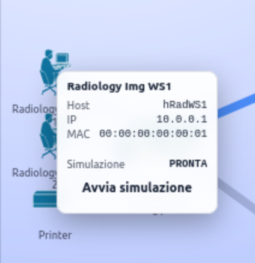  
*Tooltip dell’host con pulsante di avvio simulazione*

Il pulsante di avvio non richiede la configurazione manuale di parametri: ogni host è già mappato a una specifica simulazione predefinita.  
Alla pressione del pulsante, la GUI invia una richiesta REST al controller SDN, che identifica la simulazione associata a quell’host e ne avvia l’esecuzione tramite il modulo di simulazione del traffico.

Una volta avviata la simulazione, i collegamenti coinvolti nel traffico simulato vengono evidenziati tramite un’animazione che rappresenta il flusso del traffico lungo il percorso logico previsto dalla slice attiva.

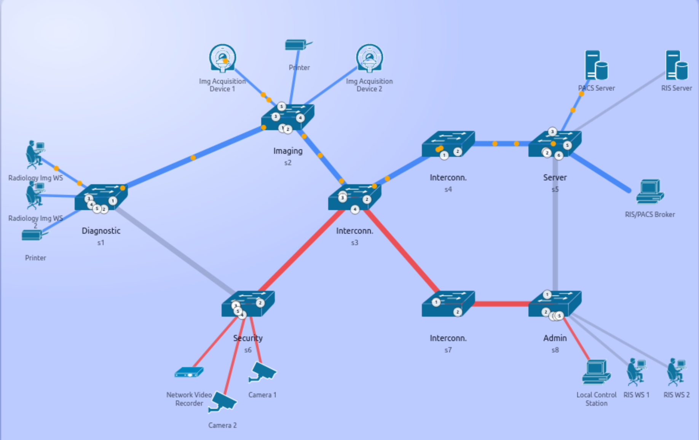  
*Animazione del traffico sui link della slice Radiologia*

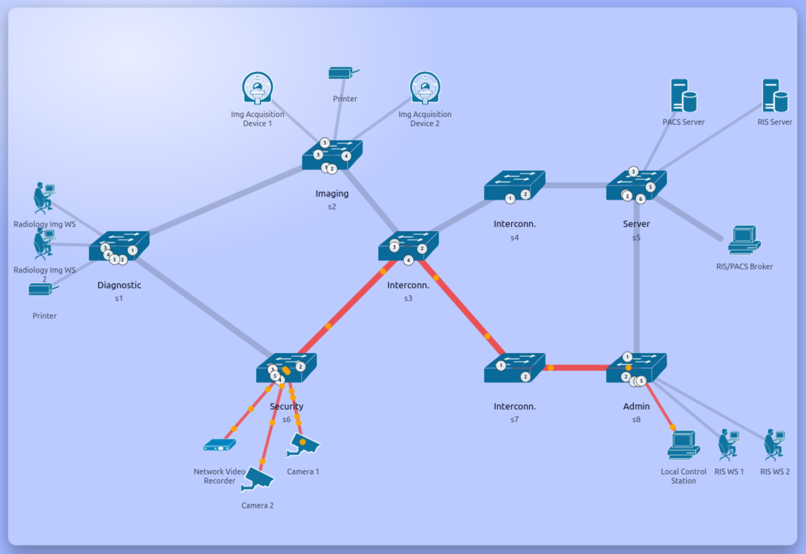  
*Animazione del traffico sui link della slice Sicurezza*

Al termine della simulazione, la GUI aggiorna automaticamente lo stato dell’host e segnala la conclusione dell’esecuzione della simulazione. 
Contestualmente:
- i processi di generazione del traffico vengono arrestati;
- le catture di pacchetti vengono chiuse;
- l’animazione del traffico viene disattivata.

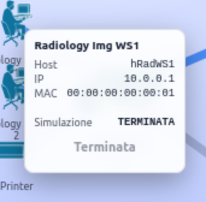  
*Notifica di simulazione terminata nella GUI*

---

### Simulazione DICOM tra Image Acquisition Device e PACS – Storage

Questa simulazione riproduce la fase di configurazione iniziale di un nuovo nodo DICOM, rappresentato da un dispositivo di acquisizione delle immagini, che utilizza il servizio di Verifica DICOM per testare la connettività e successivamente invia gli esami appena acquisiti al PACS per l’archiviazione.

In questo caso gli host coinvolti sono:

- **Image Acquisition Device (`hImgDev1`)**
  - Indirizzo IP: `10.0.0.4`
- **PACS Server (`hPACS`)**
  - Indirizzo IP: `10.0.0.13`

Prima di avviare la simulazione, assicurarsi che il controller sia impostato in modalità di slicing Topology e modalità operativa Day e che la slice Radiologia sia attiva, premendo l’apposito pulsante di attivazione nella GUI.

Il servizio **DICOM Storage** viene utilizzato per trasferire immagini DICOM e altri dati digitali correlati da un nodo DICOM a un altro nodo DICOM.

Nel contesto di questo servizio, i nodi assumono ruoli ben definiti:

- il **Service Class Provider (SCP)** è il nodo che fornisce il servizio; nel nostro caso è il PACS Server;
- il **Service Class User (SCU)** è il nodo che utilizza il servizio DICOM; nel nostro caso è la Image Acquisition Device.

L'applicazione `storescu` della collezione di librerie **DCMTK** implementa uno SCU per la Storage Service Class, mentre `storescp` implementa un SCP per la Storage Service Class.

Dal punto di vista del protocollo, il servizio DICOM Storage è implementato tramite il messaggio C-STORE:
-	lo SCU invia un messaggio C-STORE-RQ (request) allo SCP, includendo anche il dataset effettivo da trasferire;
-	lo SCP è tenuto a rispondere restituendo un messaggio C-STORE-RSP (response) allo SCU, comunicando il successo o il fallimento della richiesta di storage.

Il servizio **DICOM Verification** è probabilmente il servizio DICOM più semplice. Viene utilizzato per verificare la connettività DICOM tra due nodi DICOM.
 In pratica, è l’equivalente DICOM del comando “ping” e, infatti, viene spesso chiamato DICOM ping.

Il servizio di Verifica DICOM segue il consueto modello SCP / SCU.

Dal punto di vista del protocollo, il servizio DICOM Verification è implementato tramite il messaggio C-ECHO: 
- lo SCU invia un messaggio di richiesta C-ECHO-RQ allo SCP
- lo SCP è tenuto a rispondere restituendo un messaggio di risposta C-ECHO-RSP allo SCU.


L’applicazione `echoscu` della collezione di librerie **DCMTK** implementa uno SCU per la Verification SOP Class.

Analizzando la cattura si osserva chiaramente la sequenza completa dei messaggi previsti dal protocollo DICOM e che la comunicazione avviene utilizzando il protocollo di trasporto **TCP**, come previsto dallo [standard DICOM](https://dicom.nema.org/medical/dicom/current/output/chtml/part08/chapter_6.html).

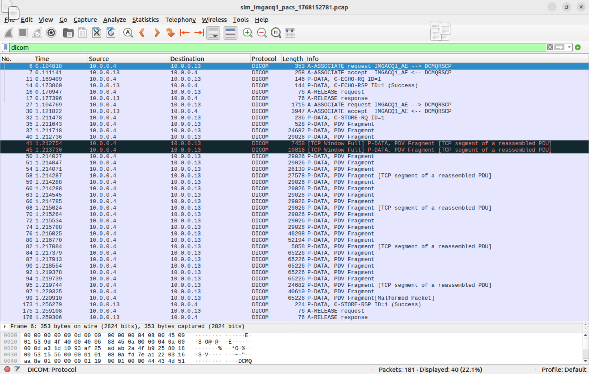  
*Screenshot Wireshark con filtro DICOM* 

---

### Simulazione DICOM tra Radiology Workstation e PACS – Query

Questa simulazione riproduce una delle operazioni più frequenti in un sistema PACS reale:  
una **workstation radiologica** interroga il **server PACS** per ottenere informazioni sugli studi presenti nell’archivio PACS.

In questo caso gli host coinvolti sono:

- **Radiology Workstation (`hRadWS1`)**
  - Indirizzo IP: `10.0.0.1`
- **PACS Server (`hPACS`)**
  - Indirizzo IP: `10.0.0.13`

Prima di avviare la simulazione, assicurarsi che il controller sia impostato in modalità di slicing Topology e modalità operativa Day e che la slice Radiologia sia attiva, premendo l’apposito pulsante di attivazione nella GUI.

Il servizio **DICOM Query** è utilizzato per interrogare un archivio DICOM (ad esempio un PACS server) riguardo al suo contenuto.
La query può includere parametri di ricerca.

Il servizio DICOM Query segue il consueto modello SCP / SCU:

- il **Service Class User (SCU)** è il nodo che utilizza il servizio DICOM; nel nostro caso è la Radiology Workstation;
- il **Service Class Provider (SCP)** è il nodo che fornisce il servizio; nel nostro caso è il PACS Server;
  
L'applicazione `findscu` implementa uno SCU per la Query/Retrieve Service Class, mentre `dcmqrscp` implementa un SCP per la Query/Retrieve Service Class. 

Dal punto di vista del protocollo, il servizio DICOM Query è implementato tramite messaggi applicativi specifici:
- lo SCU invia un messaggio **C-FIND-RQ** allo SCP, eventualmente includendo parametri di ricerca;
- lo SCP risponde con uno o più messaggi **C-FIND-RSP**, contenenti i risultati della query.

Prima che possano essere scambiati i messaggi applicativi del servizio DICOM (come C-FIND-RQ o C-STORE), i due nodi devono instaurare una associazione DICOM.
Solo dopo che l’associazione è stata correttamente stabilita è possibile avviare lo scambio dei messaggi DICOM veri e propri.

Analizzando la cattura Wireshark si osserva chiaramente la sequenza completa dei messaggi previsti dal protocollo DICOM e che la comunicazione avviene utilizzando il protocollo di trasporto **TCP**, come previsto dallo standard DICOM.

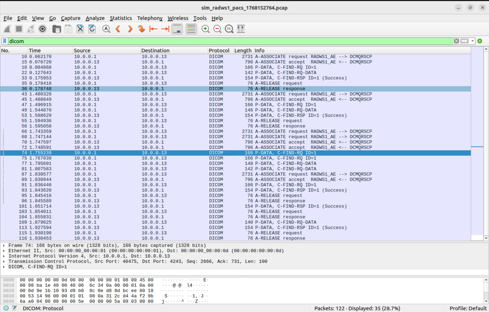  

---

### Simulazione traffico video – Telecamera di sicurezza verso Stazione di Controllo

Questa simulazione riproduce il traffico generato da una **telecamera di sicurezza** che invia un flusso video continuo verso la **stazione di controllo locale****.

- **Telecamera di sicurezza (`hCam2`)**
  - Indirizzo IP: `10.0.0.9`
- **Network Video Recorder (`hlCS`)**
  - Indirizzo IP: `10.0.0.10`
- Protocollo di trasporto: **UDP**
  
Prima di avviare la simulazione, assicurarsi che il controller sia impostato in modalità di slicing Topology e modalità operativa Day o Night e che la slice Sicurezza sia attiva, premendo l’apposito pulsante di attivazione nella GUI.

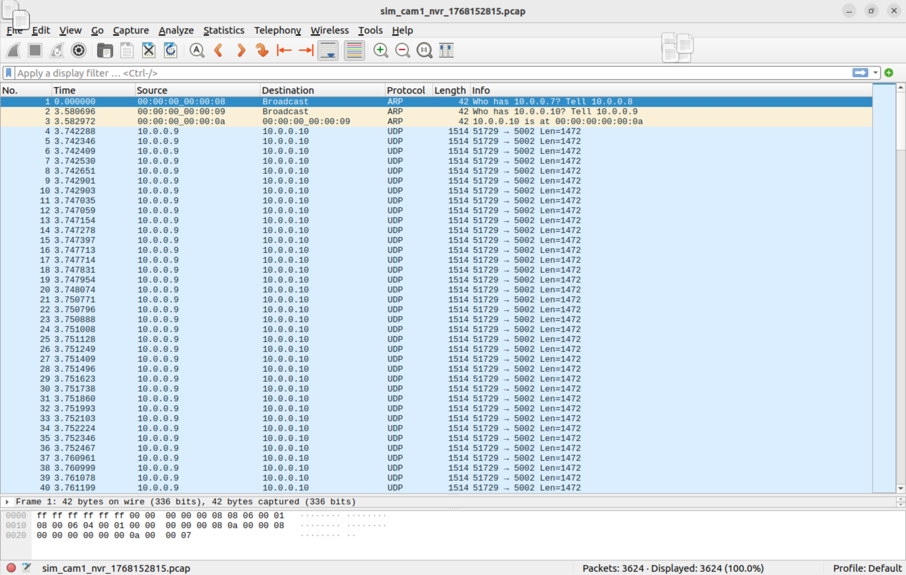  
*Screenshot Wireshark* 

Dalla cattura si osserva che la comunicazione avviene utilizzando il protocollo di trasporto **UDP** e un flusso caratterizzato da pacchetti di dimensione costante e assenza di ritrasmissioni.

---

### Simulazione traffico video – Telecamera di sicurezza verso NVR

Questa simulazione riproduce il traffico generato da una **telecamera di sicurezza** che invia un flusso video continuo verso il **Network Video Recorder**.

- **Telecamera di sicurezza (`hCam1`)**
  - Indirizzo IP: `10.0.0.8`
- **Network Video Recorder (`nvr`)**
  - Indirizzo IP: `10.0.0.7`
- Protocollo di trasporto: **UDP**
  
Prima di avviare la simulazione, assicurarsi che il controller sia impostato in modalità di slicing Topology e modalità operativa Day o Night e che la slice Sicurezza sia attiva, premendo l’apposito pulsante di attivazione nella GUI.

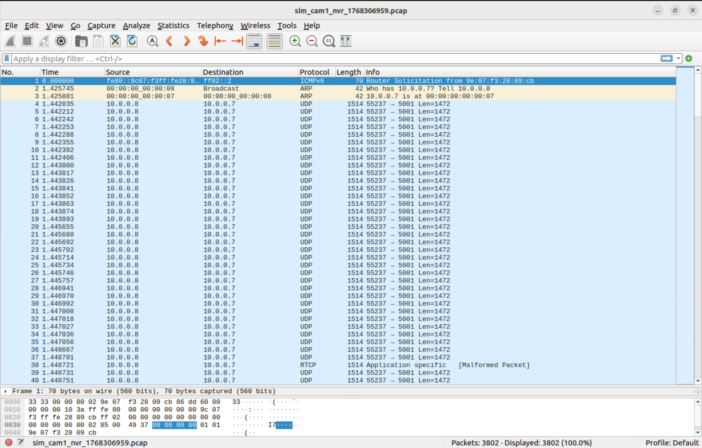   
*Screenshot Wireshark* 

---

## Documentazione della REST API

Un API Web descrive un'interfaccia HTTP che permette ad applicazioni remote di utilizzare i servizi di dell'applicazione.

REST è l’acronimo di REpresentional State Transfer, ed è il modello architetturale che sta dietro al World Wide Web e in generale dietro alle applicazioni web “ben fatte” secondo i progettisti di HTTP.
Un’applicazione REST si basa fondamentalmente sull’uso del protocollo (HTTP) e del protocollo di naming (URI) per generare interfacce generiche di interazione con l’applicazione, e fortemente connesse con l’ambiente d’uso.

L’architettura REST si basa su quattro punti : 
-  Definire risorsa ogni concetto rilevante dell’applicazione Web
-  Associargli un URI come l’identificatore e selettore primario 
-  Usare i verbi HTTP per esprimere ogni operazione dell’applicazione secondo il modello CRUD: creazione di un nuovo oggetto (metodo PUT), visualizzazione dello stato della risorsa (metodo GET), cambio di stato della risorsa (metodo POST), cancellazione di una risorsa (metodo DELETE) 
- Esprimere in maniera parametrica ogni rappresentazione dello stato interno della risorsa, personalizzabile dal richiedente attraverso un Content Type preciso

Questa parte descrive come vengono implementati gli URL della REST API.

Per associare un metodo a uno specifico URL viene utilizzato il decoratore `route` definito in Ryu.

Il contenuto specificato dal decoratore è il seguente:

- **Primo argomento**  
  Un nome arbitrario.

- **Secondo argomento**  
  Specifica l’URL.

- **Terzo argomento**  
  Specifica il metodo HTTP.

- **Quarto argomento**  
  Specifica il formato della posizione specificata.

### Response

Per la costruzione e la restituzione delle risposte HTTP nella REST API viene utilizzata la classe `Response`, che rappresenta una risposta WSGI.

| Attributo utilizzato | Traduzione | Descrizione |
|---|---|---|
| `body` | corpo della risposta | Contenuto della risposta HTTP, espresso come sequenza di byte. |
| `status` | stato della risposta | Stringa o codice che rappresenta lo stato della risposta HTTP. |
| `content_type` | tipo di contenuto | header `Content-Type` . |

### Metodi 

La classe ControllerServer definisce gli URL per ricevere le richieste HTTP e il metodo corrispondente.

#### 1. GUI Index
Restituisce la pagina principale della GUI (`index.html`).

La REST API viene chiamata tramite l’URL `/ui`.  
Se in quel momento il metodo HTTP è `GET`, viene chiamato il metodo `index` della classe `StaticGuiController`, definita nel file `controller.py`.


| Method | URL |
|---|---|
| GET | `/ui` |

| Type | Params | Values |
|---|---|---|
| HEAD | — | — |
| URL_PARAM | — | — |
| POST | — | — |

| Status | Response                                                           |
| -----: | ------------------------------------------------------------------ |
|    200 | HTML della pagina `index.html`                                     |
|    404 | `{"error":"Resource not found."}` *(se il file non è disponibile)* |
|    500 | `{"error":"Something went wrong. Please try again later."}`        |

#### 2. GUI Monitor
Restituisce la pagina di monitoraggio della GUI (`monitor.html`).

La REST API viene chiamata tramite l’URL `/ui/monitor`.  
Se in quel momento il metodo HTTP è `GET`, viene chiamato il metodo `monitor` della classe `StaticGuiController`, definita nel file `controller.py`.


| Method | URL |
|---|---|
| GET | `/ui/monitor` |

| Type | Params | Values |
|---|---|---|
| HEAD | — | — |
| URL_PARAM | — | — |
| POST | — | — |

| Status | Response                                                           |
| -----: | ------------------------------------------------------------------ |
|    200 | HTML della pagina `monitor.html`                                   |
|    404 | `{"error":"Resource not found."}` *(se il file non è disponibile)* |
|    500 | `{"error":"Something went wrong. Please try again later."}`        |


#### 3. File Statici della GUI
Restituisce file statici della GUI (JavaScript, CSS, immagini e icone).

La REST API viene chiamata tramite l’URL `/ui/{path}`.  
Se in quel momento il metodo HTTP è `GET`, viene chiamato il metodo `static_file` della classe `StaticGuiController`, definita nel file `controller.py`.


| Method | URL |
|---|---|
| GET | `/ui/{path}` |

| Type | Params | Values |
|---|---|---|
| HEAD | — | — |
| URL_PARAM | path | string |
| POST | — | — |

| Status | Response                                                    |
| -----: | ----------------------------------------------------------- |
|    200 | File statico richiesto                                      |
|    403 | `{"error":"Forbidden."}`           |
|    404 | `{"error":"Resource not found."}`                           |
|    500 | `{"error":"Something went wrong. Please try again later."}` |


#### 4. Stato del controller
Restituisce un riepilogo dello stato del controller, indicando se è in modalità Day o Night, se lo slicing è per topologia o servizi, quali slice sono attive e se la video slice è attiva.

La REST API viene chiamata tramite l’URL `/status`.  
Se in quel momento il metodo HTTP è `GET`, viene chiamato il metodo `status` della classe `ControllerServer`, definita nel file `controller.py`.

| Method | URL |
|---|---|
| GET | `/status` |

| Type | Params | Values |
|---|---|---|
| HEAD | — | — |
| URL_PARAM | — | — |
| POST | — | — |


| Status | Response |
|-----:|-------------------------------------------------------------|
| 200 | JSON con stato corrente del controller. Esempio di risposta: `{ "active_mode": "day", "slicing_mode": "topology", "enabled_topology": [1, 2], "video_enabled": false }` |
| 500 | `{"error":"Something went wrong. Please try again later."}` |

#### 5. Stato della simulazione di traffico
Restituisce lo stato corrente delle simulazioni di traffico gestite dal controller.


La REST API viene chiamata tramite l’URL `/sim/traffic/status`.  
Se in quel momento il metodo HTTP è `GET`, viene chiamato il metodo `traffic_status` della classe `ControllerServer`, definita nel file `controller.py`.

| Method | URL |
|---|---|
| GET | `/sim/traffic/status` |

| Type | Params | Values |
|---|---|---|
| HEAD | — | — |
| URL_PARAM | — | — |
| POST | — | — |


| Status | Response |
|-----:|-------------------------------------------------------------|
| 200 | JSON con lo stato delle simulazioni di traffico. Esempio di risposta: `{ "running": ["sim_1", "sim_2"], "stopped": [] }` |
| 500 | `{"error":"Something went wrong. Please try again later."}` |

#### 6. Avvio di una simulazione di traffico
Avvia una simulazione di traffico identificata da `sim_id`.

La REST API viene chiamata tramite l’URL `/sim/traffic/start`.  
Se in quel momento il metodo HTTP è `POST`, viene chiamato il metodo `traffic_start` della classe `ControllerServer`, definita nel file `controller.py`.


| Method | URL |
|---|---|
| POST | `/sim/traffic/start` |

| Type | Params | Values |
|---|---|---|
| HEAD | — | — |
| URL_PARAM | — | — |
| POST | sim_id | string |


| Status | Response |
|-----:|-------------------------------------------------------------|
| 200 | Avvio riuscito. Esempio di risposta: `{ "ok": true, "sim_id": "sim_1", "status": "running" }` |
| 400 | Parametro mancante/errato. Esempio: `{"error":"missing sim_id"}` |
| 409 | Simulazione non avviabile (ad esempio se è già attiva). Esempio: `{ "ok": false, "sim_id": "sim_1", "error": "already running" }` |
| 500 | `{"error":"Something went wrong. Please try again later."}` |

#### 7. Arresto di tutte le simulazioni di traffico
Ferma tutte le simulazioni di traffico attive.

La REST API viene chiamata tramite l’URL `/sim/traffic/stop_all`.  
Se in quel momento il metodo HTTP è `POST`, viene chiamato il metodo `traffic_stop_all` della classe `ControllerServer`, definita nel file `controller.py`.

| Method | URL |
|---|---|
| POST | `/sim/traffic/stop_all` |

| Type | Params | Values |
|---|---|---|
| HEAD | — | — |
| URL_PARAM | — | — |
| POST | reason | string *(optional, default: `context_change`)* |


| Status | Response |
|-----:|-------------------------------------------------------------|
| 200 | Stop riuscito. Esempio di risposta: `{ "ok": true, "stopped": true, "reason": "manual_stop" }` |
| 500 | Errore interno. Esempio: `{ "ok": false, "error": "..." }` |

#### 8. Definizione delle porte degli switch
Restituisce la definizione delle porte degli switch utilizzata dalla GUI per la visualizzazione della topologia.

La REST API viene chiamata tramite l’URL `/ui/port-defs`.  
Se in quel momento il metodo HTTP è `GET`, viene chiamato il metodo `port_defs` della classe `StaticGuiController`, definita nel file `controller.py`.


| Method | URL |
|---|---|
| GET | `/ui/port-defs` |

| Type | Params | Values |
|---|---|---|
| HEAD | — | — |
| URL_PARAM | — | — |
| POST | — | — |


| Status | Response |
|-----:|-------------------------------------------------------------|
| 200 | JSON con la mappatura delle porte. Esempio di risposta: `{ "s1": { "1": "h1", "2": "s2" }, "s2": { "1": "s1", "2": "h2" } }` |
| 500 | `{"error":"cannot import topology defs"}` |

#### 9. Definizione degli host 
Restituisce i dati degli host della topologia così la GUI può mostrarli come nodi con ID host e, se presenti, indirizzi IP e MAC.

La REST API viene chiamata tramite l’URL `/ui/port-defs`.  
Se in quel momento il metodo HTTP è `GET`, viene chiamato il metodo `port_defs` della classe `StaticGuiController`, definita nel file `controller.py`.

| Method | URL |
|---|---|
| GET | `/ui/host-defs` |

| Type | Params | Values |
|---|---|---|
| HEAD | — | — |
| URL_PARAM | — | — |
| POST | — | — |


| Status | Response |
|-----:|-------------------------------------------------------------|
| 200 | JSON con la lista degli host. Esempio di risposta: `{ "hosts": [ { "name": "h1", "ip": "10.0.0.1", "mac": "00:00:00:00:00:01" }, { "name": "h2", "ip": "10.0.0.2", "mac": "00:00:00:00:00:02" } ] }` |
| 500 | `{"error":"cannot import topology"}` |

#### 10. Imposta modalità operativa diurna o nottura del controller
Imposta la modalità operativa del controller, selezionando tra modalità **Day** e **Night**.  
Il cambio di modalità comporta il reset delle tabelle di inoltro degli switch e l’arresto delle simulazioni attive.

La REST API viene chiamata tramite l’URL `/mode/set`.  
Se in quel momento il metodo HTTP è `POST`, viene chiamato il metodo `set_mode` della classe `ControllerServer`, definita nel file `controller.py`.

| Method | URL |
|---|---|
| POST | `/mode/set` |

| Type | Params | Values |
|---|---|---|
| HEAD | — | — |
| URL_PARAM | — | — |
| POST | mode | `day` \| `night` |


| Status | Response |
|-----:|-------------------------------------------------------------|
| 200 | Modalità impostata correttamente. Esempio di risposta: `{ "ok": true, "mode": "day", "reset": true }` |
| 400 | Valore non valido per `mode`. Esempio: `{"error":"mode must be day|night"}` |
| 500 | `{"error":"Something went wrong. Please try again later."}` |

#### 11. Imposta modalità di slicing
Imposta la modalità di slicing del controller, scegliendo se attivare lo slicing **per topologia** o **per servizi**.  
Il cambio di modalità comporta il reset delle tavole di inoltro degli switch e l’arresto delle simulazioni attive.

La REST API viene chiamata tramite l’URL `/slicing/set`.  
Se in quel momento il metodo HTTP è `POST`, viene chiamato il metodo `set_slicing` della classe `ControllerServer`, definita nel file `controller.py`.

| Method | URL |
|---|---|
| POST | `/slicing/set` |

| Type | Params | Values |
|---|---|---|
| HEAD | — | — |
| URL_PARAM | — | — |
| POST | mode | `topology` \| `service` |


| Status | Response |
|-----:|-------------------------------------------------------------|
| 200 | Modalità di slicing impostata correttamente. Esempio di risposta: `{ "ok": true, "slicing_mode": "topology", "reset": true }` |
| 400 | Valore non valido per `mode`. Esempio: `{"error":"mode must be topology|service"}` |
| 500 | `{"error":"Something went wrong. Please try again later."}` |

#### 12. Attiva una slice di topologia
Aggiunge una slice di topologia.

La REST API viene chiamata tramite l’URL `/slice/add`.  
Se in quel momento il metodo HTTP è `POST`, viene chiamato il metodo `slice_add` della classe `ControllerServer`, definita nel file `controller.py`.

| Method | URL |
|---|---|
| POST | `/slice/add` |

| Type | Params | Values |
|---|---|---|
| HEAD | — | — |
| URL_PARAM | — | — |
| POST | slice_id | integer (es. 1, 2, 3) |


| Status | Response |
|-----:|-------------------------------------------------------------|
| 200 | Slice aggiunta correttamente. Esempio di risposta: `{ "ok": true, "slice_id": 1 }` |
| 400 | Parametro non valido o mancante. Esempio: `{"error":"invalid slice_id"}` |
| 409 | Slice già attiva o non attivabile. Esempio: `{ "ok": false, "slice_id": 1, "error": "already enabled" }` |
| 500 | `{"error":"Something went wrong. Please try again later."}` |

#### 13. Rimuovi slice di topologia
Rimuove una slice di topologia attiva.

La REST API viene chiamata tramite l’URL `/slice/remove`.  
Se in quel momento il metodo HTTP è `POST`, viene chiamato il metodo `slice_remove` della classe `ControllerServer`, definita nel file `controller.py`.

| Method | URL |
|---|---|
| POST | `/slice/remove` |

| Type | Params | Values |
|---|---|---|
| HEAD | — | — |
| URL_PARAM | — | — |
| POST | slice_id | integer (es. 1, 2, 3) |


| Status | Response |
|-----:|-------------------------------------------------------------|
| 200 | Slice rimossa correttamente. Esempio di risposta: `{ "ok": true, "slice_id": 1 }` |
| 400 | Parametro non valido o mancante. Esempio: `{"error":"invalid slice_id"}` |
| 404 | Slice non trovata/ non attiva. Esempio: `{ "ok": false, "slice_id": 1, "error": "not enabled" }` |
| 500 | `{"error":"Something went wrong. Please try again later."}` |

#### 14. Attiva Video Slice
Attiva la video slice nella modalità di slicing per servizi.

La REST API viene chiamata tramite l’URL `/service/video/on`.  
Se in quel momento il metodo HTTP è `POST`, viene chiamato il metodo `video_on` della classe `ControllerServer`, definita nel file `controller.py`.

| Method | URL |
|---|---|
| POST | `/service/video/on` |

| Type | Params | Values |
|---|---|---|
| HEAD | — | — |
| URL_PARAM | — | — |
| POST | — | — |


| Status | Response |
|-----:|-------------------------------------------------------------|
| 200 | Servizio video attivato. Esempio di risposta: `{ "ok": true, "video_enabled": true }` |
| 409 | Operazione non valida (ad esempio se la video slice è già attiva o la modalità operativa non è `service`). Esempio: `{ "ok": false, "error": "video already enabled" }` |
| 500 | `{"error":"Something went wrong. Please try again later."}` |

#### 15. Disattiva Video Slice
Disattiva la video slice.

La REST API viene chiamata tramite l’URL `/service/video/off`.  
Se in quel momento il metodo HTTP è `POST`, viene chiamato il metodo `video_off` della classe `ControllerServer`, definita nel file `controller.py`.

| Method | URL |
|---|---|
| POST | `/service/video/off` |

| Type | Params | Values |
|---|---|---|
| HEAD | — | — |
| URL_PARAM | — | — |
| POST | — | — |


| Status | Response |
|-----:|-------------------------------------------------------------|
| 200 | Servizio video disattivato. Esempio di risposta: `{ "ok": true, "video_enabled": false }` |
| 409 | Operazione non valida (ad esempio se la video slice è già disattivata o slicing non in modalità `service`). Esempio: `{ "ok": false, "error": "video already disabled" }` |
| 500 | `{"error":"Something went wrong. Please try again later."}` |
